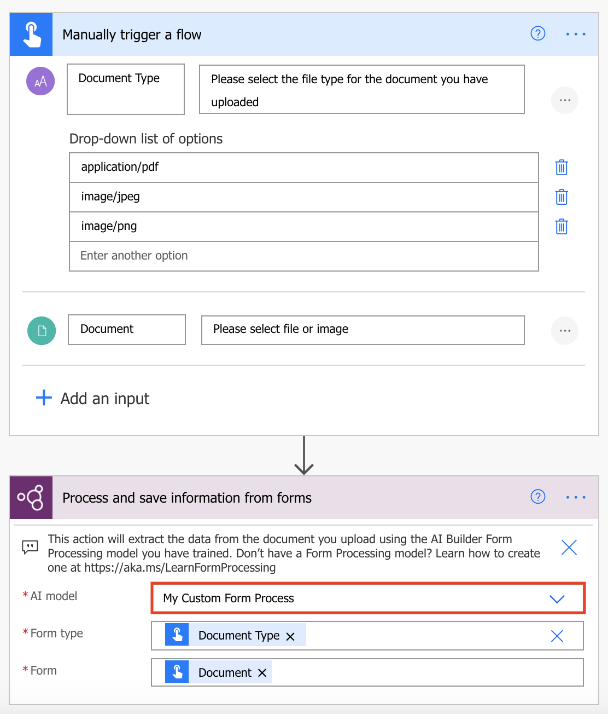

In this section, you will discover how you can easily bootstrap your AI Builder flows to fulfill your business scenarios.

## AI Builder flow templates

[Power Automate templates](https://us.flow.microsoft.com/templates/?azure-portal=true) contain pre-configured logic that eases creation of flows for specific business purposes.

Let's create a flow from an AI Builder template:

1.  Select **My templates** tab in the left menu, the list of available templates will appear

2.  Type **AI Builder** in the search bar and press enter key. All the AI Builder templates will be displayed:

    

3.  Select the template **Send a notification with the sentiment of manager's email using AI Builder**. You will see a summary of the template with a list of the connections that will be used:

    

    Select **Continue**

4.  A preconfigured flow appears (at this stage, the flow is not saved yet):

    

    You can save the flow as-is or update it at your convenience:

    - Modify existing actions: input parameters, action name or advanced parameters
     - Add new actions
     - Remove existing actions (this will likely break the actions downstream)

5.  Save the flow and test it

## Create a flow from AI Builder studio

From AI Builder studio, it's also possible to launch the creation of a flow using your favorite model.

Let's take the example of a custom form processing model. In the detail page of the model, there is a **Use Model** button (the model must be published). Selecting this button opens a right panel that offers multiple options:

Selecting **+ New Flow** opens the screen of creation of a flow from a template:

Selecting **Continue** opens a pre-configured flow with the custom model selected in the AI Builder action:

