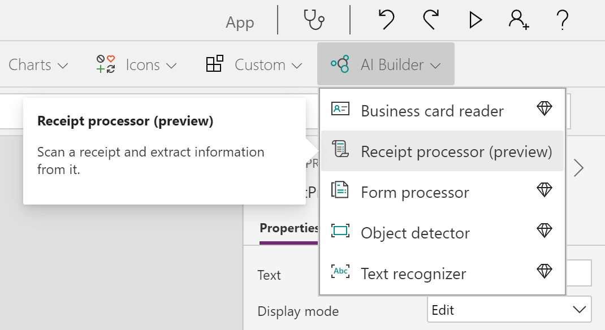

Receipt processing uses a prebuilt AI model, which means no prior training or configuration is required. You can use this model right away in your canvas app using the Receipt processor component.

> [!div class="mx-imgBorder"]
> 

In this exercise we will create a simple app which scans a receipt then displays the extracted information.

### Add the component to your app

1. Sign into Power Apps Studio and open a new or existing canvas app

2. Select **Insert > AI Builder** from the top menu

3. Select **Receipt processor (preview)**

    > [!div class="mx-imgBorder"]
    > 

Select the **play button** icon in the top right to preview your app. You can then select the **Scan receipt** button on the component to upload a test image, which will scan and outline the key detected information from the receipt.

### Use the scanned information

The AI model will look for some of the most commonly used fields in receipts, whose values can be retrieved directly as properties from the component.

> [!div class="mx-imgBorder"]
> 

1. Select **Insert > Label**

1. With the newly created label component selected, set its **Text** property using the formula bar to the **Total** property of the Receipt processor component

    > [!div class="mx-imgBorder"]
    > 

1. Select **Insert > Data table**

1. With the newly created data label component selected, set its **Items** property using the formula bar to the **PurchasedItems** property of the Receipt processor component

1. In the properties pane of the data label component, select **Edit fields**

1. Select the **Add field** button

1. Select all the field options, then select **Add**

    > [!div class="mx-imgBorder"]
    > 

    Lastly, you can retrieve more additional information about your receipts using the **DetectedFields** and **DetectedText** properties.

    **DetectedText** contains a raw list of all the recognized lines of text on the receipt.

    **DetectedFields** contains advanced information about the key fields, such as the confidence score, the bounding box, and page number.

    > [!div class="mx-imgBorder"]
    > 

    For instance, let's show the confidence score for the **Total** field we displayed earlier.

1. Select **Insert > Label**.

1. With the newly created label component selected, set its **Text** property using the formula bar to the **DetectedFields.Total.Confidence** property of the Receipt processor component

Once you have all the values you wish to retrieve, you can then save this information locally to your device, like in a Collection, or on the cloud, such as in Common Data Service or a SharePoint list.

Congratulations! You have just created an app using Receipt processing.

### Next steps

Now that you have learned how to use Receipt processing in your apps, let's learn how you can use it in your automated flows.
