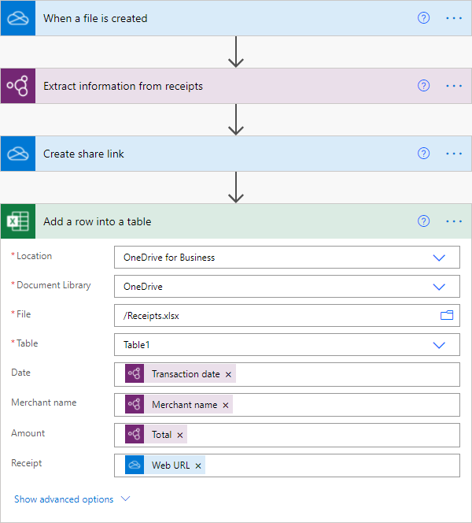

Often, you might discover that you have multiple receipts to process. An automated workflow can save you considerable time by scanning each receipt for you automatically in the background.

### Create a new flow

In this exercise, you will create a flow that automatically runs whenever a new file is added to a OneDrive for Business folder. This flow will scan the image for key receipt information and will then write it into a Microsoft Excel spreadsheet.

1. Sign in to Microsoft Power Automate.

1. [Create a new flow in a solution](https://docs.microsoft.com/flow/create-flow-solution/?azure-portal=true).

### Add a trigger

Your first task is to create the trigger for your flow, which will run whenever a file is added to the OneDrive folder that you specify.

1. Search for the **OneDrive for Business** connector or select it from the list of connectors.

1. Select the **When a file is created** trigger.

1. Specify the folder in your OneDrive for business that you want to use in the **Folder** field.

### Scan the receipt file

Next, you'll scan the contents of the image file for the key receipt information.

1. Select **+ New step**.

1. Search for the **AI Builder** connector or select it from the list of connectors.

1. Select the **Extract information from receipts** action.

1. In the **Receipt file** field, select the **File content** dynamic content from the trigger that you added.

    > [!div class="mx-imgBorder"]
    > 

### Create a share link for the receipt

You can create a direct link to the receipt file for easy reference of the expense in the future.

1. Select **+ New step**.

1. Select the **OneDrive for Business** connector, and then select the **Create share link** action.

1. In the **File** field, select the **File identifier** dynamic content from your trigger.

1. In the **Link type** field, select **View**.

1. In the **Link scope** field, select **Organization**.

### Create the Excel table

Before you begin writing your data into Excel, make sure that you have created a table that matches the information that you want to store.

> [!div class="mx-imgBorder"]
> 

1. Create a new Excel spreadsheet in SharePoint or open an existing spreadsheet.

1. In the first row, enter the following values in their own cells, which will serve as the column headers for your table: **Date**, **Merchant name**, **Amount**, and **Receipt**.

1. Select the cells that you entered and then format them as a table, marking the first row as the headers.

1. Optionally, you can format the **Date** and **Amount** columns as *date* and *currency* number formats, respectively.

### Write the data to Excel

Now that your table is set up, you can add the receipt information to the Excel spreadsheet.

> [!div class="mx-imgBorder"]
> 

1. Select **+ New step**.

1. Search for the **Excel Online (Business)** connector or select it from the list of connectors.

1. Select the **Add a row into a table** action.

1. In the **Location**, **Document Library**, and **File** fields, specify the location in SharePoint where your file is stored.

1. In the **Table** field, select the table that you created.

1. In the **Date** field, select the **Transaction date** dynamic content from the **AI Builder** action.

1. In the **Merchant name** field, select the **Merchant name** dynamic content from the **AI Builder** action.

1. In the **Amount** field, select the **Total** dynamic content from the **AI Builder** action.

1. In the **Receipt** field, select the **Web URL** dynamic content from the **OneDrive for Business** action.

Now, whenever you add a new receipt file to that folder, a new entry will be added to Excel with the extracted information.

> [!div class="mx-imgBorder"]
> 

Congratulations, you have created an automated workflow by using receipt processing.
