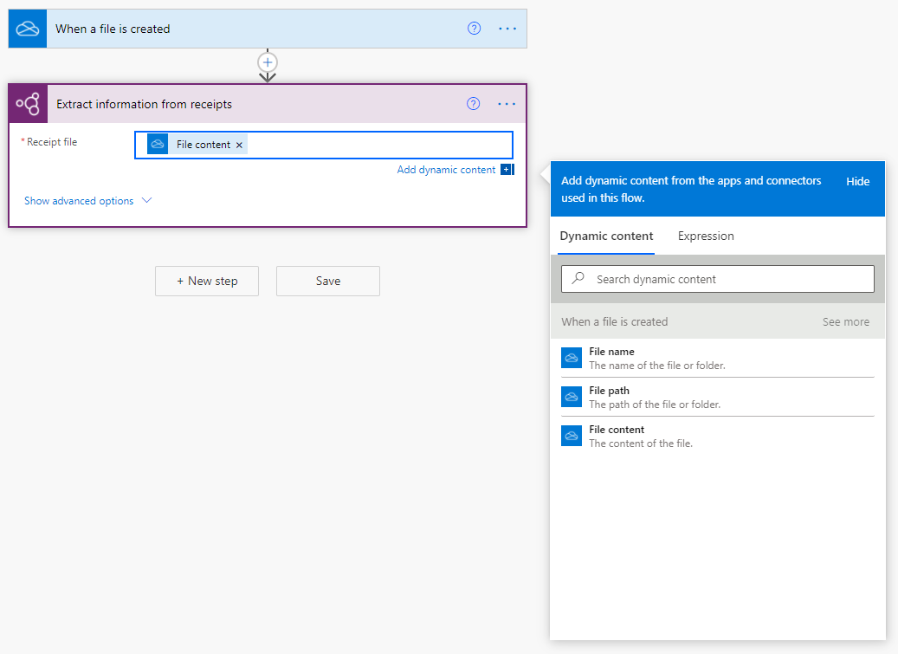

Often times you can find yourself with a large quantity of receipts to process. An automated workflow can save you a considerable amount of time by scanning each receipt for you automatically in the background.

### Create a new flow

Let's create a flow which automatically runs whenever a new file is added to a OneDrive for Business folder, scanning the image for key receipt information then writing it into an Excel spreadsheet.

1. Sign into Power Automate.

1. [Create a new flow in a solution](https://docs.microsoft.com/flow/create-flow-solution/?azure-portal=true).

### Add a trigger

We'll first create the trigger for our flow, which will run every time a file is added to the OneDrive folder we specify.

1. Search for the connector **OneDrive for Business** or select it from the list of connectors.

1. Select the trigger **When a file is created**.

1. Specify the folder in your OneDrive for business that you wish to use in the **Folder** field.

### Scan the receipt file

Next, we'll scan the contents of the image file for the key receipt information.

1. Select **+ New step**.

1. Search for the connector **AI Builder** or select it from the list of connectors.

1. Select the action **Process and save information from receipts**.

1. In the **Receipt file** field, select the dynamic content **File content** from the trigger we just added.

    > [!div class="mx-imgBorder"]
    > 

### Create a share link for the receipt

We can also create a direct link to the receipt file, for easy reference of the expense in the future.

1. Select **+ New step**.

1. Select the **OneDrive for Business** connector, then select the action **Create share link**.

1. In the **File** field, select the dynamic content **File identifier** from our trigger.

1. In the **Link type** field, select **View**.

1. In the **Link scope** field, select **Organization**.

### Create the Excel table

Before we can start writing our data into Excel, we'll need to make sure we have created a table that matches the information we want to store.

> [!div class="mx-imgBorder"]
> 

1. Create a new Excel spreadsheet in SharePoint, or open an existing spreadsheet.

1. In the first row, enter the following values in their own cell, which will serve as the column headers for our table: **Date**, **Merchant name**, **Amount**, and **Receipt**.

1. Select the cells you just entered, then format them as a table, marking the first row as the headers.

1. You can also optionally format the columns for the **Date** and **Amount** columns as *Date* and *Currency* number formats, respectively.

### Write the data to Excel

With our table set up, let's add the receipt information to the Excel spreadsheet.

> [!div class="mx-imgBorder"]
> 

1. Select **+ New step**.

1. Search for the connector **Excel Online (Business)** or select it from the list of connectors.

1. Select the action **Add a row into a table**.

1. In the **Location**, **Document Library**, and **File** fields, specify the location in SharePoint where your file is stored.

1. In the **Table** field, select the table we just created.

1. In the **Date** field, select the dynamic content **Transaction date** from the AI Builder action.

1. In the **Merchant name** field, select the dynamic content **Merchant name** from the AI Builder action.

1. In the **Amount** field, select the dynamic content **Total** from the AI Builder action.

1. In the **Receipt** field, select the dynamic content **Web URL** from the OneDrive for Business action.

Now, whenever you added a new receipt file to that folder, a new entry will be added to Excel with the extracted information.

> [!div class="mx-imgBorder"]
> 

Congratulations! You have just created an automated workflow using Receipt processing!
