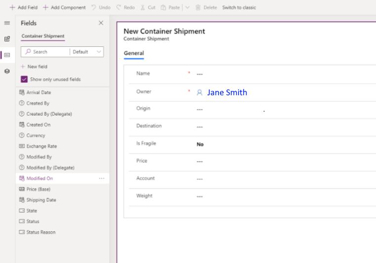

**We will build a model-driven Power Apps** (see [What are model-driven apps in Power Apps?](/powerapps/maker/model-driven-apps/model-driven-app-overview/?azure-portal=true))

## Track progress

To create container shipment requests and track containers shipment progress: Use "Create" in Power Apps left menu and then "Model-driven app from blank" then click on "Create".

Enter Contoso Container Tracking as name then click on Done.

## Use table

To use the table that we have created in previous unit we need to reference it. Select "Tables" in the Right Pane and check Container Shipment, a new entry will be added in the left view.

## Enter new shipment requests

To enter new container shipment requests, we need to create an entry form (See [Create or edit a model-driven app main form for an table](/powerapps/maker/model-driven-apps/create-edit-main-forms/?azure-portal=true)). Edit the data entry form by selecting the "Forms" button in the left view and edit button on the "Information" main form in the right pane.

## Define fields

We now need to the define the fields that will be provided by the user. On the opened window, add the following fields to the form using drag and drop from left pane: "Origin", "Destination", "Is Fragile", "Price", "Account" and "Weight".

Save and close the window.

## Track shipment progress

To track shipment progress, we need a view of all containers with their information and shipping state (See [Customize table views](/powerapps/developer/model-driven-apps/customize-entity-views/?azure-portal=true)).

Click on "Views" in the left view and "Create New" button on the left pane.

## Define information to display

We will now define which information will be displayed on this view. Click on "Column Attributes" for "Primary Table" and drag and drop the following column attributes from the right pane to the left view: Origin, Destination, Is Fragile, Price, Weight, Shipping Date, Arrival Date and State.

Click on "Column Attributes" for "Related Table" and add the "Account Name".

Name your view Containers List, save and publish.

On the component view, uncheck "All" and check Container List.

## Access container list

To access the list of containers and the new container request form, we must provide Linda with an entry point in the application. Return to the "App Designer" using the bread crumb on the top left and edit the Site Map.

Click on the top "Area" in the left view and name it Container Tracking on the right pane.

Click on the "Group" in the left view and name it All containers on the right pane.

Click on the "Sub Area" in the left view, select "Table" and "Container Shipment" as table on the right pane.

Save and publish.

## Summary

We have successfully created an application that will allow Linda to create and track container shipment requests. We are now settled to create the frontline worker application.
