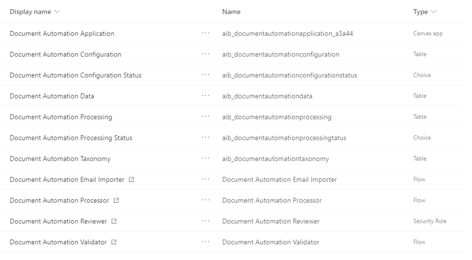
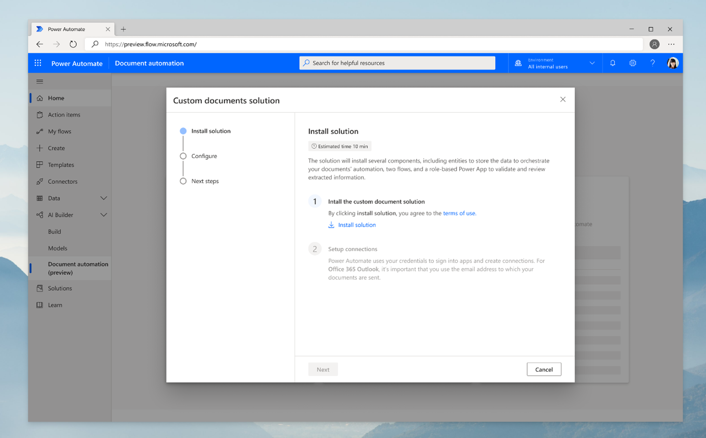
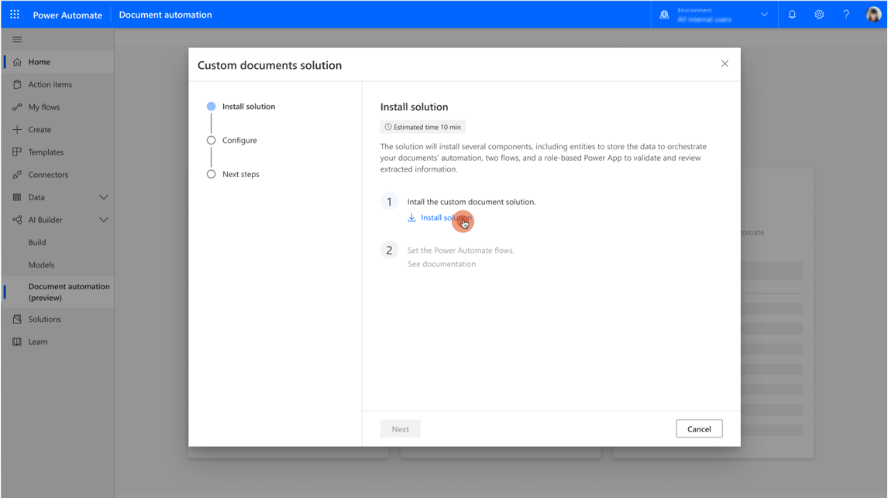
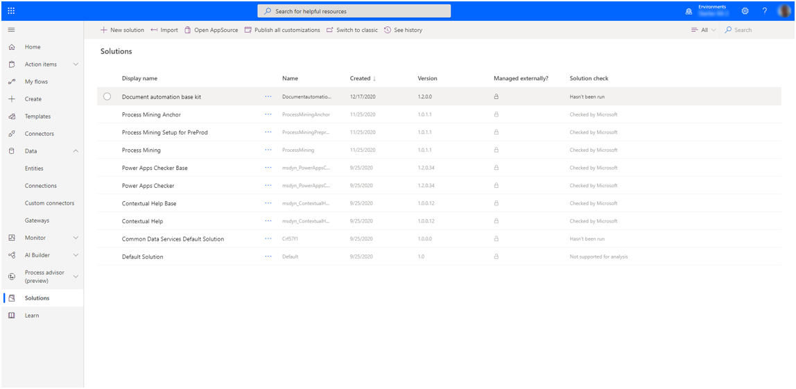
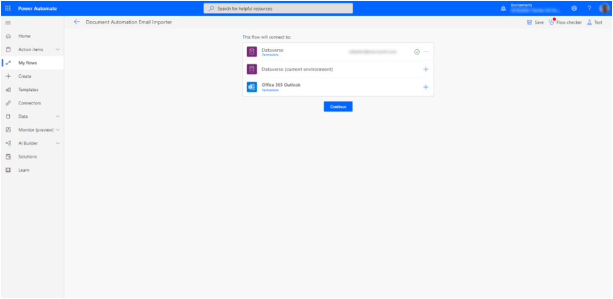
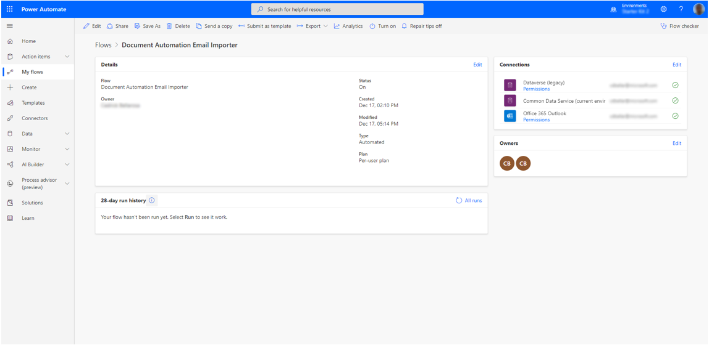

In this unit, you will

- Understand how to install the document automation base kit.

- Learn what key components are installed.

- Learn how to configure the connection to Outlook and Dataverse.

The person installing the document automation solution should:

- Have good knowledge of Power Platform concepts (at least Power Automate connections and Dataverse).

- Have enough privileges to configure Power Automate connections and add environment variables.

- Own the connection to the Outlook service mailbox that will be used to receive the documents.

Makers or Administrators are usually a good fit for this task.

The following items will be installed with this package:

> [!div class="mx-imgBorder"]
> 

- A Power Apps "Document Automation Application" allowing makers to configure the AI model to use for document extraction, and users to track processing of documents and review them.

- Three Power Automate flows

  - "Document Automation Email Importer" that listens to new emails arriving in the service mailbox, extracts any attachments, and creates a new processing request.

  - "Document Automation Processor" that calls the AI Builder model to extract values and store them in Microsoft Dataverse.

  - "Document Automation Validator" that acts as a placeholder for your business rules and sends documents to the validation application.

- Four Microsoft Dataverse tables

  - "Document Automation Processing" stores document automation requests, files to be processed, and the status of the processing.

  - "Document Automation Data" stores values extracted from the document.

  - "Document Automation Configuration" stores information about the model to use.

  - "Document Automation Taxonomy" maps where each model's labels are stored in the "Document Automation Data" table fields.

- Two Microsoft Dataverse choices

  - "Document Automation Processing Status" with steps of the workflow.

  - "Document Automation Configuration Status" to indicate that the AI model has been configured.

To install your document automation solution in one of your environments, you need to go through the following steps:

- Install the "Document automation base kit" solution package.

- Activate the flows and data connections with your account.

The flows run with the user credentials and data connections of the user who installs and configures the solution.

## Install the solution

To install and configure the document automation solution, you must follow these steps:

1. Go to Power Automate and navigate to the AI Builder > [Document automation page](https://flow.microsoft.com/manage/aibuilder/documentautomation).

1. Select the **Select** button.

    > [!div class="mx-imgBorder"]
    > 

1. Once in the wizard, select the **Install solution** link.

    > [!div class="mx-imgBorder"]
    > 

1. You are redirected to the Power Platform admin center. Accept the terms of service, then select **Install**.

Your document automation solution is now installed but is not yet activated. To finalize the installation and activate your document solution, you need to configure the data connections and turn on the flows used by the solution. We will start by configuring and activating the flow that captures documents to process.

1. Select the **Document automation base kit**.

    > [!div class="mx-imgBorder"]
    > 

1. Then select **Document Automation Email Importer**.

1. Select **Edit** in the top banner.

    > [!div class="mx-imgBorder"]
    > 

1. Select the "+" for each connection to configure the connection, then select **Continue**.

    > [!IMPORTANT]
    > The account that you use for the **Office 365 Outlook** connection is the email account that will be used to receive the documents to process. You should use the email address to which your documents are sent. If your documents are received by multiple email addresses, you can duplicate this flow to capture documents from all of those addresses.

    > [!div class="mx-imgBorder"]
    > 

1. You are in the authoring experience of the email importer flow. Here you can configure the email rules to filter on the specific emails that you want to process. You have to keep **include attachments** set to **Yes** as this flow takes the document of the attachment as the document to be processed. But you can configure filters on the topic, senders, etc., based on your needs.

    > [!div class="mx-imgBorder"]
    > 

1. Now select **Save** and then select the back arrow on the top left to return to the previous screen.

1. Select **Turn on** on the top banner.

    > [!div class="mx-imgBorder"]
    > 

    The document Automation Email Importer flow is now configured and activated to receive documents by email.

1. Repeat steps 1-10 for the "Document Automation Processor" and "Document Automation Validator" flows.

You have successfully installed the document automation base kit and are ready to configure it.
