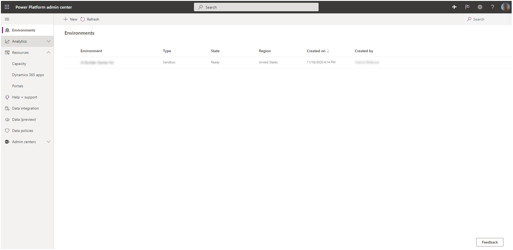
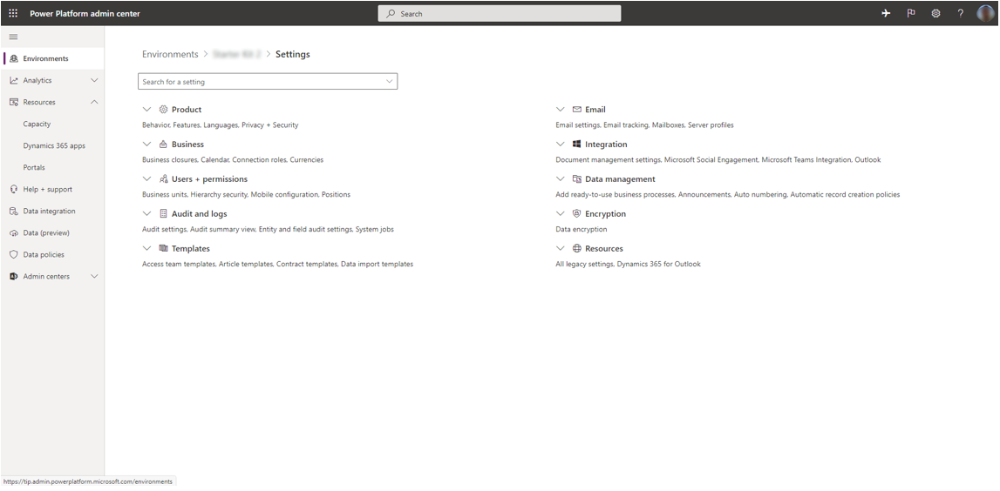
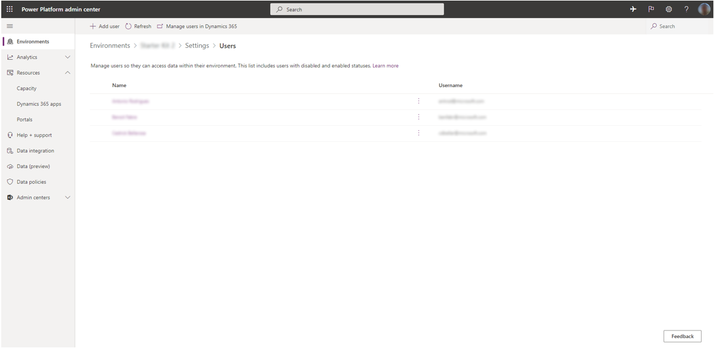
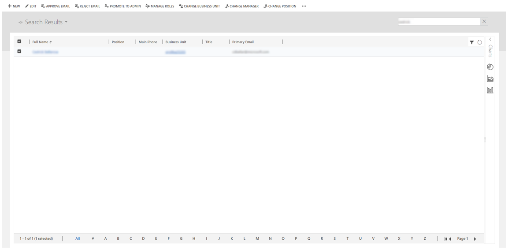
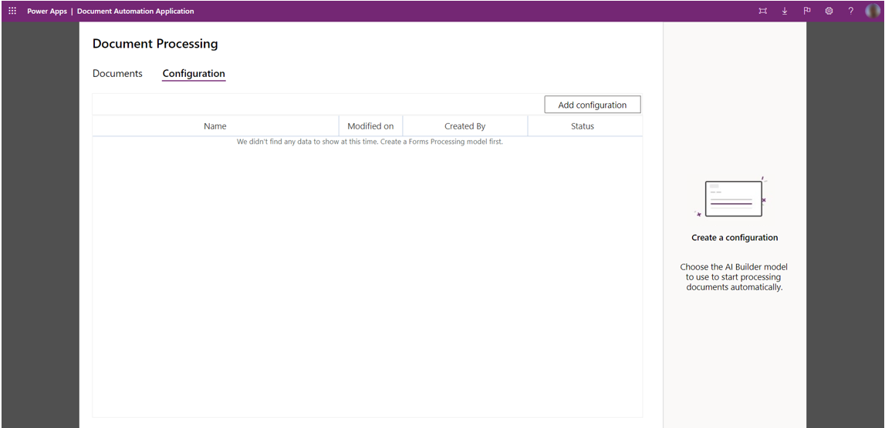
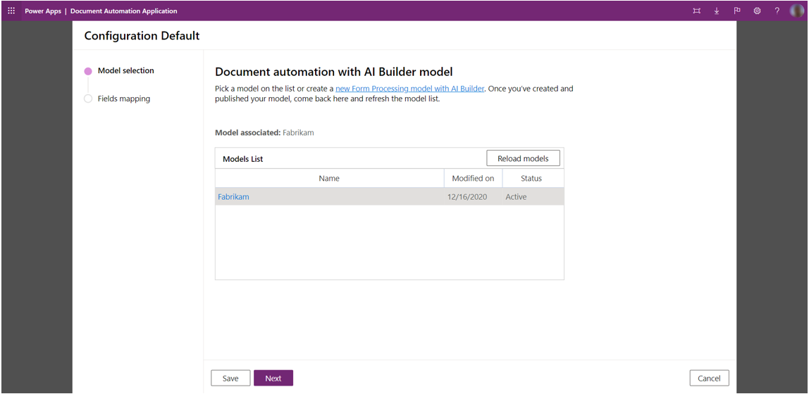
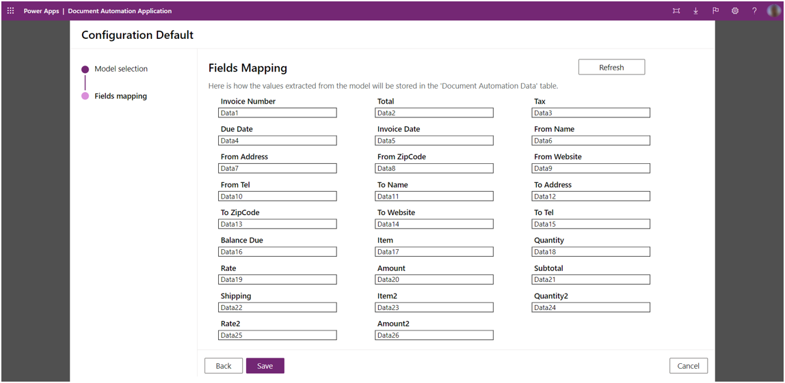

In this unit, you will

- Learn which are the predefined personas supported and which features are available.

- Discover how to configure the roles.

- Understand how to create a forms processing model to extract data from your documents.

- Assess how to prepare the pipeline to process your documents.

The targeted person for configuring roles and permissions should:

- Understand which users must have access to which features.

- Have good knowledge of the Power Platform's role-based access control.

Makers are usually a good fit for this task.

The **Document automation starter kit** provides a basic implementation of role-based access control allowing you to control features available to each persona described in the previous unit, the manual reviewer, and the process owner.

The features available in the validation application by each persona are summarized in the table.

| | Manual Reviewer | Process Owner |
|---|---|---|
|     Controlling Dataverse role                              |     Document Automation Reviewer                                            | System Customizer    |
|     Access the   **Configuration** tab                        |                                                                             |     X                |
|     Configure   the model to use                            |                                                                             |     X                |
|     Access the   **Documents** tab                            |     X                                                                       |     X                |
|     View documents                                          |     Only in **Manual Review** state if not yet opened by another reviewer*    |     X                |
|     Filter   documents list by state                        |                                                                             |     X                |
|     Open the side-by-side   viewer (file/extracted data)    |     X                                                                       |     X                |
|     Edit fields                                             |     X                                                                       |     X                |
|     Validate a   document                                   |     X                                                                       |     X                |
|     Delete a   document                                     |                                                                             |     X                |

*When someone opens a processed document, he automatically assigns it to himself. Other validators will no longer see this document in the list and would get an error if they tried to update it.

> [!NOTE]
> If your company does not need to have role-based access control, you can just assign the **System customizer** role to everybody.

## Configuring roles

1. Open the [Power Platform Admin center](https://tip.admin.powerplatform.microsoft.com/) and select your environment, then select **Settings** on the top.

    > [!div class="mx-imgBorder"]
    > 

1. Expand **Users + permissions** and select **Users**.

    > [!div class="mx-imgBorder"]
    > 

1. Then select **Manage users in Dynamics 365** on the top banner.

    > [!div class="mx-imgBorder"]
    > 

1. Search for a user name, select the user, and select **Manage Roles**.

    > [!div class="mx-imgBorder"]
    > 

1. Add the **System Customizer** role to **Process Owners** or the **Document Automation Reviewer** role to **Manual Reviewers**.

    > [!div class="mx-imgBorder"]
    > 

## Create a form processing model

The next step is to create a Form Processing model that will extract the data from your document with AI Builder.

Follow the module [Get started with Form processing in AI Builder](https://docs.microsoft.com/learn/modules/get-started-with-form-processing/) to learn how to make it.

> [!TIP]
> To create an AI Builder model, you need at least 5 samples of documents. If your suppliers send documents with various layouts, you should consider creating one collection per document type in the model.

## Configuring the model to use

### Role

The targeted person for configuring providers should:

- Have an overview of the suppliers of the company and get samples of these documents.

- Have good knowledge of AI Builder including building a Form Processing model.

Makers are usually a good fit for this task.

Once the model is created, you can use it in the pipeline.

1. Launch the **Document Automation Application** from [Power Automate Document Automation](https://flow.microsoft.com/aibuilder/document-automation) by selecting **Open application**. You will land on the documents list page where you will see all processed documents.

    > [!div class="mx-imgBorder"]
    > 

1. Select the **Configuration** tab, then **Add configuration** to configure the AI model to be used.

    > [!div class="mx-imgBorder"]
    > 

1. You now need to select an AI Builder model to extract labels from documents.

    See [Get started with form processing](https://docs.microsoft.com/learn/modules/get-started-with-form-processing/) to learn how to create an AI Builder form processing model.

    Once your model is created and **published**, you can refresh this page with **Reload models**, select the appropriate model, and select **Next**.

    > [!div class="mx-imgBorder"]
    > 

1. The next screen will show how the labels of the model will be stored in the **Document Automation Data** table of Dataverse. Select **Save**.

    > [!div class="mx-imgBorder"]
    > 

    > [!NOTE]
    > If you update your model changing the label of model, you must get back to this page and use the **Refresh** button to have changes applied to the starter kit and select **Save** again.

1. The kit is ready to perform the document extraction and to automate the processing of your documents.

    > [!div class="mx-imgBorder"]
    > 

You have successfully understood how the **Document automation base kit** allows you to define different security roles and how it must be configured to process your documents.
