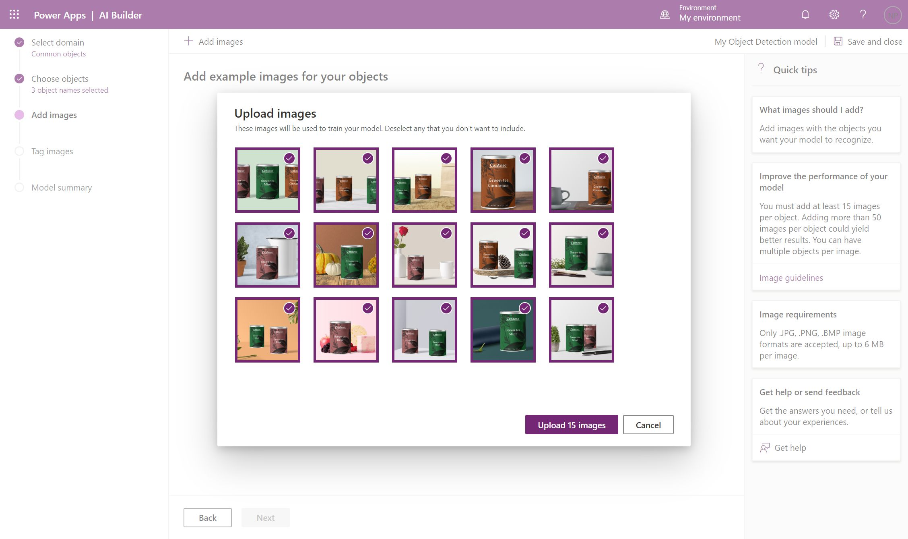
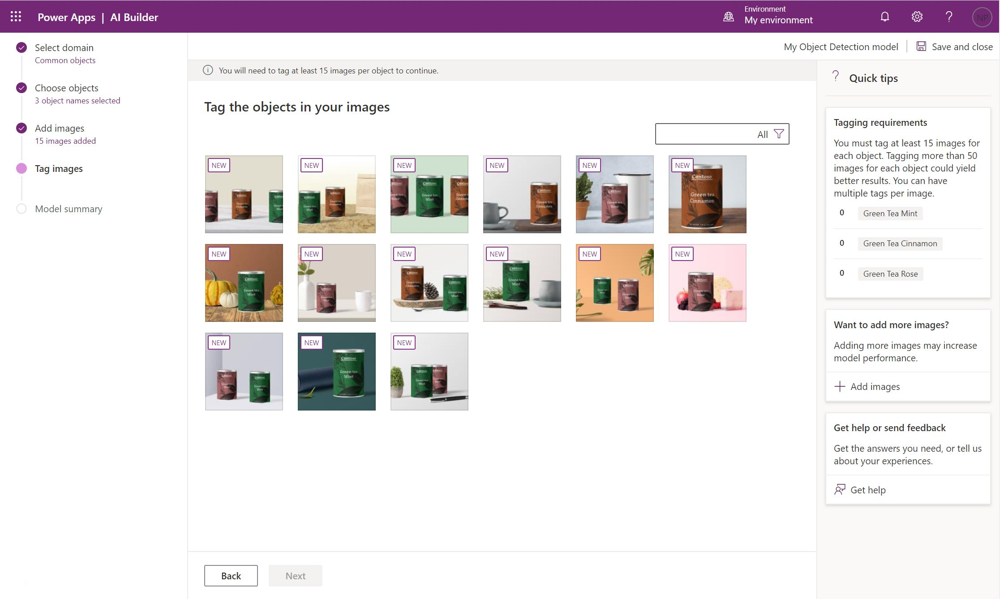
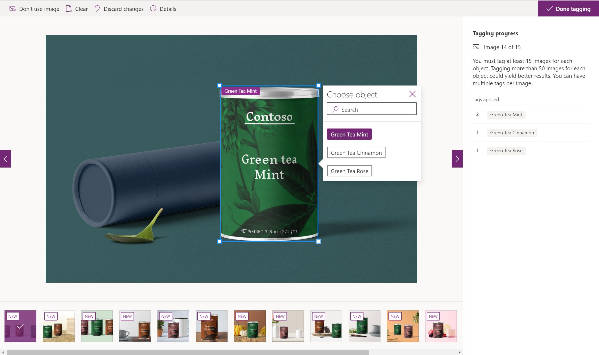

In this unit, you will:

-   Train a simple Object Detection model to recognize tea boxes

-   Test the model you created with additional images

### Sign into AI Builder

Follow these steps to sign into AI Builder:

1.  Go to Power Apps or Power Automate and sign in with your organizational account.

2.  In the left pane, select **AI Builder \> Build**.

3.  Select **Object Detection**.

4.  Enter a name for your model.

5.  If you want to create your model by using your own photos, make sure that you have at least fifteen examples that contain the object you want to recognize. Otherwise, you can use sample data to create the model.

6.  Select **Create**.

This guided experience will walk you through each step of the model creation process. You can save your work and return later at any time. Progress will be saved automatically when you navigate between steps.

If you want to use sample data, download the [**AIBuilder\_Lab.zip**](https://github.com/microsoft/PowerApps-Samples/blob/master/ai-builder/labs/AIBuilder_Lab.zip) file and extract it inside a folder on your computer. The documents that are used in this exercise are located in the **AIBuilder\_Lab\\Lab Images\\ObjectDetection\_Green Tea\\Train** folder.

### Select domain

First you need to select the domain that applies to your model. A domain helps specialize the model algorithm for better accuracy. For the purpose of this exercise, select the default value ***Common objects*** and click ***Next**.*

### Choose objects

You need to define the objects you want to recognize. If you use our sample dataset, type the following object names: *Green Tea Cinnamon*, *Green Tea Mint*, *Green Tea Rose*. Otherwise, type the object names you want to recognize. Then click ***Next**.*

### Add images

1.  Select ***Add images***

2.  Select ***Upload from local storage***

3.  Select at least 15 images. (You would need at least 15 images for each of the object you want to tag. An image can contain multiple objects.)

4.  Click ***Upload images***

5.  Once the images are uploaded, click ***Next***

### Tag images

In that step, you will have to tag your images. You can see which images have already been tagged or not.

1.  Click on an image to start tagging. You'll be presented with a fullscreen experience to do the tagging. The algorithm will suggest bounding boxes the objects in the picture that you can resize to adjust to your object.

You can also click and drag to draw your own boxes.

You can follow the tagging progress on the right panel. You will need to tag at a [minimum]{.underline} 15 images per object (an image can contain multiple object).

2.  When you are finished with the tagging, select **Done tagging**

3.  Select **Next.**

4.  Review the summary of your model's details. If everything looks acceptable, select **Train**.

### Next steps

Now that you've created an object detection model in AI Builder, you'll learn how to test your model and use it in Power Apps and Power Automate.
