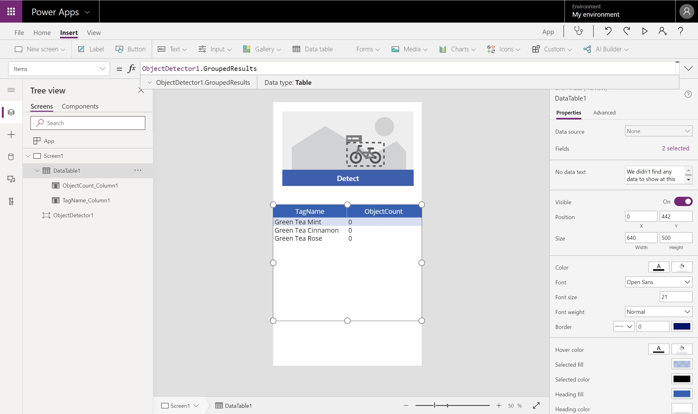

Learn how to use your object detection model in Power Apps.

### Quick test

After your model has completed training, you can view important details about your newly trained model on a details page.

To quickly see your model in action, select **Quick test**.

Drag and drop or upload an image from your device to test. If you are
using sample data, you can go to the **AIBuilder\_Lab\\Lab
Images\\ObjectDetection\_Green Tea\\Test** folder for a test image.

You will now be able to view the detected objects that you chose and the associated confidence scores.

### Publish your model

Your model can't be used until you publish it. If you are satisfied with your model, select **Publish** to make it available for use.

### Use your model in Power Apps

Now that your model is published, you can use your object detection model in a canvas app. A special component is available for you to add that analyzes any image and detect objects based on your trained object detection model.

1.  Select **Use model**.

2.  Select **Create new app** to begin the canvas app creation experience.

3.  Within your canvas app, an object detection component is automatically added and linked to your published object detection model.
Going forward, you can select **Insert \> AI Builder** to view the list of AI Builder components and then select **Object detector** to add an object detector component. You will need to ensure that you select the correct model. Only published models will appear in the drop-down list.

    

4.  Select **Insert** and then add a **Data table** component.

5.  To bind the **Object detector** component to one of the **Data table**, select the **Data table component** and replace the Formula bar value by *ObjectDetector1.GroupedResults*.

    
    
    This will auto-populate the data table with the list of objects that the model can recognized as well as their count in the image.

6.  Select **Play** on the upper right of the Power Apps studio to preview the app.

7.  Select **Detect**, and then select the image that you used to quick test earlier.

A preview of your image shows the recognized objects and update the counts accordingly.
