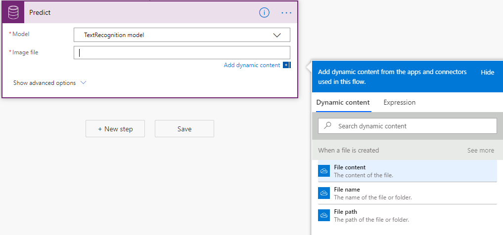
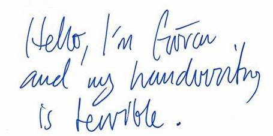
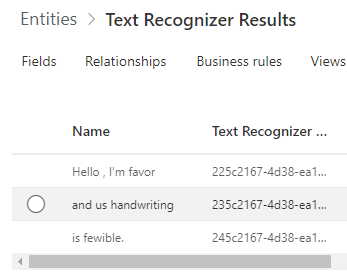

Your task for this exercise is to build a Power Automate flow, check when an image is added to a folder, and trigger AI Builder Text recognition. Then, you will save recognized text in Common Data Service. This process can be useful when automating digitalization of paper forms. For more information, see Create a flow in Power Automate.

### Create a Common Data Service entity to store recognized text
To create a Common Data Service entity to store the recognized text, follow these steps:

1. Go to <https://make.powerapps.com>. 
2. Open the **Data** menu and then the **Entities** submenu.
3. Select the **+New Entity** button, which opens a side panel where you can enter information about the entity. For this example, use **Text Recognizer Results** as the display name.
4. When you are finished, select **Create**. A **Name** field is automatically created, which you will use to store the recognized text.

The following figure shows an example of the entity structure.

You can now create a flow in Power Automate that manages the triggering of AI Builder Text recognition when an image is added to your OneDrive for Business. You can save the result in the entity that you have created.

1. Go to https://flow.microsoft.com/. 
2. Open the **Create** menu. 
3. In the **Start from blank** section, select **Automated flow**. 
4. Enter **Contoso Text Recognition** as the name. 
5. Enter **When a file is created - OneDrive for Business** as the trigger. 
6. When you are finished, select **Create**.

> [!NOTE] 
> You can use any kind of trigger, such as: **When an email arrives in Outlook**, **When a record is created in Common Data Service**, **When an item is created in SharePoint**, and more.

### Set the folder that Power Automate will monitor for new incoming images

In this example, you will set the **Folder** property to the **Images** folder.

### Call AI Builder Text recognition

1. Select **New step**. 
2. Select **Predict - Common Data Service (current environment)**. 
3. Select **TextRecognition model** in the **Model** drop-down menu. 
4. Select **File Content** in the **Image file** drop-down menu.

### Save the result in the entity that you previously created 
Follow these steps to save the result in the entity that you previously created by first iterating on text that was extracted by AI Builder Text recognition:

1. Select **New step**.
2. Select **Apply to each**. 
3. In the **Select an output from previous steps** field, select **Response results**, which will iterate over the various texts that are detected in the image.

### Save the results to the entity

1. Select **Add an action**.
2. Select **Create a new record - Common Data Service**. 
3. In the **Environment** property, enter the environment name where you have previously created the entity. 
4. On the **Entity Name** property, enter **Text Recognizer Results**. 
5. On the **Name** property, select **Response result line detected text**.

> [!NOTE] 
> You can also send the results by email, create a file in SharePoint, and more.

The following image shows what your resulting flow should look like.

Select **Save**, and your flow is now ready to process images.

The following image is an example of a file that you can drop in the **Images** folder of your OneDrive for Business.

Power Automate will automatically process this file, trigger AI Builder Text recognition, and store each line of recognized text in the entity.

