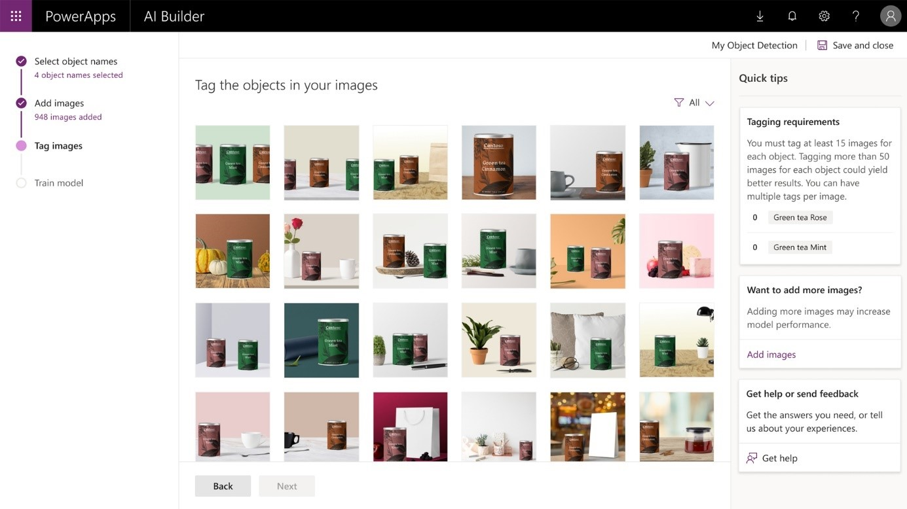

Welcome to AI Builder. This self-paced module will help you build an AI model from the beginning and will show you how to use it in your business without writing a single line of code.

## AI Builder defined

AI Builder is a Microsoft Power Platform capability that helps you improve your
business performance by automating processes and predicting outcomes. By using AI Builder, you can quickly bring AI to your apps and flows that connect to your business data that is stored in the underlying data platform (Microsoft Dataverse) or in various cloud data sources, such as SharePoint, OneDrive, or Azure.

AI models that you create in AI Builder can help provide intelligence to
enhance your business. AI Builder simplifies the AI creation experience
by giving people with any level of technical skill the ability to add AI
capabilities to their apps and flows without writing code. AI
Builder also provides prebuilt AI models, where you don't need to gather
data to build and train the model. You can start to use the intelligence
right away.

## What you can do with AI Builder

You can use AI Builder to create custom AI models that suit the needs of
your business, or you can choose from a selection of prebuilt models.
You can then use the AI from these models in your apps and
workflows.

For example, with AI Builder you can:

- Analyze text for classification, key phrases, language, and
    sentiment.

- Predict whether something will happen.

- Process business card information.

- Process text from images.

- Read and save information from standard documents.

- Recognize and count items in images.

A common use of AI Builder is to automate processes. The following
examples can help you think about how you can use AI in your business:

- **Invoice processing** - Companies often receive invoices in large
    quantities and from a variety of sources, such as mail, fax, email,
    or in person. Processing these documents and manually entering them
    into your database can take considerable time. By
    using AI to extract the text, key/value pairs, and tables from your
    documents, you can create workflows to automatically pipe the
    information into your database. You can even create an app to
    review the information.

- **Text analysis** - Businesses today are collecting more data than
    ever before. Whether it's from survey responses, product reviews,
    user feedback, or support emails, generating the proper insights is
    important to understanding your business and your customers. By using
    AI to analyze text, you can identify customer feedback that contains
    negative sentiment or certain key phrases. Use AI to identify
    problems and then trigger the necessary workflows to take action.

## Where you can use AI Builder

You can access AI Builder within Power Apps and Power Automate.

Two available areas under AI Builder in the left side menu are:

- **Build** - Where you create and get started by using AI models.

- **Models** - Where your created and shared models reside.

## Next steps

Now that you've learned about AI Builder, your next step is to gain in-depth knowledge about the available AI capabilities.
