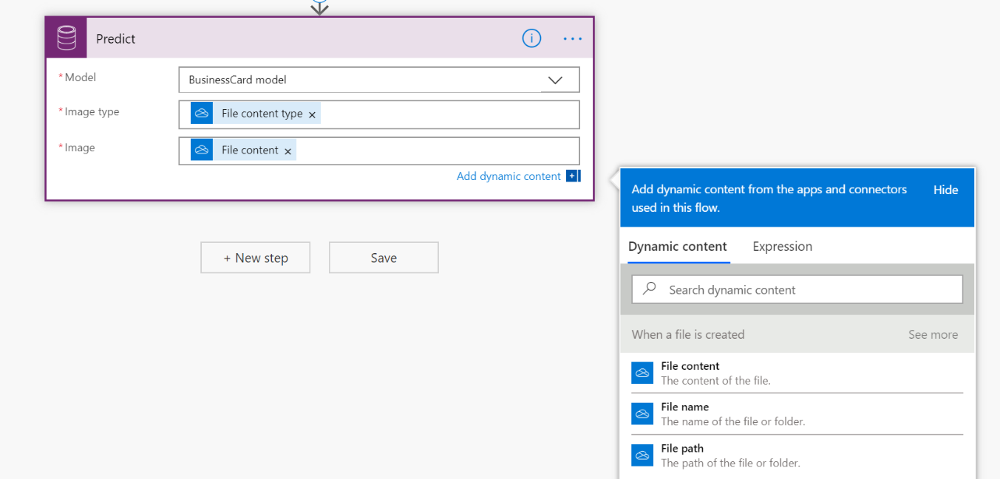

In this unit, you will

-   Develop a simple flow with Power Automate that leverages AI Builder business card reader

-   Experiment with how to automatically process business cards from a OneDrive folder and save recognized text to Common Data Service

We are going to build a Power Automate flow checking when an image is added to a folder and triggering AI Builder business card reader. If the contact information is extracted it is saved in Common Data Service. (See [Use the business card reader prebuilt model in Power Automate](https://docs.microsoft.com/ai-builder/flow-business-card-reader)).

**Create a flow in Power Automate to manage triggering of AI Builder business card reader when an image is added to your OneDrive for Business, and then saves the result in the Contacts entity.**

1. Sign in to <https://flow.microsoft.com/> and open the "Create" menu. 
2. In the "Start from blank" section, click on "Automated flow". 
3. Enter "Contoso Business card reader" as the name.
4. Enter the trigger "When a file is created \-- OneDrive for Business". 
5. Select "Create".

[!NOTE:] 
You can use any kind of trigger like "When an email arrives in Outlook", "When a record is created in Common Data Service", "When an item is created in SharePoint" and more.

**You need to set the folder that Power Automate monitors for new incoming images.**

In this example, we set the "Folder" property of the "When a file is created" step to images folder.

**Next, you need to call AI Builder text recognition.**

1. Click on "New step". 
2. Select "Predict -- Common Data Service (current environment)".
3. Select "BusinessCard model" in the Model dropdown. 
4. Select "File Content" for the "Image" property.
5. Select "File content type" for the "Image type" property.

**Save the result in the Contacts entity.**

1. Select "New step", select "Create a new record--Common Data Service". 
2. Select the environment where the contact should be created in the property "Environment". 
3. Select the "Contacts" entity in the property "Entity Name".

You can map the Contacts entity fields to the extracted fields from the Business Card model. Fields such as first name, last name, address information, email, etc. are available. There are 18 fields currently available today.

[!NOTE:] 
You can also send the results by email, create a file in SharePoint and more.

You should end with following flow. Save and it is now ready to process images.

You can drop a business card image in the "Images" folder of your OneDrive for Business. Power Automate automatically processes this file, trigger AI Builder Business card, and store a new record in the Contacts entity with the extracted data from the business card.

**You have now learned how to integrate AI Builder Business card in Power Automate to automatically process business cards from OneDrive for Business and store results in Common Data Service.**
