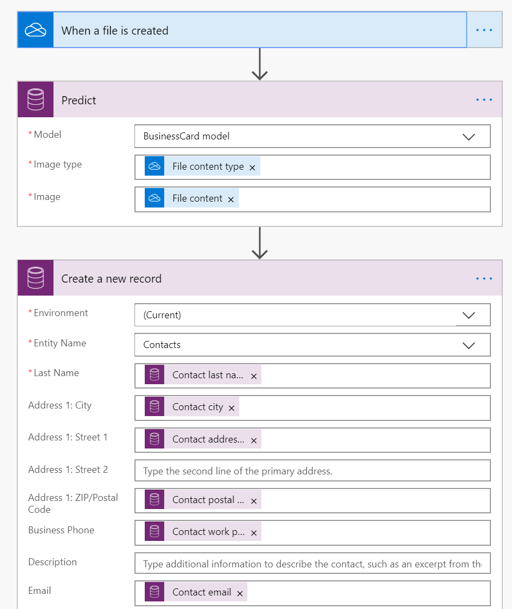

In this exercise, you will build a Power Automate flow to check when an image has been added to a folder and trigger AI Builder Business card reader. If the contact information is extracted, it is saved in Microsoft Dataverse. (See [Use the business card reader prebuilt model in Power Automate](https://docs.microsoft.com/ai-builder/flow-business-card-reader/?azure-portal=true)).

## Create a flow in Power Automate

Create a flow to manage the triggering of AI Builder business card reader when an image is added to your OneDrive for Business, and then save the result in the **Contacts** entity.

1. Sign in to [Power Automate](https://flow.microsoft.com/?azure-portal=true) and open the **Create** menu.
2. In the **Start from blank** section, select **Automated flow**.
3. Enter **Contoso Business card reader** as the name.
4. Enter **When a file is created - OneDrive for Business** as the trigger.
5. Select **Create**.

> [!NOTE]
> You can use any kind of trigger such as "When an email arrives in Outlook," "When a record is created in Dataverse," "When an item is created in SharePoint," and more.

Set the folder that Power Automate will monitor for new incoming images.

For this example, set the **Folder** property to **Images**.

### Call AI Builder Business card reader

To call AI Builder Business card reader, follow these steps:

1. Select **New step**.
2. Select **Predict - Dataverse**.
3. Select **BusinessCard model** in the **Model** drop-down list.
4. Select **File Content** for the **Image** property.
5. Select **File content type** for the **Image type** property.

    

### Save the result in the Contacts entity

To save the result in the **Contacts** entity, follow these steps:

1. Select **New step > Create a new record - Dataverse**.
2. Select the environment where the contact should be created in the **Environment** property.
3. Select the **Contacts** entity in the **Entity Name** property.

You can map the **Contacts** entity fields to the extracted fields from the Business card reader model. Fields for first name, last name, address information, email, and so on, are available. Currently, 18 fields are available.

> [!NOTE]
> You can also send the results by email, create a file in SharePoint, and more.

You should end with following flow. Select **Save**, and your flow is now ready to process images.

You can drop a business card image in the **Images** folder of your OneDrive for Business. Power Automate automatically processes this file, triggers AI Builder Business card reader, and stores a new record in the **Contacts** entity with the extracted data from the business card.

You have now learned how to integrate AI Builder Business card reader in Power Automate, which will help you automatically process business cards from OneDrive for Business and store results in Dataverse.
