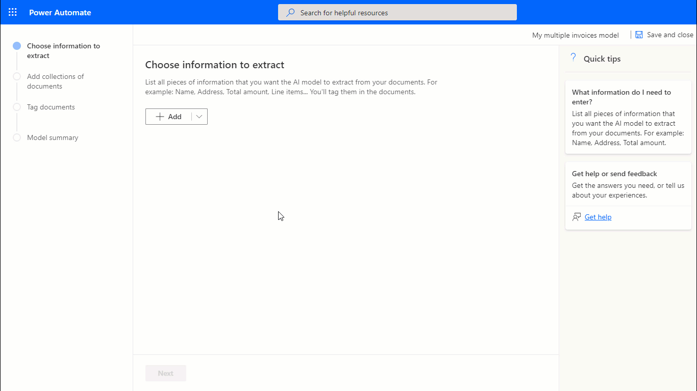
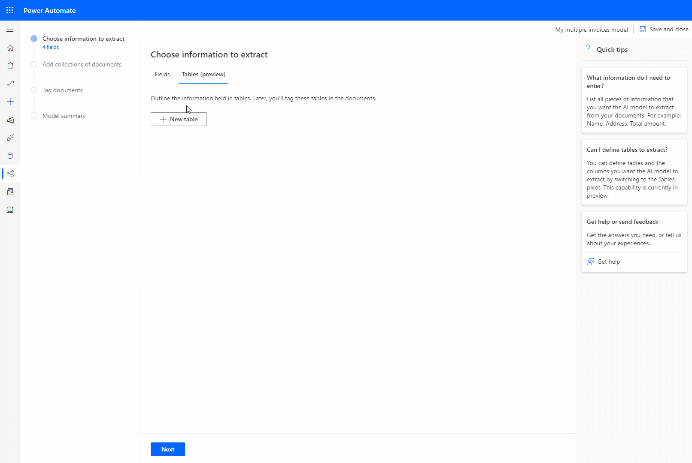
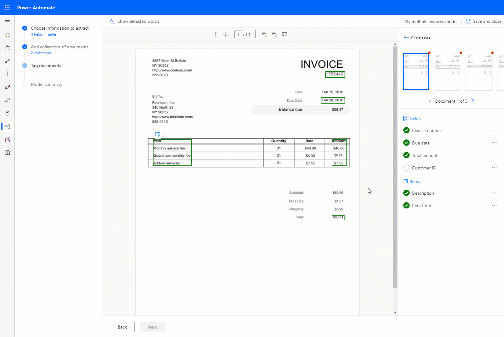
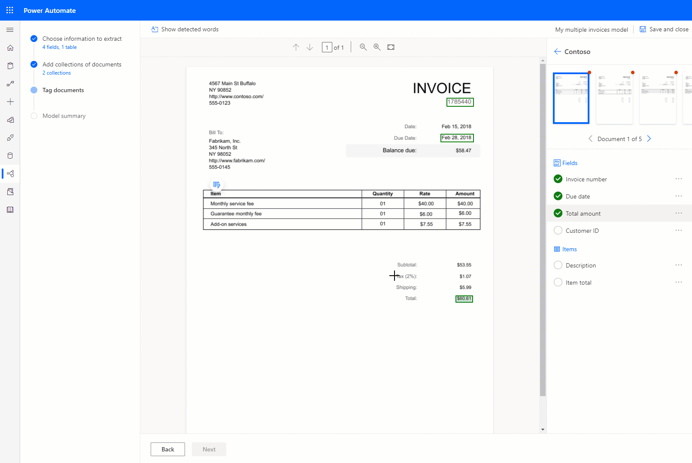
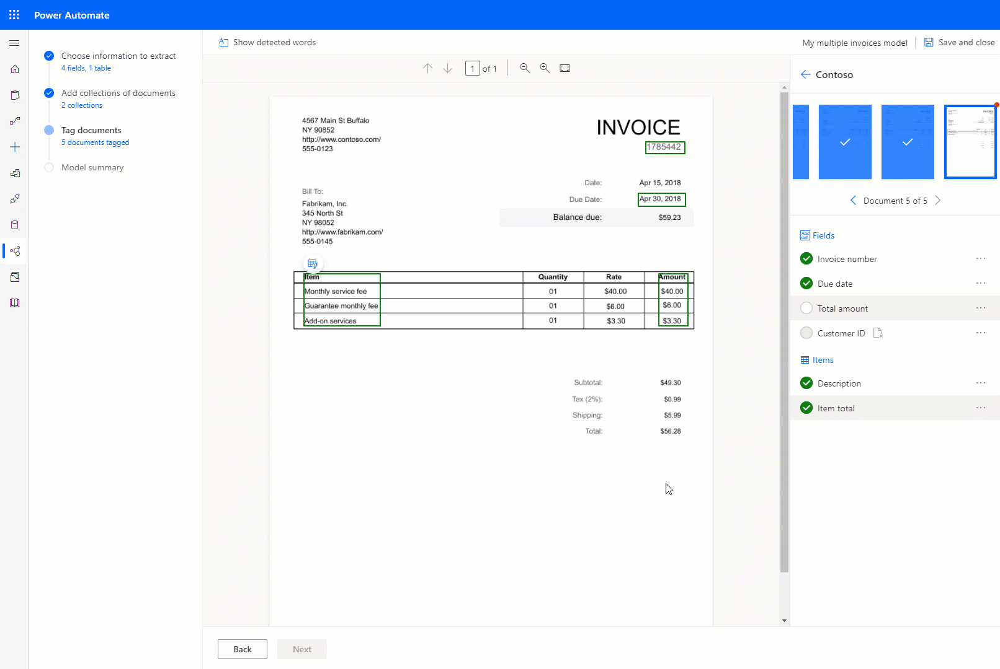

The following procedures will show you how to create a Form processing model in AI Builder. This guided experience will walk through each step of the model creation process. You can save your work and return at any time. Progress will be saved automatically when you go between steps. 

## Sign in to AI Builder

Follow these steps to sign in to AI Builder:

1.  Go to Power Automate or Power Apps and sign in with your organizational account. 
1.  In the left pane, select AI Builder > Build. 
1.  Select Form processing. 
1.  Enter a name for your model. 
1.  If you want to create your model by using your own documents, make sure that you have at least five examples that use the same layout. Otherwise, you can use sample data we will be using in this guided experience. You can download the sample data [here](https://go.microsoft.com/fwlink/?linkid=2128080).  
1.  Select **Create**. 

## Choose information to extract 

In this step you define the fields and tables you want to teach your model how to extract. 
 
The provided [sample data](https://go.microsoft.com/fwlink/?linkid=2128080) are invoices from two different providers. Define the following fields to extract: 

 - Invoice number 
 - Due date 
 - Total amount 
 - Customer ID 

We also want to extract the description and total amount for each line item present on the invoice. Define a table names **Items** and with the columns **Description** and **Item total**. 

## Define collections and upload documents 

A collection is a group of documents that share the same layout. Create as many collections as documents with different layout that you want your model to process. In this guided experience, since we have two invoice providers, and each invoice provider uses a different invoice template we define two collections. 
 
Name the first collection **Adatum** and the second collection **Contoso**.  

 
Now that we have created our two collections we will need to upload at least five samples for each collection. 
 
For the collection named **Adatum**, upload the five documents you will find on the **AI Builder Form processing Sample Data/Adatum/Train** folder. 

For the collection names **Contoso**, upload the five documents you will find on the **AI Builder Form processing Sample Data/Contoso/Train** folder.  
 

 
Once you have uploaded the sample documents to each collection click **Analyze** to continue. During the analysis step, AI Builder examines the documents that you have uploaded, and detects the fields and tables in your document. The time it takes to complete this operation depends on the number of documents provided, but in most cases, it should only take a few minutes.

## Tag documents

Now is the time to teach your AI model how to extract the fields and tables you have defined. You do this by tagging the sample documents you have uploaded.  

To start the tagging process, select a collection on the right panel. 

### Tag fields

Let’s start by tagging our defined fields **Invoice number**, **Due date**, **Total amount**, and **Customer ID**. To tag a field, simply draw a rectangle around the field on the document and select to which field name it corresponds to.

At anytime you can resize to adjust your selection.

When you hover over different words in your documents, light blue boxes appear. These indicate that you can draw a rectangle around those words to select a field.

### Field or table not in document

Not all defined fields and tables need to necessarily be in all documents. If you have started by tagging the Contoso collection, you will see that the field Customer ID is not present. For fields not present in documents, just tell the AI model that this is the case by going to the field or table on the right panel and selecting **‘Not available in the document’** in the three dotted menu.  

### Tag tables

AI Builder can detect tables automatically in your documents. These are indicated by a rounded table button on the upper left of the table. Select that button. You can preview the content detected by the table as well as tag the table. Select **Tag table** and choose the table defined on the first step. Then tag the two columns we want to extract, **Description** and **Item total**.  

> [!NOTE] 
> **Current limitations with tables:** Drawing tables that haven't been automatically detected isn't currently supported. If you defined a table that is not automatically detected, you will need to mark it as not available in document to continue.   
> For AI Builder to detect tables, rows and columns need to be clearly delimited and be properly aligned. Nested tables and merged cells are currently not supported.  

### Tag all documents 

Once you have finished tagging one document, move to the next one to tag by clicking the navigation arrows bellow the document preview on the top right. 

Once you have finished tagging one collection, navigate back to the collection list to tag the second collection.  

## Summary and train

After you have tagged all documents across all collections, follow these steps:

1.  Select **Next**.
2.  Review the summary of your model's details. If everything looks acceptable, select **Train**.

## Next steps

Now that you've created a Form processing model in AI Builder, you'll learn how to test your model and use it in Power Apps and Power Automate. 
