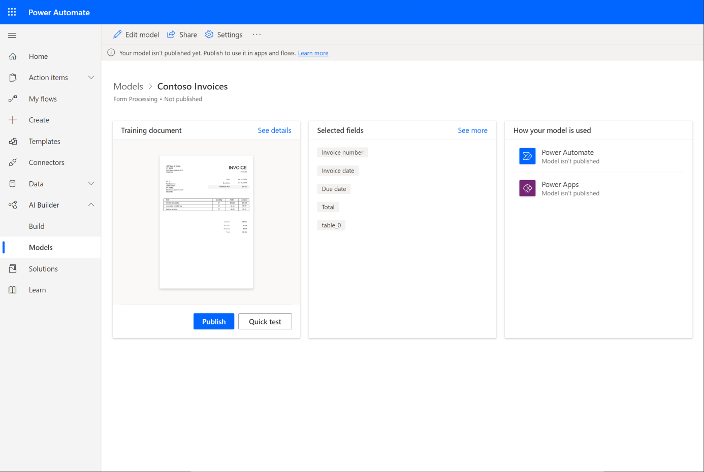
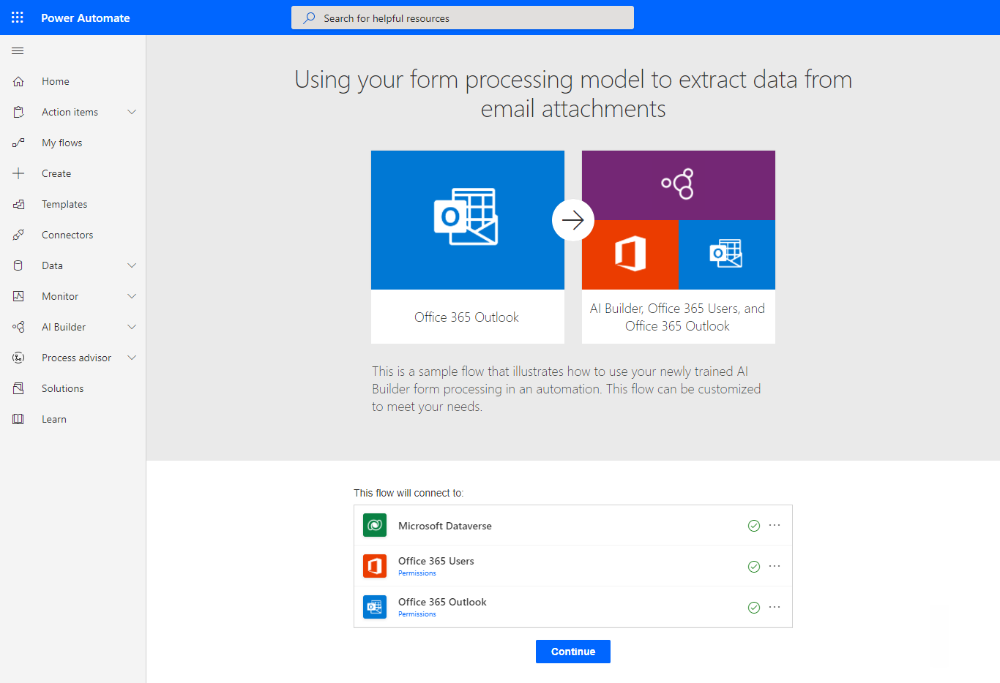

Learn how to use your Form processing model in Power Apps and Power Automate.

## Quick test

After your model has completed training, you can view important details about your newly trained model on a details page.

To see your model in action, select **Quick test**.

Drag and drop or upload an image from your device to test. From the provides sample data, use the files from the Test folders that we didn’t use for training (either from **AI Builder Form processing Sample Data\Adatum\Test** or **AI Builder Form processing Sample Data\Contoso\Test**).

You will now be able to view the detected fields that you chose and the associated confidence scores for retrieving the individual fields compared to the trained model.

## Publish your model

Your model can\'t be used until you publish it. If you are satisfied with your model, select **Publish** to make it available for use.

## Use your model in Power Automate

After your Form processing model is published, you can also use it in a flow. You can use the **AI Builder** action in Power Automate to take advantage of the results of your model.

1. Select **Use model**.

2. Select **+ New flow in Power Automate** and select one of the triggers proposed, for this module we will use the Microsoft 365 Outlook work email account.

3. Make sure that you are signed in to the flow and then select **Continue** to confirm the creation of the flow.

    > 

    The flow has already been configured to run when you receive an email with an attachment and the email subject is: AI Builder. Let's see it in action! 
    
    > 

4. Select **Save** on the top right to test the flow.

5. Select **Test**.

6. Select **Manually** and then select **Test**.

7. Now send yourself an email with the subject **AI Builder** and attach the document you used for quick test previously.

8. After a few seconds, you will see the flow running. The flow will extract the data from the attachment and send you back an email with the results.

Congratulations! You’ve built an intelligent automation flow. You can then customize the flow to your needs to perform any other action you may want. 

## Use your model in Power Apps

Now that your model is published, you can use your Form processing model in a canvas app. A special component is available for you to add that analyzes any image and extracts the text based on your trained Form processing model.

1. Select **Use model**.

2. Select **+ New app in Power Apps** to begin the canvas app creation experience.

3. Within your canvas app, a Form processor component is automatically added and linked to your published Form processing model.

    > Going forward, you can select **Insert > AI Builder** to view the list of AI Builder components and then select **Form processor** to add a Form processor component. Make sure that you select the correct model. Only published models will appear in the drop-down list.

4. Select **Insert** and then add a **Label** component.

5. To bind the **Label** component to one of the form fields, select the **Fields** property on the formula bar. This selection retrieves the details of the extracted form fields.

6. To choose a field to display, select one of the names from the **Fields** property. If you want to select table content, select one of the names from the **Tables** property.

    > 

7. Select **Play** on the upper right of the Power Apps studio to preview the app.

8. Select **Analyze** and then select the image that you used to quick test previously.

    > A preview of your document shows the detected fields and the values that were detected for the fields that you chose.
