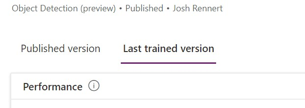

This unit describes how to manage multiple versions of your model.

Getting the best model performance for your business can be a rather
iterative process. Results can vary depending on the customizations you
make to the model, and the training data you provide.

To help facilitate this process, AI Builder allows you to have multiple
versions of your model so you can use your model and continue to improve
it at the same time.

### Edit your model

Editing your model creates a new version that is based on your existing
customizations.

1.  Select AI B    ilder \>Models in the left-side menu.

2.  Find your mod    l and select it to go to its details page.

3.  In the top left corner of the screen, click New version.
    
While you edit your model, you can save your work at any time and come
back later. The new version will be saved as a draft, which you can
access again from    your model's details page and selecting Resume draft.

### Work with multiple versions
    
You can have three versions of your model at any given time:

-   One publish    d version

-   One 'last tra    ned' non-published version

-   One draft version
    
On the model details page, you can switch between the trained versions
using the pivots at the top of the page.
    

    
When you edit your model, if you have a published version and a last
trained version,     ou can start from the configuration of either version.

### What's next?
    
In this next unit, we'll learn how you can share your model so others in
your organization can use it.
    