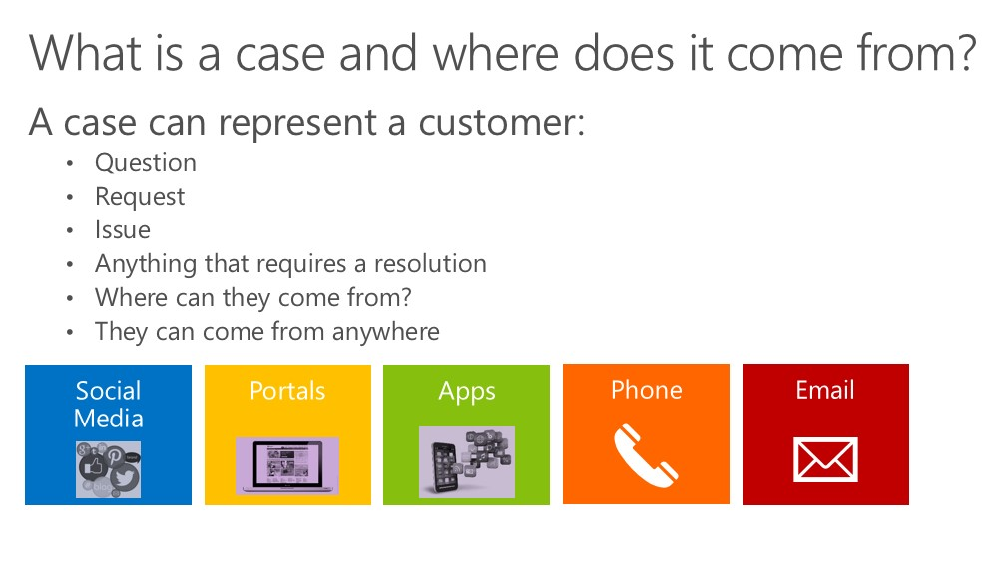
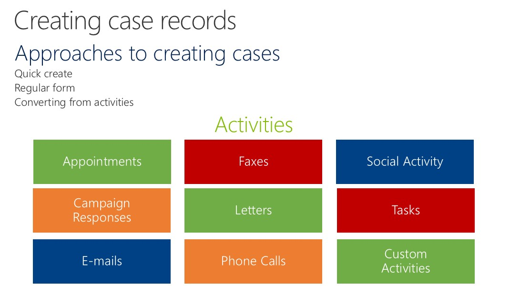

## Manage Cases
You want to understand how your organization measures success to gain insight into core priorities and drivers. Only then can you understand what data modeling, security requirements, and customization needs to be done.

While every organization will have different items they focus on as part of their practice, there are many different key performance indicators (KPI’s) that are common.  Some of the more common customer service key performance indicators are:

- **First Contact Resolution (FCR)**: FCR tracks how often an organization is properly addressing the customer's need the first time they call, thereby eliminating the need for the customer to follow up with a second call.

- **Net Promoter Score (NPS)**: NPS is a management tool that can be used to gauge the loyalty of a firm's customer relationships.

- **Customer Satisfaction (CSAT) and Customer Effort Scores**: These scores describe many different types of customer service survey questions. The goal of any CSAT score is to measure a customer's satisfaction level with your company's product. The Customer Effort Score measures how much time and effort the customer spent in getting a problem fixed, and is a strong measure of future customer loyalty. In other words, customers aren't happy if they spend too much time resolving a problem.

- **Cost per Contact**: This is a call center metric calculated by dividing the total operational costs by the total number of calls for a given period (or the average, broken out by channels).

- **Wait Time and backlog metrics**:  This indicates the average time that customers are spending on hold waiting for an agent to take their call.  Tracking backlog tracks the number of open cases or tickets for any time period.

- **Average Handle Time**: This indicates the average duration of one transaction, typically measured from the customer's initiation of the call and including any hold time, talk time and related tasks that follow the transaction.

## Case Management
Cases are the fundamental record type in service management, and represent a single incident of service. Organizations may refer to cases using different terms, including incident, ticket, service request, and so forth. A customer can have many cases associated with their record at any time. Within Microsoft Dynamics 365 for Customer Service, users can see open and resolved cases from the customer record.
 
Cases can also have knowledge base articles, subjects, products, and entitlements associated with them as related or dependent record types. In addition to these related entities, cases can have activities (such as any communication records) associated with them so that everyone in the organization can see what is happening with a case.

## Creating Case Records
Activity record types, sometimes referred to as "activities" can be used to manage and report on interactions with customers and potential customers, such as accounts, contacts and leads. Activities can also be associated with most other record types in Microsoft Dynamics 365 for Customer Service, including cases.  Activities include:
- E-mails
- Phone calls
- Appointments
- Faxes
- Service activities
- Campaign responses
- Letters

In addition, custom activity types can be created by users with the right security privileges. 

In some cases, the information that is required to create a case is already contained in an activity. In these situations, it is easier to convert that information into a case than it is to create a new case and re-enter the information.

