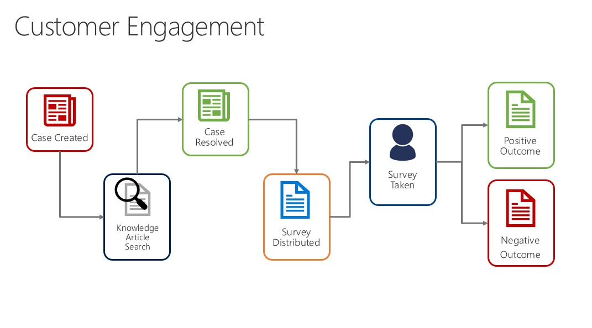
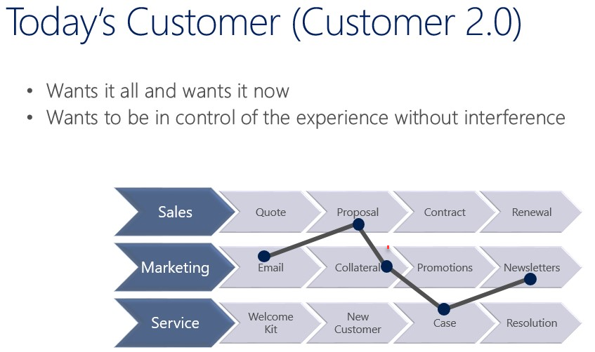

## Overview of Dynamics 365 for Customer Service

Customer service is key aspect of any customer relationship management strategy. Microsoft Dynamics 365 for Customer Service has many features that organizations can use to manage the services they provide to customers.

### Dynamics 365 for Customer Service - Agent interface

This short video shows how Dynamics 365 is used for customer service.

### Overview of the customer service landscape

To help you better understand the context of customer service, let's review some real-life customer scenarios.

**Addressing and solving customer or product issues**: Paul Cannon is a customer of Contoso Bicycles. He recently discovered that the suspension on his Contoso mountain bike is defective and isn't working correctly. Paul contacts Contoso Bicycles to discuss the issue and get help with his bike. The issue is logged in the Mountain Bikes Support Request queue. 

Rob, the Mountain Bikes Support Specialist for Contoso Bicycles, receives the issue through Customer Service. He then works with Paul to schedule a service activity to repair or replace the defective suspension.

**Receiving and answering customer questions**: Jim Glynn is a customer of Fabrikam Furniture. He recently received a table that he bought through the Fabrikam website. Although Jim tries to assemble the table, he isn't sure he's doing it correctly. Therefore, he contacts Fabrikam Furniture to ask questions and get help with his table. 

Sidney, a Customer Support Specialist at Fabrikam Furniture, receives Jim's questions. He uses the Knowledge Base in Customer Service to find a frequently asked questions (FAQ) document for the table. He then uses that document to help answer Jim's questions.

**Collecting and applying customer feedback**: Maria is the Products Manager for Tables and Chairs at Fabrikam Furniture. She wants to collect feedback about the at-home assembly process when customers contact Fabrikam. She uses the case management functionality of Customer Service to capture this feedback. She can also analyze the tables and chairs that cause more issues during at-home assembly, and those that are easier to assemble. Additionally, Maria can determine which instructions for at-home assembly of tables and chairs must be prioritized for editing and review.

### Understanding today's customer
Customers today are more informed than ever. Customers are used to having what they want, when they want it, the way they want it. 
 
Think of the typical process of buying a TV:

1. Before you go to the store to buy the item, you probably do some research on the internet.
1. You might select several TVs, and compare the different options and features.
1. You'll likely check out customer reviews and determine which TV you think is best before you set foot in a store.
1. After you're in the store, you might engage with a sales rep, but you already have a good idea of what you're looking for.

The same process can be applied across different experiences. Customers want to be in control of the experience, and they prefer little or no interference as they work through the process. Customers should have the flexibility to drive the engagement experience but still be able to engage with live agents. But any such engagement should be on *their* terms.

### Trends influencing customer service
There are many trends that are currently affecting how customer service works. As a service organization, it's important that you understand what those trends are and how you can take advantage of them to enhance and drive the customer experience. Here are some of the trends influencing service today:

- **Mobile devices**: With so many mobile devices available today, people are no longer engaging with customer service just through a phone call or email. They want to be able to access portal information on their mobile devices or engage with an agent through a chat that they initiate on their device. 
- **Social media**: People aren't usually shy when it comes to expressing their thoughts and opinions on social media. You must be able to take advantage of this platform to ensure that customer issues or complaints are handled the same way they would be if the customer engaged directly with support.
- **Self-service**: Self-service can mean different things:

    - It can be as simple as providing a knowledge base that customers can use to find answers to simple procedural questions. 
    - It can involve letting customers manage their accounts.
    - Sometimes, it can involve giving customers a way to engage with other customers who are in the same situation.

- **Internet of Things**: With more and more devices connected to the internet and communicating back and forth, it's important to take advantage of the technology used on these devices to engage in service calls. Here are some of the ways this can be done:

    - Anomaly detection
    - Predictive maintenance
    - Just using the data that's collected to help drive service offerings in the future

- **Customer engagement**: Engagement is more than just reaching out to gain customers opinions. It can include knowing these details:

    - When is the right time to engage?
    - What channels should be used?
    - What information should you collect?
