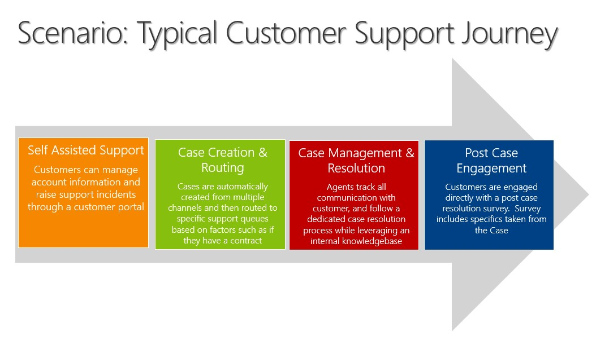
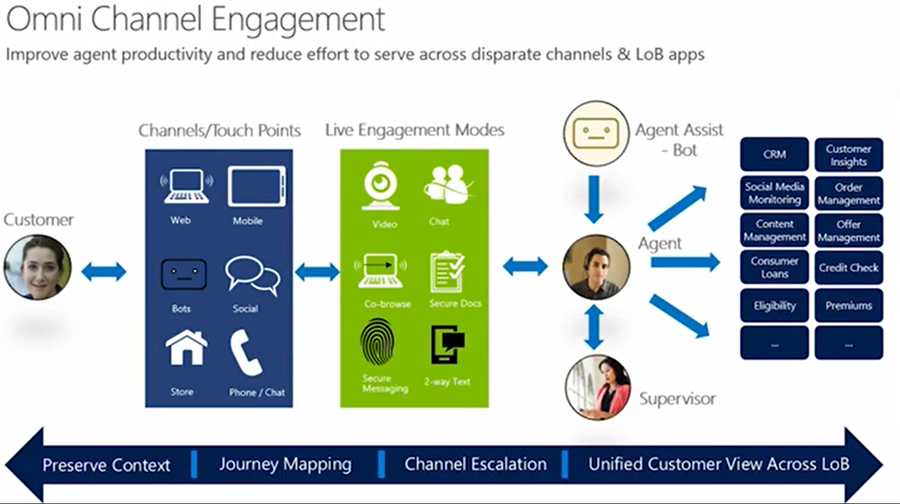

## Modern customer journey

> [!VIDEO https://www.microsoft.com/en-us/videoplayer/embed/RE2rlss]

Service has changed drastically over the last five to ten years. In the past, a customer would call and be put on hold until somebody picked up the phone to help. Today, the support landscape looks very different. 

Today's customer starts a support journey from multiple starting points. 

With the advent of self-service capabilities, customers can now start educating themselves by using any of these resources:

- Portals with an interactive bot
- Live assisted chat windows
- Interactive kiosks
- A mobile app deployed by the customer's organization
- Remote sharing of screens between a service agent and the customer
- Any number of social networks, including Facebook and Twitter

As this list shows, we can never be certain just where the customer is coming from. Therefore, we must be prepared, with all possible channels and media open and listening.

### Customer perspective and expectations
It isn't enough just to have a bunch of different channels. Your service organization must be integrated, so that:

- All the support channels have the same information. You don't want the advice that your bots give to differ from the advice that a customer representative would give.
- Your support channels are seamlessly connected. You want information to be able to pass easily from one channel to the other.

And the complexity doesn't stop there. In general, the modern service company must consider the following:

- **Social media**: Customers are highly active on social media. And don't expect them to leave comments about just the things they like. They'll also comment—loudly—about what they don't like. What's more, many of their friends—your potential customers—are listening to those comments and forming their own opinions of your company.
- **Company size**: Companies often want to target both small and enterprise customers through the same channels.
- **Support for contract and non-contract customers**: Everyone gets support, not just those with service level agreements (SLAs). Again, you don't know where new customers are coming from.
- **Fast response times**: Customers expect fast response times. If you can't give them a timely response, they'll go elsewhere—maybe even to your competitors, who might have a better support channel in place.
- **On-site support**: Sometimes, customers can't be helped online. In this case, they often expect the service company to visit them at their place of business or in the field to resolve an issue. 

### Typical customer journey

The typical customer will follow a specific path to get a resolution to an issue:

1. **Self-assistance**: When people need help, the first thing they do is go on the internet and see if they can fix the issue themselves. They'll visit a few forums and newsgroups, and ask a few questions, hoping for a quick fix. They might visit the company's website and do some research while looking around in the documentation.
1. **Initial case creation and routing**: Cases will be generated from multiple channels. They can then be routed to specific queues, based on factors like whether there's a contract, whether the customer is a preferred customer, or whether a technician who's qualified to handle the issue is available on a specific queue.
1. **Case management and resolution**: A service agent will now track all communication with the customer and follow a dedicated case resolution process while using an internal knowledge base. At this point, customer communication can be through email, text messages, or a phone call. Cases are typically tracked to create a historical log of what happened with the customer. The knowledge base will also be built out, so that other service representatives can take advantage of knowledge from past cases.
1. **Post-case activities**: Customer service organizations are paying more and more attention to what they do *after* a case is resolved. These post-case activities are now seen as critical. Companies now want to get feedback from customers about the quality of the interaction, as a way to keep channels open and encourage the customer to stay with the company. To gain more insights from the case and further build out their knowledge base, companies might send customers a survey with specifics of the case.

In the modern world, this is typically how customers interact with a support company.