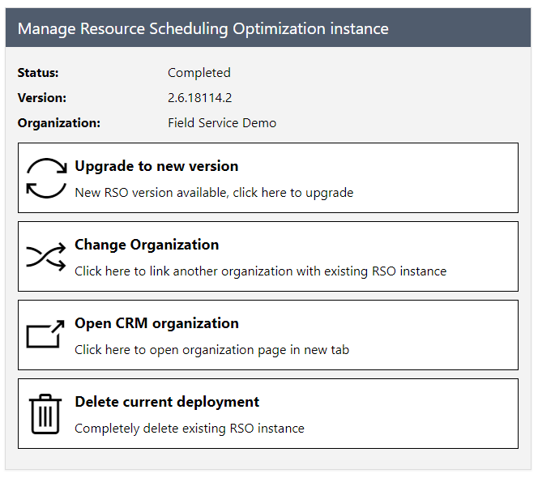
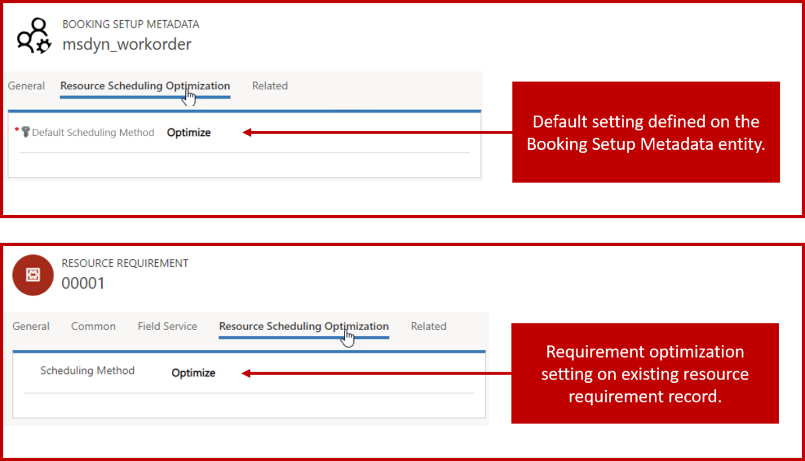
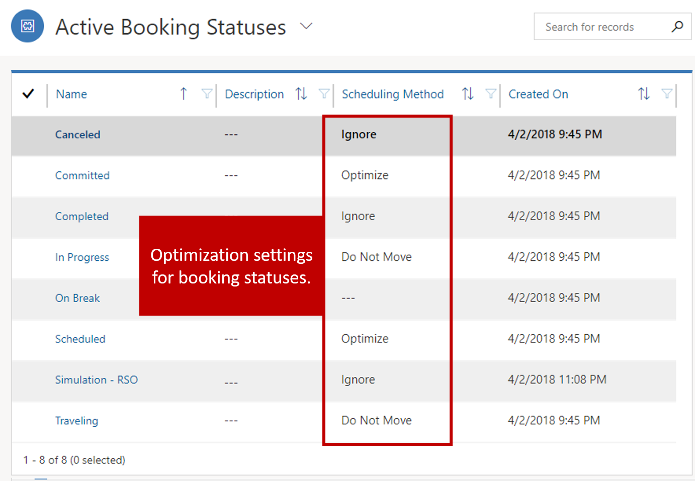

By default, all scheduling for an organization will either be done manually or with help from the schedule assistant. Organizations that require automated scheduling and optimization can purchase the Resource
Scheduling Optimization (RSO) add on solution. Once purchased, the solution can be deployed to a specific Dynamics 365 instance from the
Dynamics 365 Admin center by navigation to the applications tab. The RSO
application will be listed in the available applications list. Once
located, it can be configured for a specific instance by selecting the
manage button.

When deploying the solution, you will need to provide the organization
it should be deployed to and agree to the licensing agreement. When it
is deployed, RSO creates a Microsoft hosted Azure instance, that hosts
the optimization engine and service. This instance in managed and
maintained by Microsoft and is used only for the RSO deployment. After
the RSO solution has been deployed, it can be managed from this same
area moving forward.

After it is deployed, the RSO instance management screen provides the
following capabilities:

-   **Upgrade to newest version:** The RSO solution is updated regularly, as newer versions become available, the updates can be applied from the management screen.
-   **Change Organization:** Provides the ability to link the existing RSO instance to another organization.
    -   For example, you could change the organization if you wanted to move from a testing to a production organization.
-   **Open CRM Organization:** Allows you to access the Dynamics 365 organization that is associated with the RSO instance.
-   **Delete current Deployment:** This will delete the RSO Azure resources. The RSO solution will remain in your Dynamics 365 environment. It does not impact anything inside the Dynamics 365 organization.

### Initial Configuration

After the solution has been deployed, it will need to be configured
inside your Dynamics 365 instance. Configuring the RSO solution includes
items such as enabling the functionality in your environment and
defining what should be optimized by the solution.

By default, RSO will not be enabled, so it will need to be turned on.
This is done from the either the Resource Scheduling Optimization app or
from the Universal Resource Scheduling app by selecting
**Administration** > **Resource Scheduling Parameters**. When it is
installed, the RSO will add Resource Scheduling Optimization tab. From
the tab you can enable RSO by setting the Enable Resource Scheduling
Optimization field to yes. Additionally, you can define a default goal
for the organization if needed. A default goal helps speed up
interactions with RSO through the schedule board by predefining how the
engine optimizes data. Users can still pick different goals. *(More on
creating a goal can be found in creating Resource Scheduling
Optimization Goals.)*

### Enabling Maps

RSO utilizes mapping functionality to locate the closest resource to
work on an item, so it is important that the organization has enabled
mapping functionality. By default, the connect to maps field will be set
to No. You will need to set this to yes to ensure the schedule board and
schedule assistant will use maps to schedule items. By default, it will
use Bing maps, but you can configure it to work with any mapping
provider, by providing a specific Map API Key value for the mapping
provider you want to use in the Map API Key field. Additionally,
organizations can configure a custom mapping entity to populate items
like longitude and latitude if needed.

### Settings to prepare data for optimization

For RSO to be able to optimize the necessary resources, requirements,
and bookings, you will need to ensure that you have enabled each item
that will need to be optimized. For example, if you want RSO to update
and schedule items for sub-contractors, you will need to ensure that
each contractor is defined in the application as a resource, and that
they are set to be optimized.

### Resource Optimization Configuration

RSO will only optimize the schedules of resources that have been
enabled. To define the resources that can be optimized, you will need to
go to **Resource Scheduling Optimization** \> **Resources**. Navigate to
the scheduling summary view, select one or more resource records, and
then click Edit to bulk edit, and set the Optimize Schedule field to
Yes.

After you enable your resources for RSO, you will also need to ensure
that each resource has valid latitude and longitudes defined based on
their starting and ending locations.

-   **Start Location:** Defines where the resource begins there day. This is used to assist in route mapping for the resource.
-   **End Location:** Defines where the resource ends there day. This is used to assist in route mapping for the resource.
-   **Organizational Unit:** Defines the specific organization unit that the resource belongs to and will be schedule out of.
When you define a starting and ending location, you have three options that you can define:
-   **Organization Unit Address:** Uses the latitude and longitude associated with the Organizational Units that the resource belongs to.
-   **Resource Address:** Uses the latitude and longitude associated with the corresponding record based on the resource type:
    -   **Resource Type -- User:** Uses the latitude and longitude associated with the address defined on their Office 365 user record.
    -   **Resource Type -- Contact:** Uses the latitude and longitude associated with the address defined on their Dynamics 365 contact record.
    -   **Resource Type = Account:** Uses the latitude and longitude associated with the address defined on their Dynamics 365 account record.
-   **Location Agnostic:** Does not have a specific location defined. Can be useful when resources do not have a clearly defined starting and ending location.

> [!IMPORTANT] 
> The start and end locations must have the same setting. For example, you cannot have the start location be a personal address and the end location be location agnostic.

### Requirement Optimization Configuration

Requirements are one of the key items that will potentially be optimized
by RSO. For example, when a work order is created, a resource
requirement record is also created. To ensure that the resource
requirement that is created can be scheduled by the optimization engine,
it needs to be enabled for optimization. This can be done by configuring
the booking setup metadata for the work order entity. To configure the
booking setup meta data, navigate to **Resource Scheduling
Optimization** \> **Administration** \> **Enable Entities for
Scheduling**. After you select the entity you want to configure, you can
set the default scheduling method to optimize. For example, if the work
order entity's booking setup metadata is set to optimize, every newly
created work order and related resource requirement will be configured
to optimize automatically.

If you have existing resource requirement records that were created
before the optimization setting was defined, you will need to update the
resource requirements scheduling method to be optimized. Go to
**Resource Scheduling Optimization** \> **Resource Requirements,**
navigate to the unscheduled work order requirements view, select the
existing requirements you want to optimize, click Edit to bulk edit, and
set the Optimize Schedule field to Yes.

> [!IMPORTANT] 
> The work location must be set to on-site or location
agnostic. If on-site is the requirement, latitude and longitude values
must exist. These will typically be populated automatically to the work
order based on the address of the account the work order is associated
with. Ensure these values are being populated for any resource
requirement you want to schedule.*

### Booking Status Optimization Configuration

The final step in the configuration process is to ensure that you have
defined how RSO should handle each booking status defined in the system.
Bookings status are associated with any bookings that have been created.
Bookings typically represent scheduled items on the schedule board. Not
all bookings should be optimized. For example, is a technician is
currently working on an item, the booking status will be set to in
progress. We should not optimize that item, because the technician is
actively working on it. However, if the booking status is scheduled, and
the technician has not yet started on that item, therefore it could be
optimized.

You can configure the optimization settings for any booking status
defined in the system by navigating to Booking Statuses in the Resource
Scheduling Optimization app.

There are three optimizations options available:

-   **Optimize:** RSO is free to move this booking around.

-   **Do Not Move:** RSO does not alter the booking.

    -   RSO preserves the estimated arrival time and assigned resource.

    -   The booking's start time and estimated travel duration may be changed if RSO schedules a booking in a new location before the Do Not Move booking.

    -   This operates the same as if the user set the booking to locked to resource + time on the scheduling lock options field.

-   **Ignore:** RSO will completely ignore this booking.

    -   It will ignore for both location and time, meaning there will be overlaps. It is as if the booking does not exist. Use this when the booking status is in the state of proposed or canceled.

