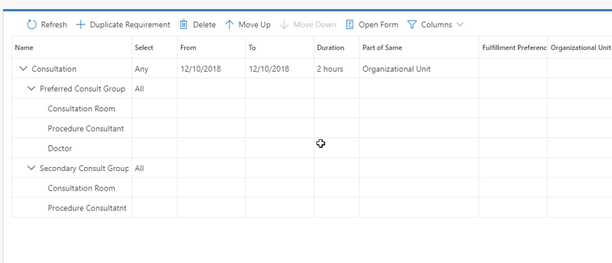
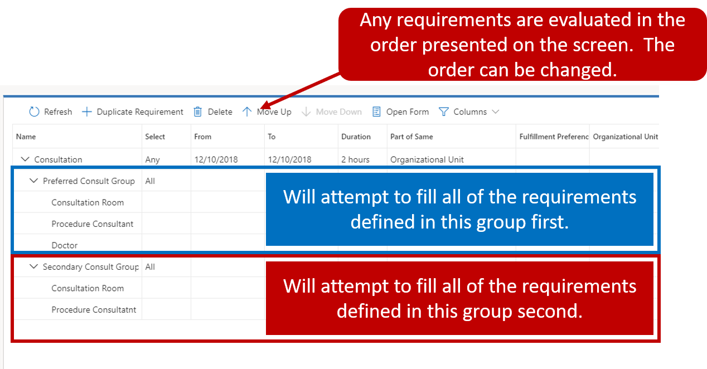
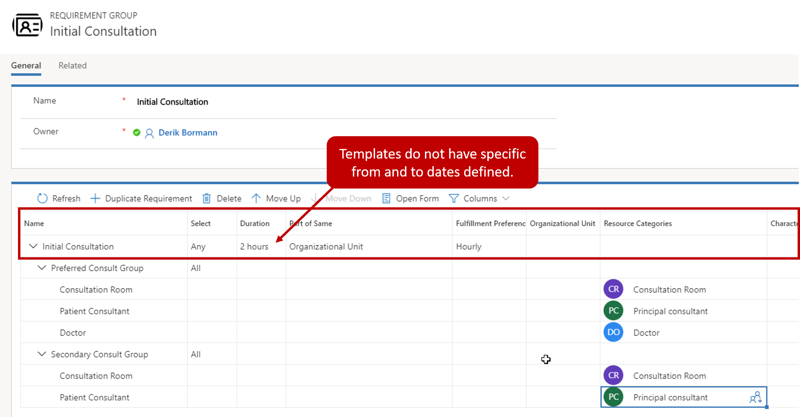

Typically, when a record that is enabled for scheduling like a work order is created, a corresponding resource requirement record is also created. The resource requirement defines the details about a resource
that will be needed to schedule the item.

For example, when a work order is created, a resource requirement record might include:

-   The date windows the customer prefers or has been promised.
-   The territory the customer belongs to.
-   Any skills and/or certifications a resource should possess to work on the work order.
-   Any resource preferences the customer has.

While the resource requirement record does a great job of communicating specific needs for a single resource. Often, organizations will require multiple resources to complete a specific job or appointment. For example, an automotive service center may have multiple service bays and multiple technicians. Each service technician may have specific skills. When a customer wants to book a service appointment, the dispatcher needs to ensure that they have a service bay available, and depending on the job, at least one qualified technician to complete the appointment.

To accomplish this, we would need more than one resource requirement record. We would need at least two:

-   A requirement for the service bay.
-   A requirement for each technician.

## Requirement Group

A resource requirement group creates and groups multiple requirements together for scheduling. This enables dispatchers to schedule an entire team of resources for one single work order. For example, in the previous mentioned scenario, a requirement group would be created that included requirements for each technician and service bay that is needed. When a resource group is created, requirements can be added directly to the group, or sub-groups could be defined to provide additional flexibility.

For example, a resource group has been created for consultations. It contains two sub-groups:

-   Preferred Group
    -   Consult Room
    -   Procedure Consultant
    -   Doctor
-   Secondary Group
    -   Consult Room
    -   Procedure Consultant
   

When a requirement group is created, it is possible to specify if all the requirements need to be fulfilled or if only some need to be fulfilled. This can be accomplished using the select column. The select
column contains two options:

-   **All:** Specifies that every defined requirement need to be fulfilled.
-   **Any:** Specifies that only one of the defined requirements needs to be fulfilled.

For example, we can see in the image that any was selected for the consultation service. This states that we only need to fill either the preferred consult group or the secondary consult group requirement but not both. We have also defined that for each sub-group, we would need to fulfill all the resource requirements. One last consideration is the order in which the sub-groups and requirements are showing. Since the consultation group is set to any, and the preferred consult group is listed first, this is the requirement that it will attempt to fill first. If it cannot fulfill the requirement, it will move to the secondary consult group which does not include a doctor requirement.

The sub-grid provides many options to assist in the creation of the individual requirements. This includes duplicating requirements, deleting requirements, and even the ability to edit groups, sub-groups,
and requirements inline directly on the grid. Some of the settings available that can be edited on the grid can be defined at a group level, and some of the settings can be defined at an individual requirement level.

For example, requirement group items are defined such as:

-   **From and to windows:** Defines the dates that the requirement group record applies to. The dates are automatically added to any requirement records that are created for the group.
-   **Duration:** Defines the duration the appointment should take. Like the dates, the duration is automatically added to any requirement records created for the group.
-   **Part of same:** Allows you to define if the resources should belong to the same organizational unit, resource tree, or location.
-   **Fulfillment preferences:** Defines if there are any fulfillment preferences that should be used when suggesting resources.

Any other filter criteria are defined on the individual requirement records themselves. This includes specifying items like characteristics, categories, or preferred resources level. Some of the criteria can be
modified directly on the requirement sub-grid. Each requirement record can be opened, and criteria can be define using the requirement form.

Additional items to consider at a requirement level are:

-   **Sort option:** Defines how resources should be presented in the search results. There are four options to choose from:
    -   **None:** Does not perform any sorting.
    -   **Randomized:** Presents a randomized available resource.
    -   **Most Busy:** Presents the available resource that has the most bookings.
    -   **Least Busy:** Presents the available resource that has the least bookings.

-   **Effort required:** Defines the number of resources that are required for that type.

## Requirement Group Templates

As you can see from the previous example, a resource group can contain some complex scenarios that can impact how it is scheduled. A resource group that meets the items we defined in the Consultation group would need to be created every time a consultation needs to be scheduled. It would be an unreasonable expectation to assume that a dispatcher will do this every time a consultation is created.

This is where a Requirement Group template come in. A template lets us define the items that are needed for the requirement group. When a resource requirement group needs to be created, we would use the
template to create the group. This would ensure that all the defined requirements exist.

For example, when a work order is created, you can specify an incident type for the work order. An incident type specifies any products, services, tasks, certifications, etc. that should be added to any work order that uses that incident type. When an incident type is created, a requirement group template can be linked to the incident type as a related item. When a work order is created that uses that incident type a requirement group will be automatically created based on the incident type.
