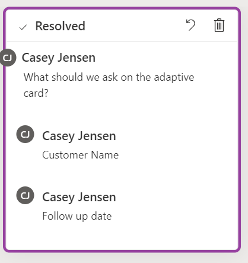
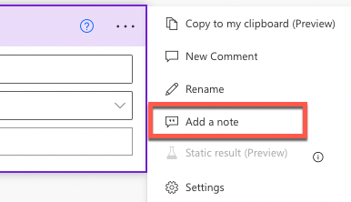
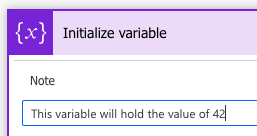

Use comments when creating and maintaining cloud flows to improve documentation and collaboration.

> [!div class="mx-imgBorder"]
> 

The following are some of the key uses of comments:

- Document your flow.

- Use them as to-do items to track remaining work.

- Collaborate with other users.

- Utilize threads to keep related comments together.

- Resolve comments and save them for future reference.

In the following video, you can see the basics of how comments work in cloud flows.

> [!VIDEO https://www.microsoft.com/videoplayer/embed/]

## Get started with comments

The comment feature is enabled for cloud flows edited in Power Platform environments that have Microsoft Dataverse configured. Your cloud flow doesn't need to be in a Dataverse solution or use any of the Dataverse connector actions. Dataverse is used to store the comments. If you're using Dataverse solutions, you can only add comments to cloud flows in unmanaged solutions, which typically happens in the development environments.

Once you've saved your flow the first time, you can start adding comments from the trigger or any action step in the cloud flow.

> [!div class="mx-imgBorder"]
> 

You can also open the comments pane and add a comment from there. The comment will be associated with the currently selected trigger or action when added from the comment pane.

> [!div class="mx-imgBorder"]
> 

You can see which steps in the flow have comments by looking for the comment icon with a count in the step header.

> [!div class="mx-imgBorder"]
> 

The comment icon doesn't show for control actions like condition, switch, and scope. However, if you select a comment in the comment pane, the associated step in the flow will be expanded and selected. This allows you to have the context of what the comment was about.

As comments are added, they're displayed in the comments pane in the order added, oldest to newest. You can add multiple comments on each step, or you can reply to an existing comment to start a thread of related comments.

> [!div class="mx-imgBorder"]
> 

Comments can be edited, resolved, or deleted. Replies to comments can only be edited and deleted. Resolving a comment marks the comment as resolved, and no one can make further edits or replies. Resolving is a good way to retain some history on the cloud flow but to track what remains outstanding. The following screenshot shows a resolved comment.

> [!div class="mx-imgBorder"]
> 

## Collaborate with others

Comments can be used to collaborate with other users allowing you to get help or seek input on the flow. Any user that is a co-owner of a cloud flow can see and add comments. You can @mention a user in a comment or reply to notify them of your comment.

> [!div class="mx-imgBorder"]
> 

You can @mention any existing co-owner. If the cloud flow is in a Dataverse solution, you need to add users manually as co-owners before you can @mention them. For non-solution cloud flows, it will prompt you to Share and notify.

> [!div class="mx-imgBorder"]
> 

> [!Important]
> You should only add trusted users who you want to have full access to your cloud flow as a co-owner.

The user you mentioned will receive an email inviting them to view the flow.

> [!div class="mx-imgBorder"]
> 

## Notes and comments

You may be already familiar with the concept of notes that you can add to any step in a flow:

> [!div class="mx-imgBorder"]
> 

> [!div class="mx-imgBorder"]
> 

The primary objective of the notes is to add a description to the step, making it easier to understand the step's purpose and to document complex expressions.

Comments extend this concept to enable multiple comments and collaboration. Comments can also be seen listed all together in the comment pane without having to open each step in the flow.

In the rest of this module, we'll explore more details on how you can use comments in your cloud flow to be more productive.
