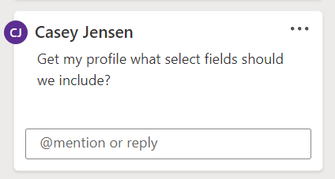

Cloud flow comments are designed to make you more productive when building flows. There's no right or wrong way to use them. Give comments a try to find what works best for you. In this article, we'll explore a few ideas you can try when using comments with your cloud flows.

## Include the step title

You can select a comment in the comment pane, and it will highlight the step. However, if you have numerous comments and are looking at the comment pane list, if the comment has the step title, it can make it easier to corelate with the step it belongs to. In the following example, **Get my profile** (the title of the step commented on) was included at the beginning to give context.

> [!div class="mx-imgBorder"]
> 

## Informal to-do tracking

As you start building your flow, you may not necessarily include all the steps at the beginning and instead build your flow incrementally. You can also add steps without filling in all the options to configure the step. Use comments to track what needs to be done. You can prefix the comment with something like TODO: to make it stand out from other comments.

> [!div class="mx-imgBorder"]
> 

Then use these to manage your work. As you complete the tasks, you can resolve or delete the related comment.

## Tie comments to your work item tracking

If you're using GitHub issues or Azure DevOps work items to track your work, you can include the work item link in the comments. That way, someone can easily look up all the details.

> [!div class="mx-imgBorder"]
> 

## Conduct flow reviews

A great way to improve the quality of the flows you and your team build is to conduct flow reviews. Flow reviews are done by having others look at your flow and provide feedback. Comments can be used to record feedback during the review process. You could prefix comments with Review: to make them stand out.

> [!div class="mx-imgBorder"]
> 

## Recognize when you shouldn't use comments

While comments are flexible, sometimes you need to recognize the need to switch from comments to an email, a meeting, a link to a wiki page, or some other medium to be more productive. For example, you can create a long comment that is hard to read in the comment pane. The same goes for a comment that generates numerous replies. An email or a quick chat might be more productive. Pictures or screenshots can often explain a comment, but flow comments don't allow you to include pictures. But you can put your picture in a site like SharePoint and include a link in the comment.

Notes are still more appropriate if you want to document some specific technique used in the step. For example, writing the formula used in the step as a note could be helpful. Especially when someone is trying to understand the flow process as they don't have to drill into the step for details. Doing the same in the comments pane can be distracting.

These are just a few ideas to get you started. Sit down with your team and think about what might work best with how you build your flows.
