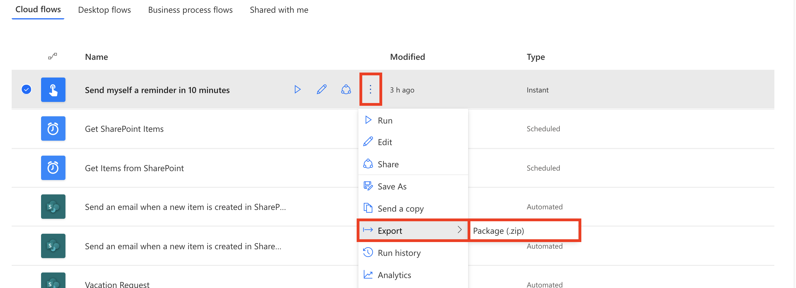

Power Automate allows you to export and then import a flow so that others can use it.

## Export a flow

1. Go to Power Automate, and sign in by using your organizational account.

1. In the left pane, select **Cloud flows**.

1. For the flow that you want to export, select the **More commands** button (the three vertical dots), select **Export**, and then select **Package (.zip)**.

    

1. Fill in the package details:

    - **Name**: Enter a name for the flow.
    - **Environment**: Enter the environment for the flow.
    - **Description**: Enter a description of the flow.
    - **Review Package Content**: Select export options, and add comments to provide instruction or add version notes.

1. Select **Export** to export the zip file. You can then select the folder to in which to download.

When you export a flow, the dependent resources for your flow are also exported into the package.

## Import a flow

After a flow has been exported, anyone that you send the zip file to can import it.

1. Go to Power Automate, and sign in by using your organizational account.
1. In the left pane, select **My flows**.
1. Select **Import**.
1. On the **Import package** page, select **Upload**, and then, in the dialog box, select the zip file that you exported.
1. Back on the **Import package** page, select **Import**.

    - In the flow settings, you can select whether to create a new flow or update an existing one with the flow definition from the package.
    - You must also select the connections that are required to set up the flow as part of the import process.
    - The **Import** button should become available after you've configured all the required settings.

1. After the flow is completely imported, you will have a link to open it and see the flow in **My Flows**, under the **Cloud flows** heading.
