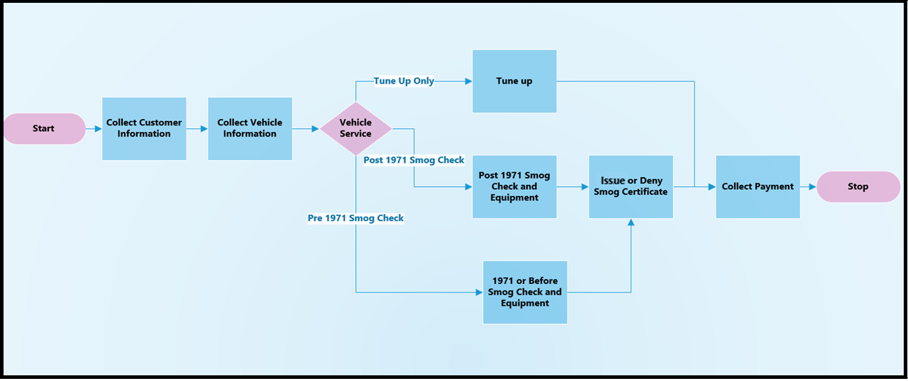

By now you should know how to create a two-step linear business process flow. Some business processes are
simple step-by-step sequential workflows, but many processes might need branching
logic that requires one set of stages for one condition and another set of
stages for an alternative condition. Think of this logic as an
*if then else* statement. So if a condition fulfills certain logic, then do one thing, else do another thing.

Logical branching requires a decision point
and a test of a value or condition. If a condition matches a certain value,
then the flow goes through one branch with one or many stages; if it does not,
then the flow goes through another set of one or many stages. Occasionally, the two
logical paths will meet at a rendezvous point; other times, they will
not. The following sections explore how you can use logical branching with
business process flows.

Branching logic is useful when you are trying to model a business process
to standardize data collection and improve process outcomes. Logical branching
enables the creation of business process flows that can adapt to different conditions
within the same flow instead of having to create and launch many
different flows to handle one condition or another.

For example, consider the scenario from the previous module, where customers refer to the fictitious
company SmogChecksRUs for bi-annual smog checks on their vehicles. In
many jurisdictions, different requirements are in place for emission
control standards and equipment based on the year of the vehicle
manufacture. It would be useful to be able to model all required
tests within a single business process flow. You
can accomplish this task by using logical branching within a business process
flow.

The following diagram models the branching business logic that you need to
build into your flow.

The business process flow logical diagram shows that the smog
equipment and the required checks are different for vehicles that are built before
or during 1971 and after 1971. As a result, you need to add a logical
branch to check the year when the vehicle was manufactured, collect
different information, and then perform different checks on vehicles that are built
after 1971. The exercises in this module explain how to build a business process flow to
manage this scenario.

Unfortunately, business process flows have some limitations on what can
be modeled with logical branching. The following sections examine what types of
logical branching can't be modeled and built in business process flows today.

## Unsupported logical branching and a possible work-around

Occasionally, you will want to model a business process that has multiple
branches, and not all branches end up at the same rendezvous stage. Currently, this situation
is not allowed in a business process flow. An example of an unsupported flow is shown in the following image.

Notice the choices that exist around the Vehicle Service decision point.
Two of the branches end up at the **Issue or Deny Smog
Certificate** stage and then move into the **Collect Payment** stage, whereas
the top branch skips the **Issue or Deny Smog Certificate** stage and then ends
at the **Collect Payment** stage. This logical model is not supported.
All stages at a decision point must resolve to the same stage, and cannot have
intermediate stages for some but not other branches.

The root of the problem in the preceding figure is that the logic is not modeled properly. The
decision stage is modeling two *if then else* conditions and not
one. A better way to model this logic is to add a second decision point, as
shown in the following figure. The approach that is shown in the diagram is supported because
the decision stages are each testing one condition and all resolve to a single stage.

Study this example so you understand how to add another logical branch and model business process flows correctly.
