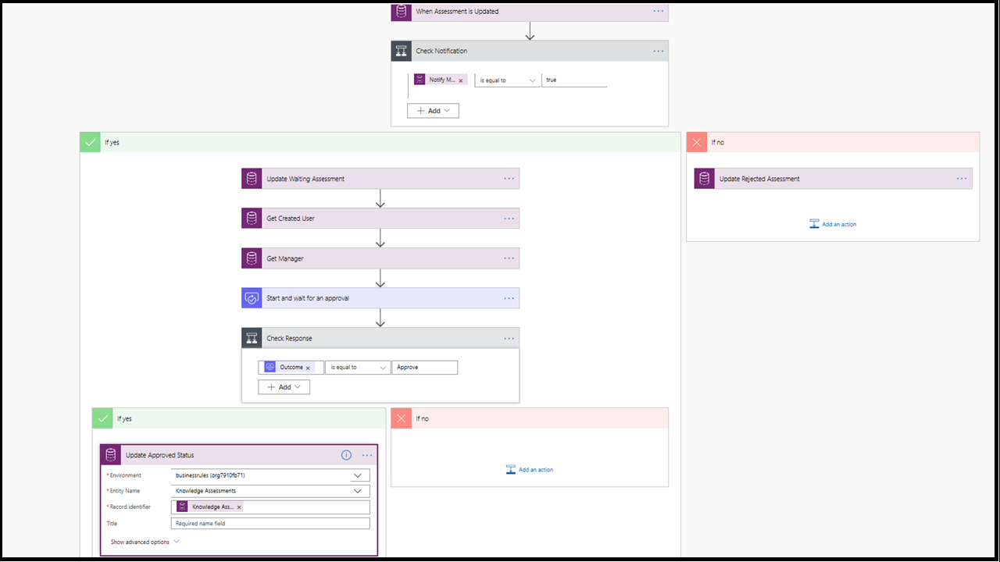

Business Process Flows are not the exclusive workflow automation option
available to an entity in Common Data Service. In fact, a single
Business Process Flow can run against up to 5 entities in Common Data
Service. Dynamics workflows are also supported as part of a Business
Process Flow. This topic is beyond the scope of this learning path, but
you can learn more about Dynamics workflows following a link in the
summary unit of this module. A third kind of workflow automation, called
instant flows in Power Automate, offer a powerful capability that can
supplement Business Process Flows. We will explore this option within
this module.

Microsoft Power Automate offers instant workflows that can execute
(trigger) automatically based upon a schedule, time, data value, or if a
record is added, selected, or modified. These workflows can work in
conjunction with a Business Process Flow to gather approvals, copy data
from Common Data Service to another Data Source, or trigger an email
notification to specific users to alert them something has changed and
needs their attention. You can make instant flows that automatically
trigger based upon a record created, deleted, or modified, or you can
make them trigger by a user clicking a button within a step in a Stage.

Instant Flows are made with Power Automate and they start with a single
trigger followed by a series of actions. An example of an instant flow
that sends an approval request to a user when a record in an entity in
Common Data Service is modified is shown below. We will create an
instant workflow in Power Automate and add it to our Business Process
Solution within the exercise within this module.

In summary, Business Process Flows work within the Power
Platform and there are many options including instant
flows and Approval flows that can run in concert with a Business Process
Flow. Business Process flows do not exclude the possibility of adding
additional capabilities to the envisioned solution by leveraging
additional components of the Power Platform like PowerApps, Power
Automate instant flows, and PowerBI Dashboards. You can read more about
instant flows by following the links in the summary unit within this
module.
