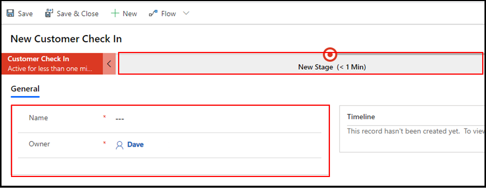

You may have built some basic business process flows, but it is important to 
understand how to elevate those flows to the next level. Extending your solution with 
instant flows or approval flows in Power Automate will certainly help to get you there, but 
creating advanced flows starts with your existing processes. Take the following example from 
the module Create an immersive business process flow in Power
Automate. Review the following screenshot and notice the visual
representation of the process flow and a form under the business process
flow called **General**, which contains only the **Name** and **Owner** fields.

While a business process flow allows you to add a field to a stage in a process, the users begin by seeing 
the main form associated with the table from a business process flow. Adding more fields to this form 
will make for a better user experience and a more beneficial process 
overall. Instead of having only one or two fields for a stage, consider somewhere between 5 and 10. 
This isn't a hard and fast rule and your stages are likely to vary greatly, but too few or too many stages 
indicate an inefficient process or at minimum, one, which fails to flow naturally from one stage to the 
next as a business process flow should. For this specific example, you may want to record the amount of the 
invoice, in which case you could record an autogenerated invoice number and then add general notes 
about the service that you completed for a customer.
                  
Ensuring you have the appropriate number of fields and displaying them on a form that is associated
with an immersive business process flow can be a quick way to create more advanced and polished 
business process flows. 