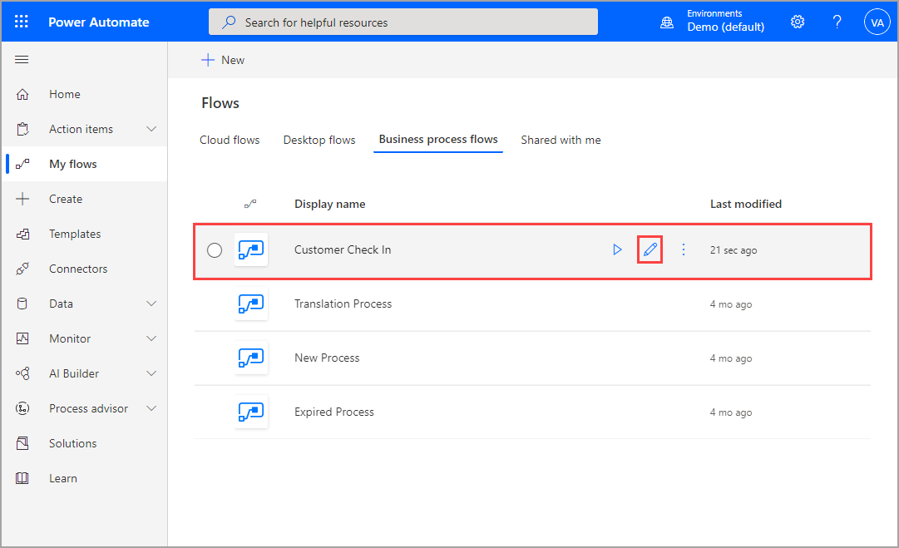
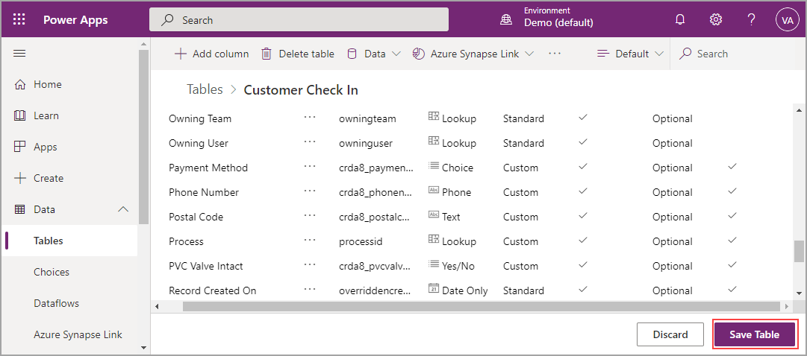
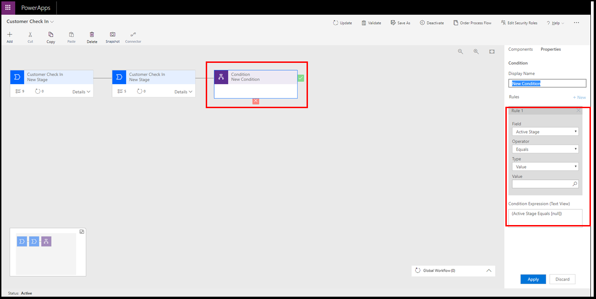
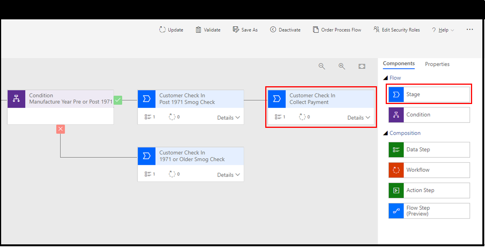

This exercise assumes that you have completed the exercise to create an immersive 
business process flow in the previous module of this learning path. If
you have not, return to the previous module and complete the exercises within
prior to attempting the exercises in this module.

In this exercise, you'll enhance the business process flow by adding 
a logical branch to determine what test needs to be performed and
what information is required to collect to complete a smog check on a
vehicle based on the vehicle's manufacture year. You will add
logic that will provide a different set of instructions for vehicles
that were manufactured prior to, or during, 1971 versus vehicles that were manufactured after 1971. 

1. Sign in to [Power Automate](https://preview.flow.microsoft.com/?azure-portal=true) 
and make sure that you are in the same environment that you used to create the process flow in 
the previous module.

1. Select **My flows** and then select **Business process flows**.

1. Select the **Edit** button (pencil icon) and open the **Customer Check In** business process flow in the **Business process flow** editor.

	

Before you create the conditions, you need to set up the data that you want to collect in each stage that you add. Select the **Customer Check In** stage and add the following fields by using the **Click to add field and forms** hyperlink on the right side of the page.

> [!NOTE] The entity window may open in the an older UI. Alternatively, you can open Power Apps, select your environment, expand **Data** and select **Entities** to see the modern UI. 
	
1.	Select the **Add field** button in the ribbon above the fields that are shown for
	the **Customer Check In** entity, as shown in the following figure, and then add the following
	fields.
	
	
	
	- Smog Pump Intact - Two Options - Set Yes as default
		
	- PVC Valve Intact - Two Options - Set Yes as default
		
	- Aftermarket Exhaust Headers - Two Options - Set No as default
		
	- Comments Pre 1972 - Text Area
		
	- Exhaust Test Performed with Passing Score - Two Options - Set Yes as default
		
	- HC Reading at 2000 RPM - Floating Number
		
	- O2 Reading 2000 RPM - Floating Number
		
	- CO Reading 2000 RPM - Floating Number
		
	- Original Equipment - Two Options - Set Yes as default
		
	- Comments Post 1972 - Text Area
		
	- Amount - Currency
		
	- Certificate Number - Whole Number
		
	- Payment Method - Create a new option set with the following options:
	
		- Cash
			
		- Mastercard
			
		- Visa
			
		- Discover
			
		- Debit Card
			
		- Bit Coin
	
	
	
	After you have created the new fields, select the **Save Entity** button and then
	close the screen and return to the **Business process flow** designer.
	
	
1. Select the **Condition** flow control under the **Components** tab and then drag
it to the right of the **Customer Check In** stage, as shown in the following image.

	

	

1. Select the **Condition** component within the editor and enter the following information:

	-   **Display Name** - Manufacture Year Pre or Post 1971
	
	-   **Field** - Automobile Year
	
	-   **Operator** - Is greater than
	
	-   **Type** - Value
	
	-   **Value** - 1971

	The entries should resemble the following screenshot. When finished, select
	the **Apply** button.
	
	

1. Select the **Components** tab and then drag a new stage to the plus 
(**+**) sign on the right of the page and another to the plus (**+**) sign under the **Condition** stage, as shown in the following figure.
Name each of the new stages by selecting each new stage and entering the new name.

	

1. Drag another stage to the right of the **Customer Check In Post 1971 Smog Check** stage, as shown in the following screenshot. Rename this last stage as **Collect Payment**.

	

1. Connect the **Customer Check In 1971 or Older Smog Check** stage to the **Collect Payment Stage** by following these steps:

	1. Select the **Customer Check In 1971 or Older Smog Check** stage.
	
	1. Select **Connector** in the ribbon and then select the **Connect** option.
	
	1. Select the **Customer Check In Collect Payment** stage to connect the two stages, as shown in the following screenshot.

	

Now, you will add the fields that you created to each stage. Refresh your
browser and then select the following stages. Add the fields that are noted for each 
stage as a step under the stage by selecting the details link drop-down menu
and then adding data steps. 

Add a data step for each field within each stage. When you are done, you 
should have a data step under each of the following stages.

	Stage - Customer Check In Post 1971 - add the following fields by using the Add field option:	

	- Smog Pump Intact
			
	- PVC Valve Intact
			
	- Aftermarket Exhaust Headers
			
	- Comments Pre 1972

	Stage - Customer Check In 1971 or Older - add the following fields:

	- Exhaust Test Performed with Passing Score

	- HC Reading at 2000 RPM

	- O2 Reading 2000 RPM

	- CO Reading 2000 RPM

	- Original Equipment

	- Comments Post 1972

	Stage - Customer Check In Collect Payment - add the following fields:

	- Amount

	- Certificate Number

	- Payment Method

When you're done, select the **Update** button in the top ribbon.
Your business process flow should look like the following screenshot.
	

Now, you'll test the enhanced business process flow. 

1. Select **My flows** and then **Business process flows**.

1. Run the Customer Check In flow by selecting the **run**
button (the little triangle button next to the name of the flow).

You can enter a vehicle with a manufactured date of 1971 or before 
and another after 1971. Notice that the smog check information in Stage 3
changes based on the year of vehicle manufacture. Additionally, notice that both 
potential flows reconnect again at the last stage called **Collect Payment**.
