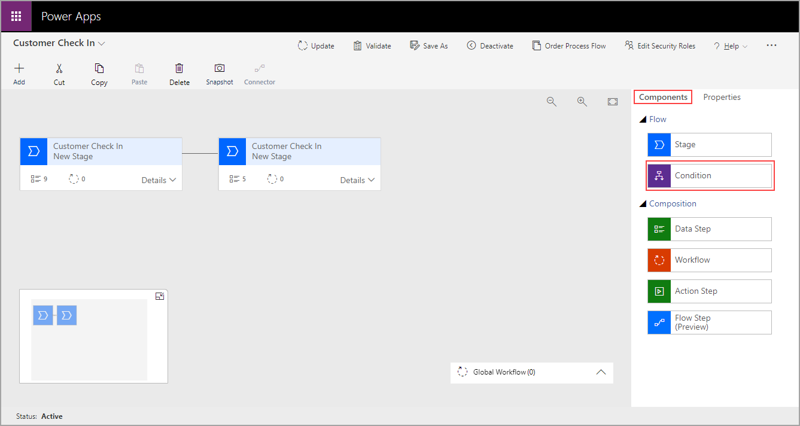
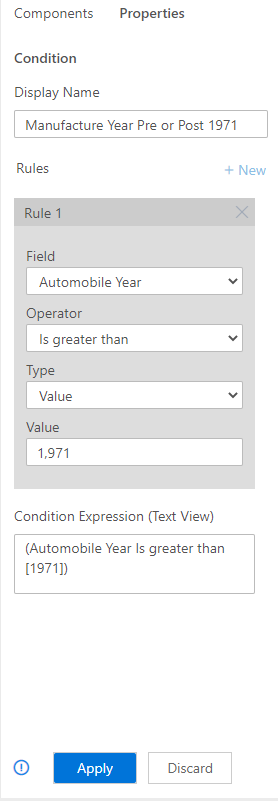
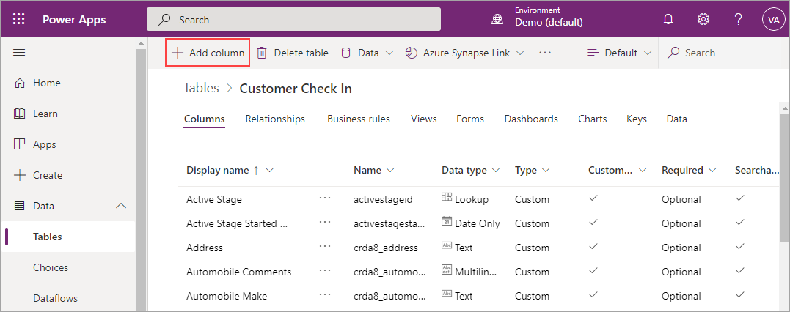

In this exercise, we will enhance the current Business Process Flow by
adding a logical branch to determine what test needs to be performed and
what information is required to collect to complete a smog check on a
vehicle based upon the year of the vehicle manufacture. We will add
logic that will provide a different set to of instructions for vehicles
manufactured prior to or during 1971 versus vehicles manufactured after
1971. Let's get started.

1. Log into [Power Automate](https://us.flow.microsoft.com/?azure-portal=true) in the
United States) and make sure you are in the same environment you used to
create the process flow in module 2.

1. Navigate to My Flows > Business Process Flow.

1. Select the edit button (pencil icon) and open the "Customer Check
In" Business Process Flow in the Process Flow Editor. The Business
Process Flow editor is shown below in step 4.

	

1. Select the Condition Flow control under the components tab and drag
it to the right of the Customer Check in Stage as shown below.

	

	

1. Select the Condition component within the editor and enter the
following:

	-   Display Name - Manufacture Year Pre or Post 1971
	
	-   Field - Automobile Year
	
	-   Operator - Is greater than
	
	-   Type - Value
	
	-   Value - 1971

	The entries should look like the screenshot below. When complete select
	the Apply button.
	
	

1. Select the Components tab and drag a new Stage to the right side
"+" and another to the "+" under the Condition stage as shown below.
Name each of the new stages as shown by selecting each new stage and
typing in the new name.

	

1. Drag another stage to the right of the "Customer Check in Post 1971
Smog Check" stage as shown below. Rename this last stage as "Collect
Payment".

	

1. Connect the "Customer Check In 1971 or Older Smog Check" Stage to
collect payment Stage by following the steps below:

	1. Select the "Customer Check In 1971 or Older Smog Check" Stage.
	
	1. Select Connector in the Ribbon and select the Connect option.
	
	1. Select the "Customer Check In Collect Payment Stage" to connect the two stages as shown below.

	

1. Now let's set up the data we want to collect in each stage that we
just added.

	Select the "Customer Check In Post 1971" Stage and add all of the
	following fields using the "add field and forms" hyperlink on the
	right-hand side of the page
	
	
	
	Select the "Add Field" button in the ribbon above the fields shown for
	the "Customer Check In" Entity as shown below and add the following
	fields:
	
	
	
	- Smog Pump Intact - Two Option - Set Yes as default
		
	- PVC Valve Intact - Two Option - Set Yes as default
		
	- Aftermarket Exhaust Headers - Two Option - Set No as default
		
	- Comments Pre 1972 - Text Area
		
	- Exhaust Test Performed with Passing Score - Two Option - Set Yes as	default
		
	- HC Reading at 2000 RPM - Floating Number
		
	- O2 Reading 2000 RPM - Floating Number
		
	- CO Reading 2000 RPM - Floating Number
		
	- Original Equipment - Two Option - Set Yes as default
		
	- Comments Post 1972 - Text Area
		
	- Amount - Currency
		
	- Certificate Number - Whole Number
		
	- Payment Method - Create a New Option Set with the following options	(shown below)
	
		- Cash
			
		- Mastercard
			
		- Visa
			
		- Discover
			
		- Debit Card
			
		- Bit Coin
	
	
	
	After you create all the new fields, select the Save Entity button then
	close the screen and return to the Business Process Flow designer.
	
	
	
	Now we will add the fields we created to each stage. Refresh your
	browser then select the stages below and add the fields noted for each
	stage as a step under the stage by selecting the details link dropdown
	and then adding in data steps as we did in module two. Add a data step
	for each field within each stage. When you are done, you should have a
	data step under each of the stages shown below.

	Stage - Customer Check In Post 1971 Stage - add the following fields using the add field option	

	- Smog Pump Intact
			
	- PVC Valve Intact
			
	- Aftermarket Exhaust Headers
			
	- Comments Pre 1972

	Stage - Customer Check In 1971 or Older Stage - add the following fields

	- Exhaust Test Performed with Passing Score

	- HC Reading at 2000 RPM

	- O2 Reading 2000 RPM

	- CO Reading 2000 RPM

	- Original Equipment

	- Comments Post 1972

	Stage - Customer Check In Collect Payment Stage - add the following fields

	- Amount

	- Certificate Number

	- Payment Method

1. Select the Update button in the top ribbon.

	Your Business Process Flow should look like the screenshot below.
	
	

1. Now we will test the enhanced Business Process Flow. Open up
Business Process Flow and Select My Flows> Business Process Flows.

1. Run the "Customer Check In Business Flow" by selecting the run
button (little triangle button next to the name of the flow).

1. Try entering in a vehicle with a manufacture date of 1971 or
before and another after 1971 and notice the smog check info in stage 3
changes based upon the year of vehicle manufacture. Notice both
reconnect again at the last stage called "Collect Payment".
