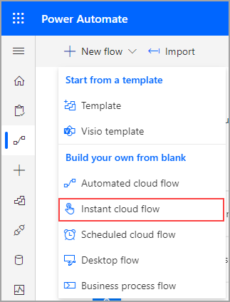
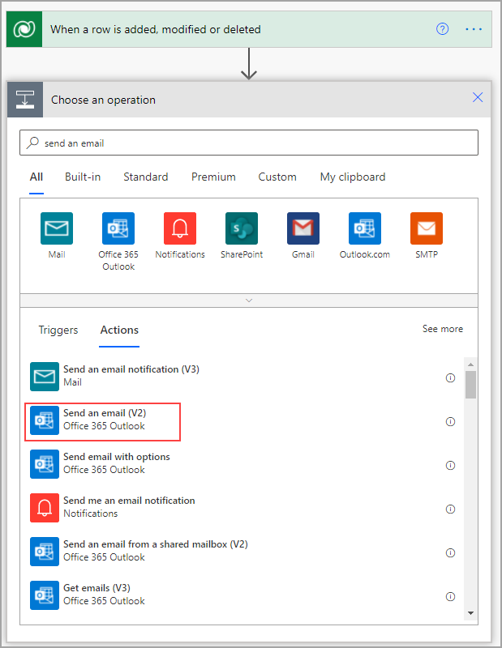
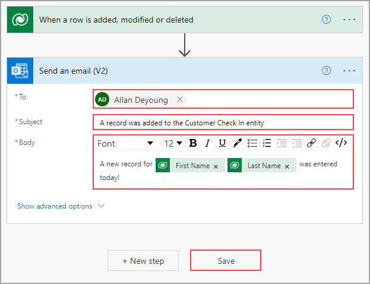
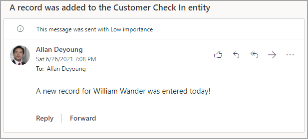

Now we have a great Business Process Flow that includes logical
branching for vehicles made in 1971 or before and all others made in
1972 and beyond. Let's enhance it by adding a simple Instant flow in
Power Automate. We will create an instant flow that sends an email to
the store manager (you) when a new customer check in record is created.
Let's get started.

1. Open Power Automate > My Flows.

1. Select the New Flow in the ribbon at the top of the screen.

1. Select "Instant From Blank" option as shown below:

	

1. Select the Skip button to open the Flow instant designer as
shown below.

	

1. Type Common Data Service in the Trigger Search dialog as shown
below.

	

1. Select the Common Data Service trigger "When a Record is created".
Enter in the Environment name we used in the module two exercise and
used in the previous exercise, then select the "Customer Check In"
entity, then select the "User" as scope then select the New Step as show
below.

	

1. Type in Send Email in the search box and select "Send an email notification (v3)" as shown below.

	

1. Enter in the following into the Send Email Action as shown below.

	-   To - enter your Email Address so you receive an email and can see how the instant Flow works.

	-   Subject - "A record was added to the Customer Check in entity".

	Now you will select the first and last name fields from the list of fields under the Dynamic Content option

	-   Email Body - Type the following "A new record for" (now select the new_firstname field then the new_lastname field as shown), then type "was entered today!" (Do not use quotations, these were added within the instructions so it is easier to read. Just type as shown in the screenshot below).

	

1. Save the Flow by selecting Save in the top ribbon.

1. Close the instant flow we just created then navigate to Power Automate> My Flows> Business Process Flows.

1. Run the Business Process Flow "Customer Check In"- Enter the
values in the first stage [and then]{.underline} enter a value in the
Name field in the main screen (the field is in the General form under
the Business Process flow diagram) so there are values in the record
BEFORE you save it. Save the record and you will see an email appear in
your inbox like the one below in a few moments.

	

Congratulations - you just created an instant flow that works with your Business Process Flow!
