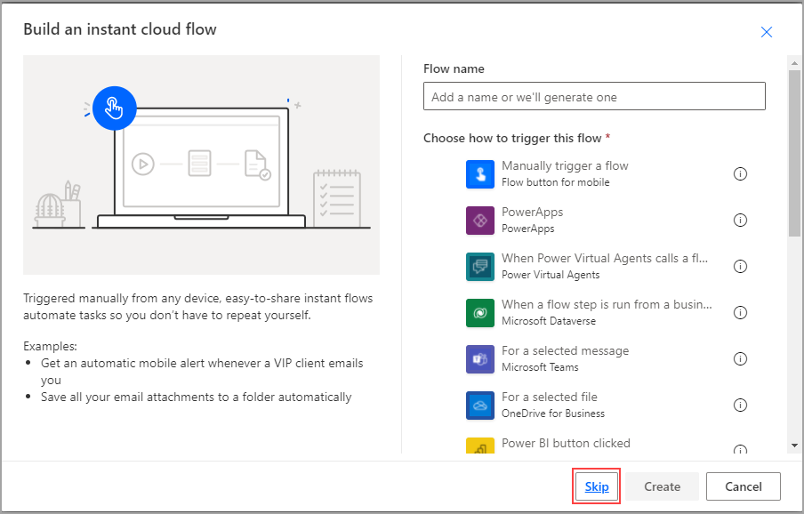

Now we have a great business process flow that includes logical
branching for vehicles made in 1971 or before, and all others made in
1972 and beyond. Let's enhance it by adding a simple instant flow in
Power Automate. We'll create an instant flow that sends an email to
the store manager (you) when a new customer check in record is created.
Let's get started.

1. Log in to [Power Automate](https://preview.flow.microsoft.com/?azure-portal=true) and select **My flows**.

1. Select **+New** in the ribbon in the left-hand corner of the screen.

1. Select the **+Instant-From blank** option as shown below:

	

1. Select the **Skip** button to open the flow instant designer as
shown below.

	

1. Enter Common Data Service in the connector search dialog as shown
below.

	

1. Select the Common Data Service connector and the **When a Record is created** 
trigger. Select the **Environment** name you used in the previous exercises and 
then select Customer Check In the **Entity Name** field, then select the **User** 
in the **Scope** field and then select **+New step** as show below.

	

1. Type in Send Email in the actions search box and select **Send an email notification (v3)** as shown below.

	

1. Enter the following into the Send Email Action as shown below.

	-   **To** - Enter your email address so you receive an email and can see how the instant flow works.

	-   **Subject** - Enter A record was added to the Customer Check In entity.

	Now select the first and last name fields from the list of fields under the Dynamic Content option.

	-   **Email Body** - Enter the following *A new record for* (now select the **new_firstname** field and the **new_lastname** field), and then type *was entered today!* 

	

1. Save the flow by selecting **Save** in the top ribbon.

## Run the instant flow

1. Close the instant flow we just created, and select **My flows** and **Business process flows**.

1. Run the business process flow Customer Check In.  

1. Enter some values in the first stage fields and then enter a value in the
**Name** field in the main screen (the field is in the General form under
the Business process flow diagram) so there are values in the record
BEFORE you save it. 

1. Save the record and you should see an email appear in your inbox like the one below.

Congratulations - you just created an instant flow that works with your business process flow!
