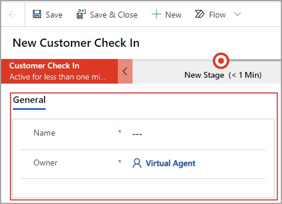
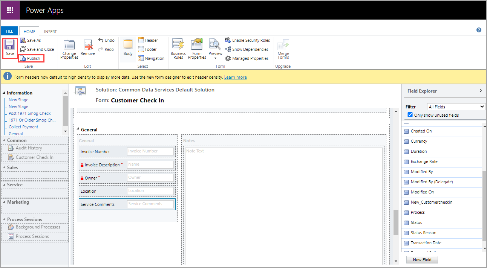
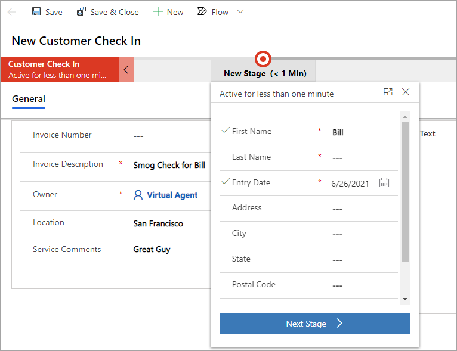

One last enhancement needs to be made before you can complete your business process 
flow. Before you begin, quickly review the fields on the main form under the
diagram of your business process flow. 

The following screenshot shows a new instance of your business process flow. 
Notice that only two fields are shown on the main screen (outlined in red): **Name** and **Owner**.
The name of the record is similar to the title of this record, and the 
owner of the record is the current user who created the instance of the 
current business process flow. Now, you will add some fields to make this screen more useful.

## Add fields to the main form

Follow these steps to add fields to the main form. 

1. Sign in to Power Automate, make sure that you are in the proper environment 
that you have been working in, select **My flows**, and then select **Business process flows**.

1. Open the **Customer Check In** flow in design mode by selecting the pencil icon, as shown in the following screenshot.

	

1. Select the last stage (Collect Payment) and then select the **Data Fields and Forms** link.

	

1. Start your enhancements by selecting the **+Add field** button and then adding the following fields.

	

	- Clerk - Text
	
	- Transaction Date - Date Only
	
	- Location - New Option Set
	
		- Los Angeles
		- San Francisco
		- San Diego
		- Portland
	
	- Invoice Number - Autonumber - leave the defaults that are provided by Power Automate and Common Data Service
	
	- Service Comments - Text Area

1. After you have added the new fields, save the entity by 
selecting the **Save Entity** button. Don't skip saving the entity or 
your new fields will not be saved with the entity.

   

1. To enhance the main form, select the **Forms** tab on the current screen, as shown in the following figure.

   

1. Select the top main form name, which is a hyperlink to the form
designer (the name of your form might be different). This action will
open the WYSIWIG forms designer. The WYSIWIG designer is not
available for immersive business forms at this time.

   

1. Select **Switch to classic** when the new screen opens.

   

1. Scroll down to the **General** section at the bottom of the form.
Double-click the **Name** field, rename the title to **Invoice Description**, and then select the **OK** button.

   

1. Drag the new fields that you previously added in this exercise
onto the form, as shown in the following screenshot. Select the **Save** button and then select
the **Publish** button in the ribbon at the top of the form designer.

   

1. Close the **Designer** tab in the browser.

1. Go back to the home page of Power Automate. Select **My flows** and 
**Business process flows**. Select the **Customer Check In** flow and run 
an instance of the flow by selecting the small triangle icon next to the 
flow name. It should look like the following screenshot. Add data to the 
main form and the stages and then save the record.

   

## Add read-only fields to the form

Your next task is to add a few fields to the main form
from the data that you entered within a few of the stages. You will 
make these fields read-only.

1. Go back to the list of business process flows (available from **My flows** in
Power Automate).

1. Select the pencil icon next to the **Customer Check In** flow to enter 
the business process flow designer.

1. Select the **Collect Payment** stage and then select the
**Click to add fields and forms** hyperlink, as shown in the following figure.

   

1. Select the **Forms** tab. 

   

1. Select the name of the main form, which is a hyperlink to the form designer.

   

1. Select **Switch to classic**, as shown in the following figure. Now, you are back at the 
form designer, where you'll make a few more changes.

   

1. Enhance the main form with some of the data that you collect
within the stages. Clear the **Only show unused fields** option 
above the list of fields.

   

1. You should see all the fields that are available within the **Customer Check In**
entity. Drag the following fields from the field panel into the
General section of the form, as shown in the following screenshot.

   -   Entry Date
	
   -   First Name
	
   -   Last Name
	
   -   Smog Cert Number

    

1. Double-click the **Entry Date** field that you added and make it
read-only, and then select the **OK** button.

   

1. Do the same for the following fields to also make them read-only.

	-   First Name
	
	-   Last Name
	
	-   Smog Cert Number

1. Select the **Save** button in the ribbon and then select **Publish**.

	

1. Close the **Form Designer** tab and return to the business process
flow designer. Double-click the first stage and rename it to **Customer
Info**. Double-click the second stage and rename to **Automobile Info**, as
shown in the following figure. Select the **Update** button in the ribbon so all 
the changes are saved and ready to use.

   

1. Close the flow designer screen and refresh your browser. Run the **Customer 
Check In** flow to check that all the changes that you made are working properly. 
The business process flow should look like the following screenshot.

   

You can create a new instance of the **Customer Check In** flow by selecting
the **+ Add record** button in the ribbon. 

Congratulations, you've created a working business process flow.  
