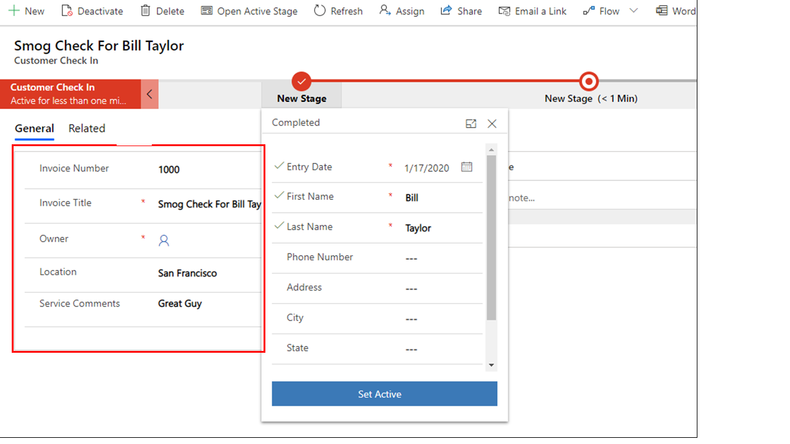
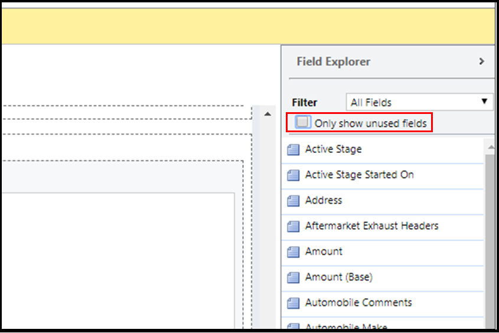
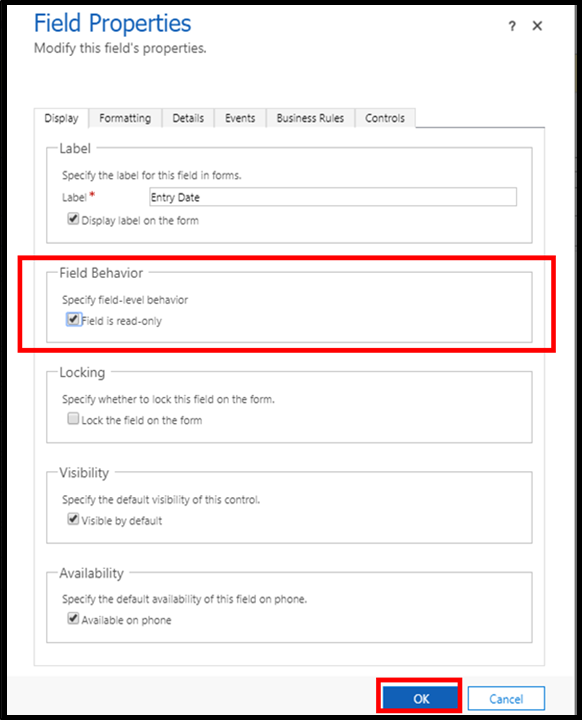
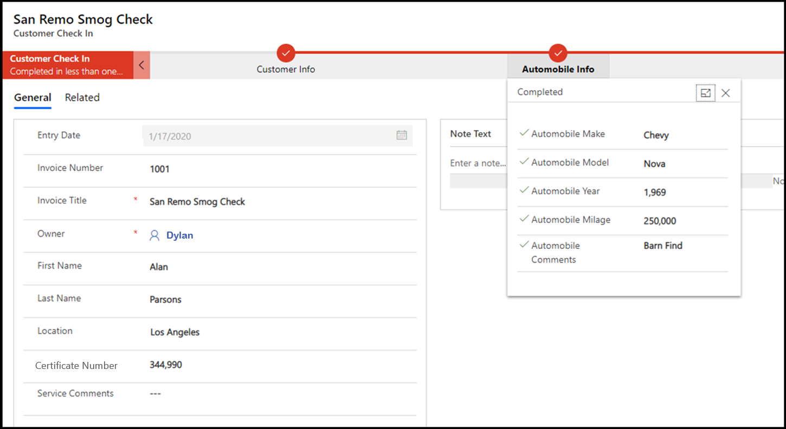

We have come a long way, but we have one last enhancement before we
complete our Business Process Flow. Keep going, you are nearly at the
finish line!

Let's start with a quick review of the fields in the main form under the
diagram of our Business Process Flow. The screenshot below shows a new
instance of our Business Process Flow. Notice there are only two fields
shown on the main screen (outlined in red), the Name of the record -
sort of like the title of this record, and the owner of the record -
the current user who created the instance of the current Business
Process Flow. Let's add some fields to make this screen a little more
useful. Follow the steps below.

1. Log into Power Automate and make sure you are in the proper environment we have been working in, then navigate to My Flows > Business Process Flows.

1. Open the "Customer Check In" Business Process Flow in design mode by hitting the pencil as shown below.

	

1. Select the last stage (Collect Payment) and then select the "Fields and Forms" link as shown below.

	

1. Lets start our enhancements by adding the following fields by selecting the Add Fields button as shown below.

	

	- Clerk - Text
	
	- Transaction Date - Date Only
	
	- Location - New Option Set
	
		- Los Angeles
		- San Francisco
		- San Diego
		- Portland
	
	- Invoice Number - Autonumber - just leave the defaults provided by power automate and common data service.
	
	- Service Comments - Text Area

1. Once you have added the new fields make sure to save the entity as
shown below (don't skip saving the entity or your new fields will not be
saved with the entity).

	

1. Now we are ready to enhance the main form. Select the Forms Tab in
the current screen as shown below.

	

1. Select the top main form name - it is a hyperlink to the form
designer. (don't worry if the name of your form is different). This will
open the WYSIWIG forms designer. The WYSIWIG designer is not
available for Immersive business forms at this time.

	

1. Select Switch to classic when the new screen opens.

	

1. Scroll down to the General section at the bottom of the form.
Double-click on the Name Field and rename the title to say "Invoice
Description" as shown below and select the OK button.

	

1. Now drag the new fields we just added in step 4 in this exercise
onto the form as shown below, then select the Save button then select
the Publish button in the Ribbon at the top of the form designer.

	

1. Close the Designer tab in the browser.

1. Navigate back to Power Automate > My Flows > Business Process
Flows > Customer Check In and run an instance of the Business Process
Flow by selecting the little triangle next to the "Customer Check In"
Business Process Flow name. It should look like the screenshot below.
Add some data to the main form and the stages and save the record.

	

You are doing great! Now let's add a few fields to the main form
from the data entered within a few of the stages. We will make these
fields read only.

1. Navigate back to the list of Business Process Flows (under My flows in
Power Automate).

1. Select the pencil button next to the "Customer Check In" Business
Process Flow to enter the Business Process Flow designer.

1. Select the last Stage called "Collect Payment" and then select the
hyperlink "Click to add fields and forms" as shown below.

	

1. Now select the Forms tab and the Main form then select the Classic
button as we did before to get back into the Forms designer as shown in
the screenshots below.

	

1. Now select the name of the main form - it is a hyperlink to the form designer.

	

1. Next, select the "Switch to classic" button as shown below.

	

	Now we are back at the form designer. Let's make a few more changes.

1. Let's enhance the main form with some of the data we collect
within the stages. Uncheck the checkbox above the list of
fields that says "Only show unused fields".

	

1. Now we can see all the fields available within the "Customer Check In"
entity. Drag in the following fields from the field panel into the
General section of the form as shown below.

	-   Entry Date
	
	-   First Name
	
	-   Last Name
	
	-   Smog Cert Number

	

1. Double Click on the Entry Date field we just added and make it
read-only and then select the OK button as shown below.

	

1. Now do the same for the following fields to also make them read-only.

	-   First Name
	
	-   Last Name
	
	-   Smog Cert Number

1. Select the Save button in the Ribbon and then select the Publish
button as shown below.

	

1. Close the Form Designer Tab and return to the Business Process
Flow designer. Double-click on the first Stage and rename it to Customer
Info. Double-click on the second Stage and rename to Automobile Info as
shown below. Finally, select the Update button in the ribbon so all of
these changes are saved and ready to use.

	

1. Close the Business Process Flow Designer screen. Refresh your
browser then return to Power Automate > My Flows> Business Process
Flows and run the" Customer Check In" Business Process Flow to check
that all the changes we made are working properly. Your final Business
Process Flow should look like the screenshot below.

	

1. Wait - we forgot to add the amount field and the payment type
field into the main form - we gather in last stage of the "Customer
Check In" Business Process Flow. That is not a problem now that you know
how to enhance the main form associated with the Business Process Flow.
Let's make those changes by following the instructions below.

	1. Open the Business Process Flow" Customer Check In" in design mode (My Flow > Business Processes Flows > Select the pencil) and then select a stage in the Business Process designer.

	1. Next, select the "Click to add fields and forms link" on the right-hand side of the designer, then select the main form name.

	1. Select the Switch to classic mode button, scroll down to the General section of the form then uncheck the "only show unused fields" check box and drag in the "amount" and "payment type" as shown below.

	1. Make sure to make these two additional fields read only as shown in step 15 above then select the Save the Publish buttons. (See steps 13-16 if you want to reference screenshots to help guide you).

	

1. Run the Business Process Flow again and make sure the new fields are now present in the main form under the Business Process Flow.

	

1. If you want to view all of the data you have created and quickly start using the Business Process Flow follow the steps below.

	1. Log in to the [PowerApps maker](https://make.preview.powerapps.com/home/?azure-portal=true).

	1. Make sure to select the environment where you created the "Customer Check In" Business Process Flow.

	1. Select Data > Entities in the left-hand column.

	1. Select the "Customer Check In" Entity we created for this Business Process Flow.

	1. Select the Data tab as shown below then select All Fields view in the top right. This will show you all the data you have created throughout the exercise.

	

	

1. You can view any existing record by selecting it in the list and
selecting the Edit button in the ribbon. You can also create a new
instance of the "Customer Check In" Business Process Flow by selecting
the "+Add Record" button in the Ribbon. Try it. Now you have a power
simple Business Process Flow!

	
