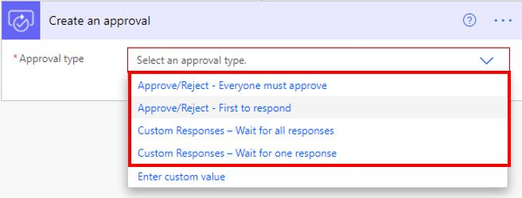
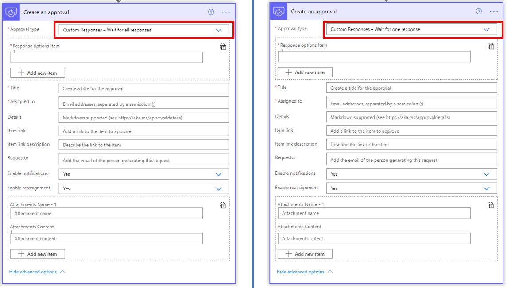
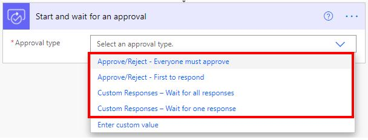
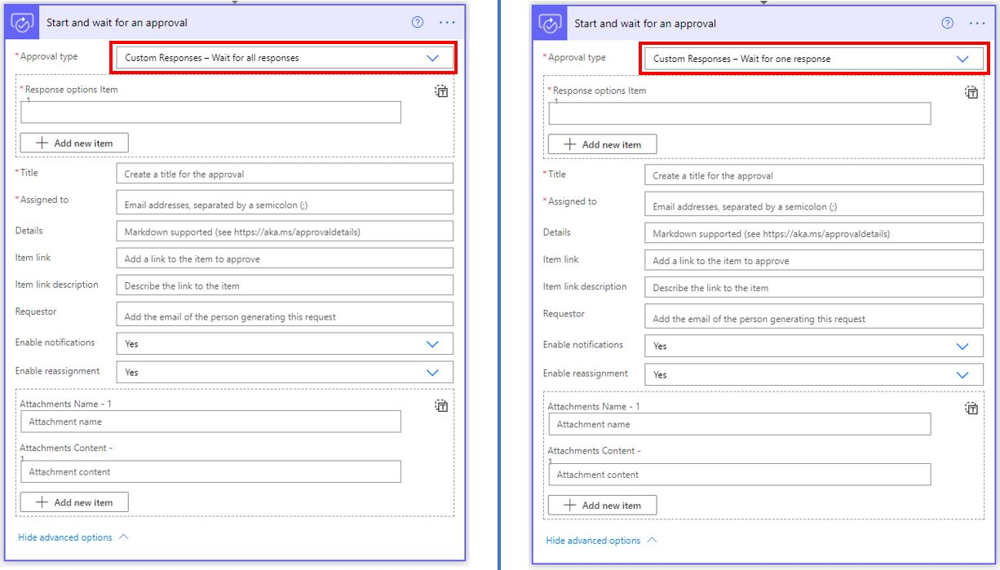

The **Create an approval action** starts an automated approval process but does not wait for the approval to complete. The approval is cancelable.

This action can be paired with the **Wait for an approval** action in order to wait for a response.

There are four types of approval actions available in Create an approval. They can be summarized into two categories, **Approve/Reject** and **Custom Responses.**

> [!div class="mx-imgBorder"]
> 

Below are the two Approval/Reject categories side by side. They look the same, however, they have one key difference and that is the number of approvals required to complete. As the name suggests, the one on the left waits for everyone to approve, and the one on the right requires only one.

> [!div class="mx-imgBorder"]
> 

The **Assigned to** is where you add the email addresses of the approvers and can be separated with a semicolon ';'.

Here is a closer look at the advanced settings. It includes adding a link to a description, attachments, and even assigning a requestor who is sending this approval request.

> [!div class="mx-imgBorder"]
> 

Approve and Reject are the two out-of-box response options available, with Custom Responses, you can add your own options. The Response options item is where you add your options.

Below are the two Custom Responses categories side by side. They look the same, however, they have one key difference and that is the number of approvals required to complete. As the name suggests, the one on the left waits for all responses, and the one on the right requires only one.

> [!div class="mx-imgBorder"]
> 

Here is a closer look at the advanced settings. It includes adding a link to a description, attachments, and even assigning a requestor who is sending this approval request.

> [!div class="mx-imgBorder"]
> 

The following are all the metadata files that are available along with it.

-   Approvers Approver name

-   Approvers Approver email

-   Respond link

-   Teams Adaptive Card

-   Approval ID

-   Title

-   Details

-   Item link

-   Item link description

-   Request date

-   Approvers Approver ID

-   Approvers Approver tenant ID

-   Approvers Approver user principal name

-   Approvers item

-   Body

-   Approvers

## How to use Wait for an approval action

As the name suggests, this approval waits for a specified approval to complete. It requires the ID of the previous approval.

> [!div class="mx-imgBorder"]
> 

Here are all the metadata that are available along with it.

-   Response summary

-   Completion date

-   Outcome

-   Approval ID

-   Title

-   Details

-   Item link

-   Item link description

-   Request date

-   Responses Approver ID

-   Responses Approver name

-   Responses Approver email

-   Responses Approver tenant ID

-   Responses Approver user principal name

-   Responses Request date

-   Response Approver response

-   Response comments

-   Body

-   Responses responder

-   Responses item

-   Responses

## How to use Start and wait for an approval action

The **Start and wait for an approval** is the most common used approval action.

> [!div class="mx-imgBorder"]
> 

Below are the two Approval/Reject categories side by side. They look the same, however, they have one key difference and that is the number of approvals required to complete. As the name suggests, the one on the left waits for everyone to approve, and the one on the right requires only one.

> [!div class="mx-imgBorder"]
> 

The **Assigned to** is where you add the email addresses of the approvers and can be separated with a semicolon ';'.

Here is a closer look at the advanced settings. It includes adding a link to a description, attachments, and even assigning a requestor who is sending this approval request.

> [!div class="mx-imgBorder"]
> 

Approve and Reject are the two out-of-box response options available, with Custom Responses, you can add your own options. The Response options item is where you add your options.

Below are the two Custom Responses categories side by side. They look the same, however, they have one key difference and that is the number of approvals required to complete. As the name suggests, the one on the left waits for all responses, and the one on the right requires only one.

> [!div class="mx-imgBorder"]
> 

The following are all the metadata files that are available along with it.

-   Response summary

-   Completion date

-   Outcome

-   Approval ID

-   Title

-   Details

-   Item link

-   Item link description

-   Request date

-   Responses Approver ID

-   Responses Approver name

-   Responses Approver email

-   Responses Approver tenant ID

-   Responses Approver user principal name

-   Responses Request date

-   Response Approver response

-   Response comments

-   Body

-   Responses responder

-   Responses item

-   Responses
