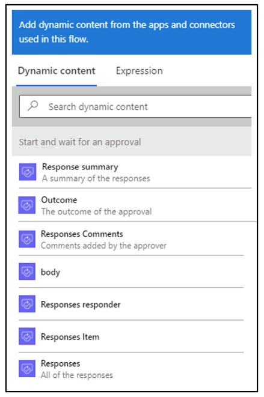
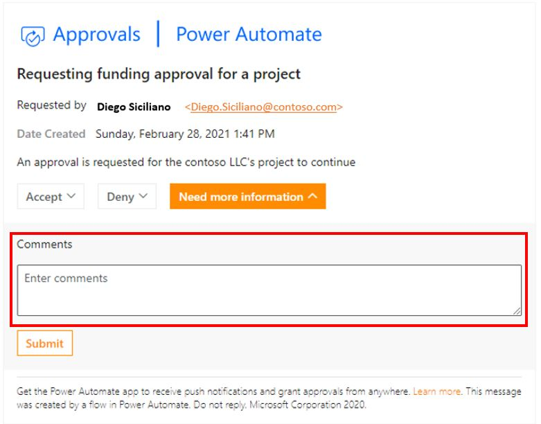
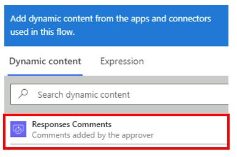

The Power Automate Approvals actions provide several metadata items that are helpful.

## Who approved or rejected?

Once an item is approved or rejected, all the metadata that is part of this process is available for other workflow processes. Here is the primary dynamic content that captures the information.

> [!div class="mx-imgBorder"]
> 

Outcome will provide you which approval option was selected. It's either approve or reject or any of the custom responses you may have added.

## Date and time stamps of the approvals

Several dates and time stamps are automatically captured by approval. Here are all the dates that are captured.

> [!div class="mx-imgBorder"]
> 

## Additional comments

When you are responding to an approval, you can add comments. You can capture these comments and save them in the data source of your choice.

Here is what the option to add the comment looks like.

> [!div class="mx-imgBorder"]
> 

The comment can be captured using Power Automate.

> [!div class="mx-imgBorder"]
> 
