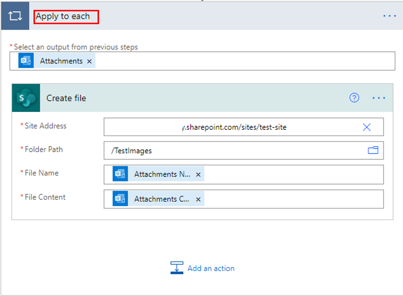
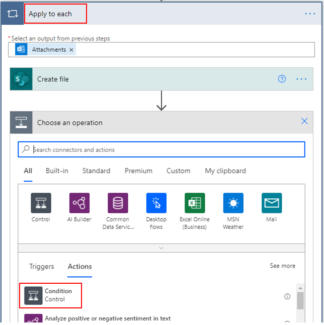
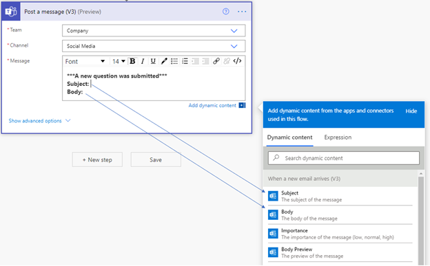

Users can be bombarded with incoming emails that leave them distracted and unable to concentrate on a single task. This is where Power Automate can help with its ability to monitor the to, from and the subject line of the emails and create an automated workflow to take actions based on conditions.

## Trigger flows

There are currently four triggers for Power Automate flows. They are from the Office 365 Outlook Standard connector and can be used to monitor incoming emails. The triggers are:

-   When a new email arrives (V3)

-   When an email is flagged (V3)

-   When a new email arrives in a shared mailbox (V2)

-   When a new email mentioning me arrives (V3)

Each of the above triggers will monitor all the incoming emails of the folder you have specified in the trigger. Your default Inbox is one of those folders. You can make the monitoring more specific by describing to whom the email was sent, was anyone added to CC, who was it sent by, any specific string in the subject and if there were any attachments.

## Save metadata to SharePoint lists

Metadata is defined as a set of data that describes and gives relevant information about other data. For example, as emails arrive to our Microsoft Outlook Inbox, we primarily focus on the key metadata such as To, From, Subject and Body. However, there are several other metadata items that are available, like Importance, which are available and can be captured for future use. Saving metadata makes it easier to search in the future.

If you would like to only capture the metadata of specific emails, then you can use a combination of options already available to define that. For example, you can only trigger a flow if the email came to you, Cc'd to a specific group email address and the email subject contains 'Monthly Inventory Report'

> [!div class="mx-imgBorder"]
> 

The metadata from the email can be saved to columns in a SharePoint list as a new item.

> [!div class="mx-imgBorder"]
> 

These are all of the metadata items that are currently available:

**From** – The mailbox owner and sender of the message.

**To** – The recipients for the message.

**Subject** – The subject of the message.
**Body** – The body of the message.

**Importance** – The importance of the message such as low, normal, and high.

**CC** – The Cc recipients for the message.

**BCC** – The Bcc recipients for the message.

**Reply To** – The email addresses used when replying.

**Body Preview** – The preview of the email message.

**Message ID** – The unique identifier of the message.

**Internet Message ID** – The Message ID in the format specified by Request For Comments or RFC 2822
Conversation ID – The ID of the conversation the email belongs to.

**Received Time** – The date and time the message was received.

**Attachments, Attachments ID** – Attachment ID

**Attachment Name**

**Attachment content**

**Attachments Content** - Type

**Attachments last Modified Date Time**

**Attachments Content ID**

**Has Attachment** – Indicates whether the message has attachments.

**Is Read** – Indicates whether the message has been read.

**Is HTML** – Indicates whether the email body has an HTML format.

**Attachments Size** – The size in bytes of the attachment.

## Save attachments to SharePoint document libraries

A SharePoint document library is a perfect place to save your email attachments. Those documents are then easily accessible from anywhere with internet access. Thanks to Power Automate you can create a flow to monitor emails of your choice and save their attachments to a document library.

You create a flow using the **When a new email arrives (V3) trigger** and set the **Only with Attachments** option to **Yes**.

> [!div class="mx-imgBorder"]
> 

Add a new action where you search for **SharePoint** and select **Create a file**. Technically, you are only saving an existing file, however from a SharePoint perspective, a new file is being created and hence this action is selected.

> [!div class="mx-imgBorder"]
> 

Add the site address, folder path, file name and file content. The folder patch is for the library where you would like to save the attachments.

> [!div class="mx-imgBorder"]
> 

> [!NOTE]
> Adding the file information will automatically add the **Create a file** action in an **Apply to each**. This is by design to make sure all the attachments are saved.

> [!div class="mx-imgBorder"]
> 

We need to confirm the file(s) have been saved successfully and if not, then we need to be notified. To accomplish this, add a condition inside the **Apply to each**.

> [!div class="mx-imgBorder"]
> 

In the left side of the condition, click on **Add dynamic content**, select **Expressions** and add the following formula outputs('Create_file')['statusCode']. On the right, add 403.

> [!div class="mx-imgBorder"]
> 

In If yes click on **Add an action** and add the **Send an email (V2).**

This error notification email is sent to the same person who received the original email from which the attachment has to be saved.

> [!div class="mx-imgBorder"]
> 

Now when incoming emails match the criteria the attachments will be saved in the SharePoint document library and if for some reason there is an error the user will be notified.

## Post message on Microsoft Teams

When inquiry type emails are sent to a general address, you can create a Power Automate flow to monitor those types of emails and copy them to a Microsoft Team. This will make the email content available to a wider audience and quicken the response time and / or quality of the response.

Consider incoming emails, which are all sent from a specific mailbox that is used to send notifications from a customer-facing form. You can use that email address in the **To** field. If all emails come with the same subject, then you can add that in the **Subject** filter as well.

> [!div class="mx-imgBorder"]
> 

Add a new step and search for Teams. Select **Post a message (V3) action**.

> [!div class="mx-imgBorder"]
> 

Select the **Team** and **Channel**. In the message, add a combination of text and dynamic content. The dynamic content comes from the **Subject** and **Body** of the incoming email.

> [!div class="mx-imgBorder"]
> 
