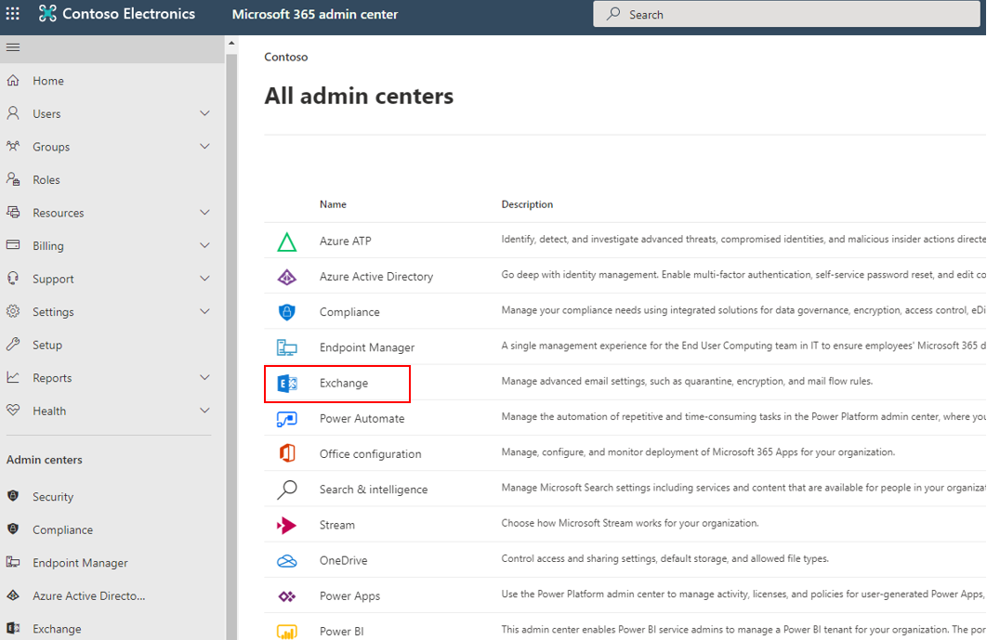
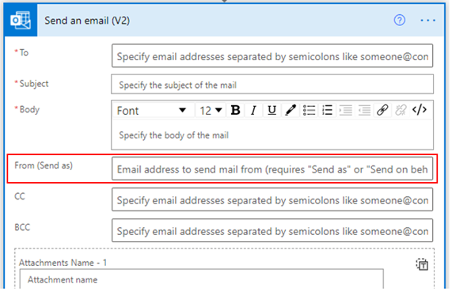
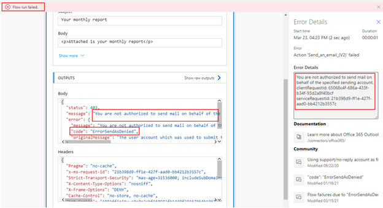
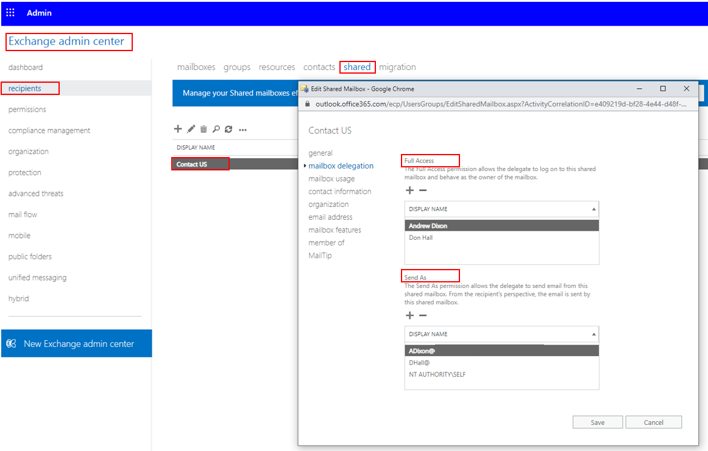
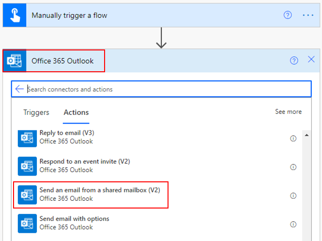
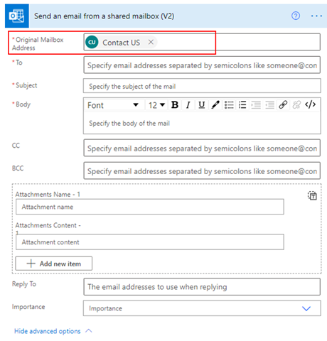

Microsoft Exchange is part of the Microsoft 365 suite that is used to provide email service.

> [!div class="mx-imgBorder"]
> 

This is the same service that runs the **Office 365 Outlook** connectors.

> [!div class="mx-imgBorder"]
> 

All your email addresses are created there as mailbox accounts. If you would like some else to send an email on your behalf, then that person needs to be added to the **Send As** field of your mailbox. This gives that user the required permission.

Once you have the required permission, you can send emails on behalf of the person using Power Automate flow.

Microsoft Office 365 Outlook connector's Send an email (V2) action has the option to send an email on behalf of someone. To find this feature, select **Show advanced options**.

> [!div class="mx-imgBorder"]
> 

In the **From (Send as)** you can add the name of the person whose mailbox you have Send as access.

> [!div class="mx-imgBorder"]
> 

> [!NOTE]
> If you are not added to **Send As** i.e., do not have access to the user's mailbox, then your flow will fail.

> [!div class="mx-imgBorder"]
> 

## A shared mailbox

A shared mailbox is an Exchange mailbox that multiple users can use to read and send email messages. To access a shared mailbox, users must first be granted **Send As** or **Full Access** permissions to the mailbox.

> [!div class="mx-imgBorder"]
> 

Once permissions have been granted, you can use the **Send an email from a shared mailbox (V2)** action.

> [!div class="mx-imgBorder"]
> 

In this action, you add the shared mailbox that you have access to in the **Original Mailbox Address** field. When this flow runs, the end users will receive an email from the shared mailbox and not from you, the maker of the flow.

> [!div class="mx-imgBorder"]
> 

## A do not reply mailbox

Do Not Reply Mailboxes are email accounts that are used to send email notifications with important information. The email body will clearly state not to reply to. This is another scenario where the shared mailbox process, as explained above, can be used.

