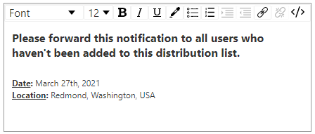
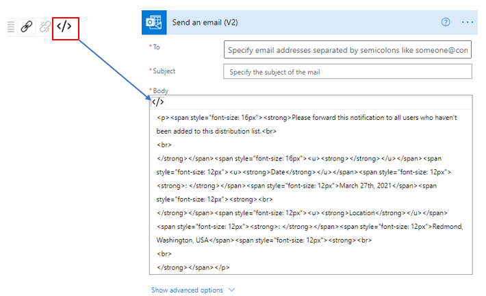
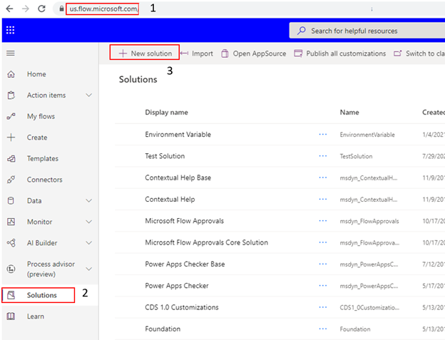
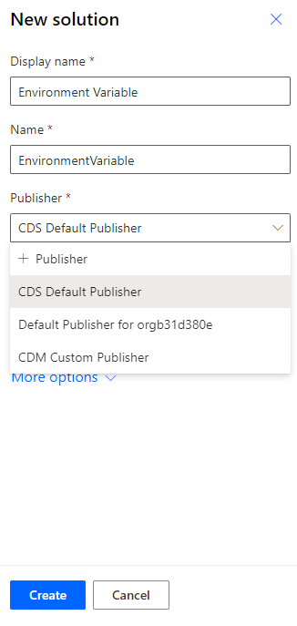
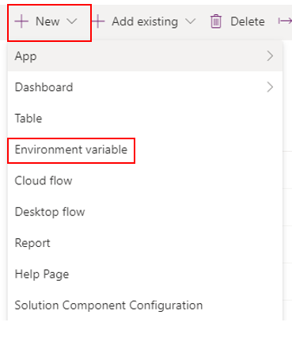
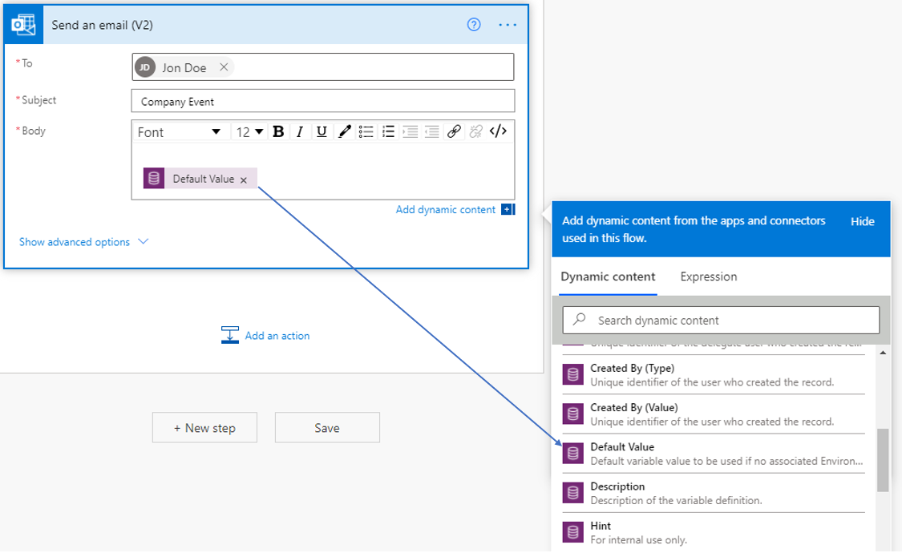

An email is often an official means of electronic communication; therefore, it is important to have the body well formatted.

## Use rich text edit

Microsoft Office 365 Outlook and Mail connector have a **Send an email** action that allows you to format the email body.

> [!div class="mx-imgBorder"]
> 

The email action in both applications provides a comprehensive set of tools to help you format the text of your email body.

> [!div class="mx-imgBorder"]
> 

The **code view** (**</>**) option allows you to see the rich text format in an HTML format, which gives you the extra functionality to fine-tune the format.

> [!div class="mx-imgBorder"]
> 

## Add a signature by using the Environment variable

When you want to repeatedly add the same data as text, date, or numbers in an app, you can assign it to a variable and reuse that variable, which will make the process much easier. Variables can hold a value at an app level and environment level. Three functions that help you create variables at the app level are: **UpdateContext**, **Set**, and **Collection**. **Environment variables** is the only function that you can use to create variables at the environment level. An environment is a space to store, manage, and share your organization's business data, apps, and flows. It also serves as a container to separate apps that might have different roles, security requirements, or target audiences.

Microsoft Power Apps Studio comes with several variable functions, such as:

- **UpdateContext** - Use the **UpdateContext** function to create a context variable, which temporarily holds a piece of information, such as the number of times that the user has selected a button or the result of a data operation. Context variables are scoped to a screen, which means that you can't build a formula that refers to a context variable on another screen.

- **Set** - Use the **Set** function to set the value of a global variable, which temporarily holds a piece of information, such as the number of times that the user has selected a button or the result of a data operation. Global variables are available throughout your app on all screens.

- **Collection** - The **Collection** function adds records to a data source called **Collection**. Collections are used to hold global variables that are available throughout your app on all screens.

- **Environment variables** - Flows often require different configuration settings across environments. Environment variables as configurable input parameters allow you to manage data separately compared to hard-coding values within your customization or using other tools.

Environment variables are part of Power Automate solutions. Solutions are used to transport apps and components from one environment to another or to apply a set of customizations to existing apps. A solution can contain one or more flows and other components such as site apps, maps, tables, processes, web resources, choices, and more. For more information, see [Solutions overview](https://docs.microsoft.com/powerapps/maker/data-platform/solutions-overview/?azure-portal=true).

To create a solution, go to [Power Automate](https://us.flow.microsoft.com/?azure-portal=true), select **Solutions**, which is available on the left vertical navigation, and then select **+ New solution**.

> [!div class="mx-imgBorder"]
> 

You can add the **Display Name** and **Name**, select an existing **Publisher** or add a new one, and then select **Create**.

> [!div class="mx-imgBorder"]
> 

Inside the new solution, select **+ New > Environment variable**.

> [!div class="mx-imgBorder"]
> 

The following screenshot shows the settings to add a new environment variable. You can add a default value and add a current value. Notice that the name has a prefix of **crec7_**. Note this prefix because you will need it for your flows.

> [!div class="mx-imgBorder"]
> 

After the environment variable is created once, you can reuse it repeatedly in any flow in that environment. For example, you can get the company name and add it to all your emails.

To get the company name in a flow, add **List rows** and then add **Environment Variable Definitions**.

> [!div class="mx-imgBorder"]
> 

In this same action, select **Show advanced options** and, in the **Filter rows** field, add **schemaname eq 'Prefix_EnvironmentVariableName'**.

> [!div class="mx-imgBorder"]
> 

You can now add the company name as a footer in all your emails, and if the company name were to change, you can change it in the environment variable, which will automatically change across all flow actions.

> [!div class="mx-imgBorder"]
> 
