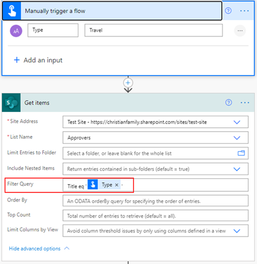

It is common for a workflow process to undergo an approval step. Approvals can be required from either a single user or multiple users and the responses need to be captured to make decisions for the next step.

## Use the Approval connector

Power Automate gives you the flexibility to connect to either data or a service using a connector. Connectors come in two tiers, standard and premier. Standard connectors are part of your Microsoft 365 licenses and no other license is needed. Premier connectors require either a per-flow or a per-user license. For more information on flow license, you can go to [Power Automate Licensing](https://flow.microsoft.com/pricing/?azure-portal=true). Approvals are a part of the standard tier.

An organization's data is critical to its success. Its data needs to be readily available for decision-making, but the data needs to be protected so that it is not shared with audiences who shouldn't have access to it. To protect this data, you can use **Power Automate** to create and enforce **data loss prevention (DLP)** policies that define the consumer connectors that specific business data can be shared with.

Connectors can now be added to either one of the three groups available in DLP, **Business, Non-Business and Blocked**. The **Approval** connector cannot be blocked. It can only be added to Business or Non-Business.

> [!div class="mx-imgBorder"]
> 

There are three actions available for **Approvals.**

> [!div class="mx-imgBorder"]
> 

## In sequence or simultaneously

It is possible to have a scenario where you need to send Approval actions to a list of users whose names are from a SharePoint list. In this case, the Approval action is automatically added to an Apply to Each and the Approval action by default will run in sequential order based on the names it gets from the SharePoint list. However, you do have the option to have all those actions in the Apply to Each run in parallel, which will send all the approval actions simultaneously.

For example, consider a scenario where you have a SharePoint List that has items such as PTO, travel and expense, and each item has its respective approver.

> [!div class="mx-imgBorder"]
> 

Based on the approval type that is added, the flow will filter through the SharePoint list and find the respective approvers.

> [!div class="mx-imgBorder"]
> 

When you add the **Approver email** in the **Start and wait for an approval action**, the approval action is automatically added into an **Apply to each**.

> [!div class="mx-imgBorder"]
> 

By default, each approval is completed in a sequential manner. If you would like to change that to parallel, then select the ellipses for **Apply to each** and select **Settings**.

> [!div class="mx-imgBorder"]
> 

Toggle the **Concurrency Control** radio button to **On** and select **Done**. The maximum number of concurrent runs is 50 and the default is 20.

> [!div class="mx-imgBorder"]
> 

Now your approvals will be sent all at once.

