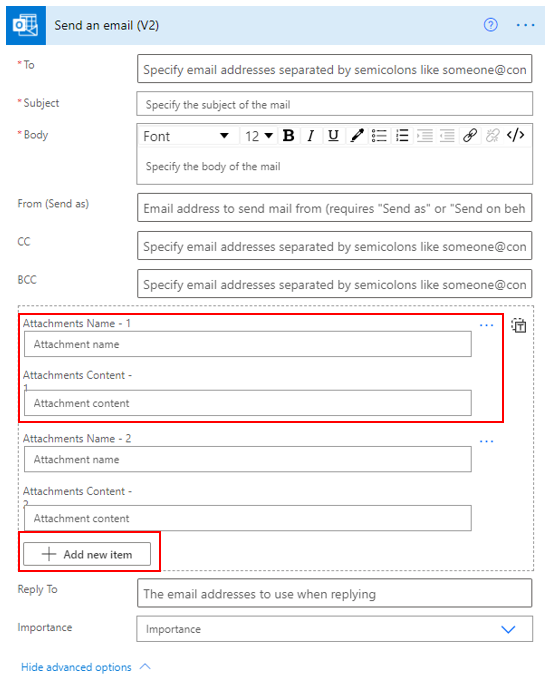
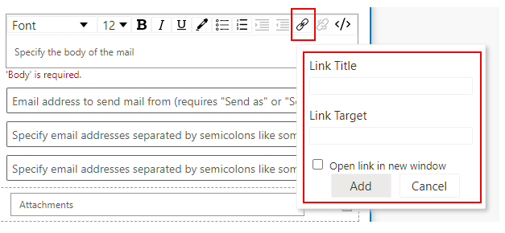

If you have spent time collaborating on a document with people, then more than likely you have sent copies of the document back and forth via email. However, depending on the situation you might want to consider saving the document to a SharePoint library and sending the link instead.

## When to send information as an attachment or a link

If the user to whom the email notification is being sent via flow is part of your company, an approved guest or external user then using links instead of attachments is a better option. Guests and external users are approved users in your tenant who have restricted access to locations you have provided. This access level is configured in your Microsoft tenant's Active Directory.

If, however, emails are sent to people outside your company then sending attachments is the only option.

The Office 365 Outlook connector's send email actions allows you to add multiple attachments.

> [!div class="mx-imgBorder"]
> 

You have the option to add multiple attachments using the name and the content. In addition, the entry of the attachments can switch to an array.

> [!div class="mx-imgBorder"]
> 

> [!NOTE]
> Using the array requires an array variable to be created before the send email action. The creation of the array variable looks like this.

> [!div class="mx-imgBorder"]
> 

Links are part of the rich text option available in the body of the email. Clicking on the link icon will allow you to add both the title and the target, the target being the location of the content.

> [!div class="mx-imgBorder"]
> 

Power Automate gives you the flexibility to get both the file name and the file content dynamically from SharePoint if you have the necessary actions before it.

Consider a scenario where you would like to send a link to an attachment of a new SharePoint list item.

In this case, you use the Get attachments action to get the file link and the file name and add that to the link of the email body. You can add multiple links.

> [!div class="mx-imgBorder"]
> 
