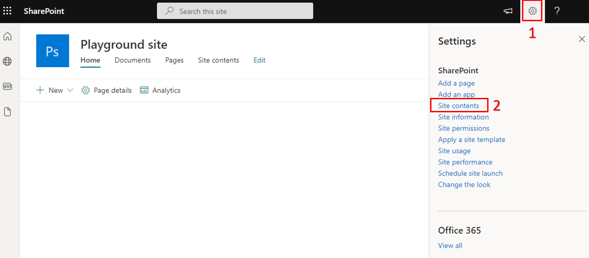
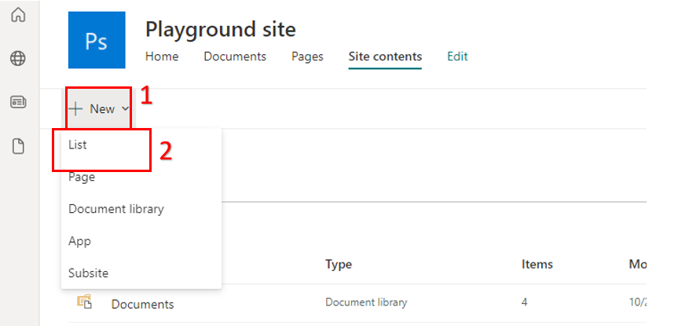
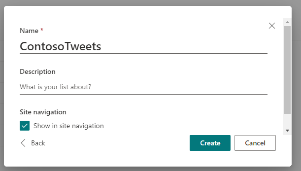
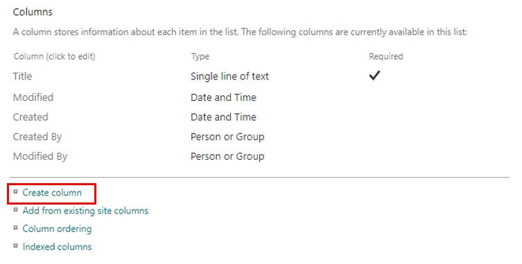
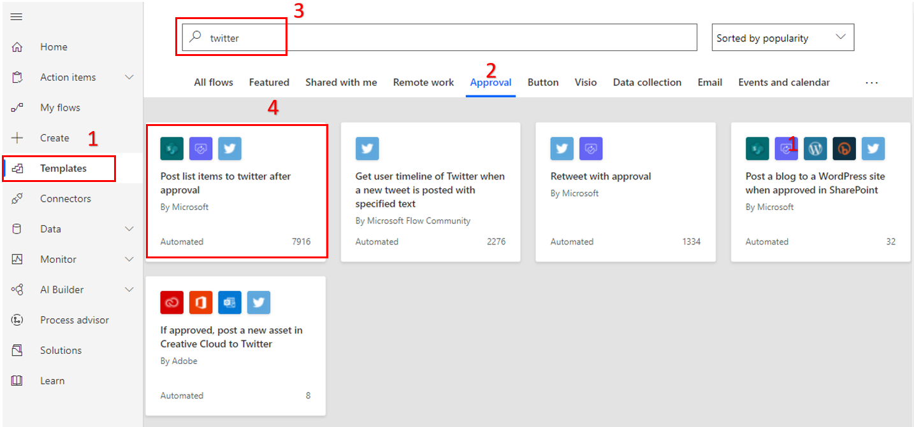
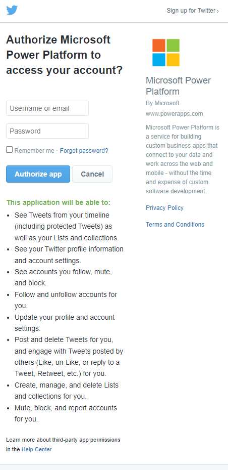
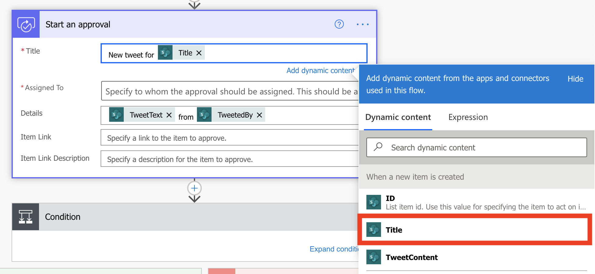
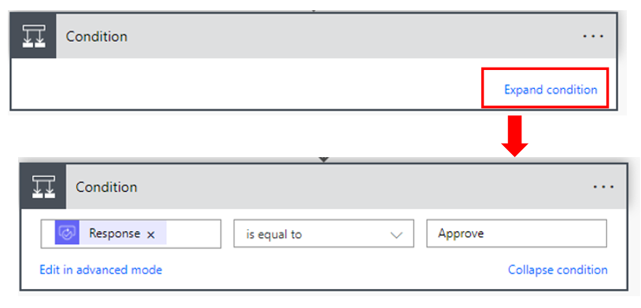
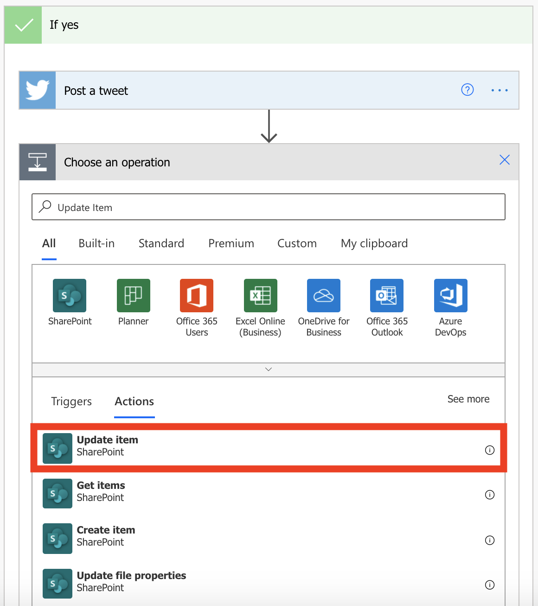
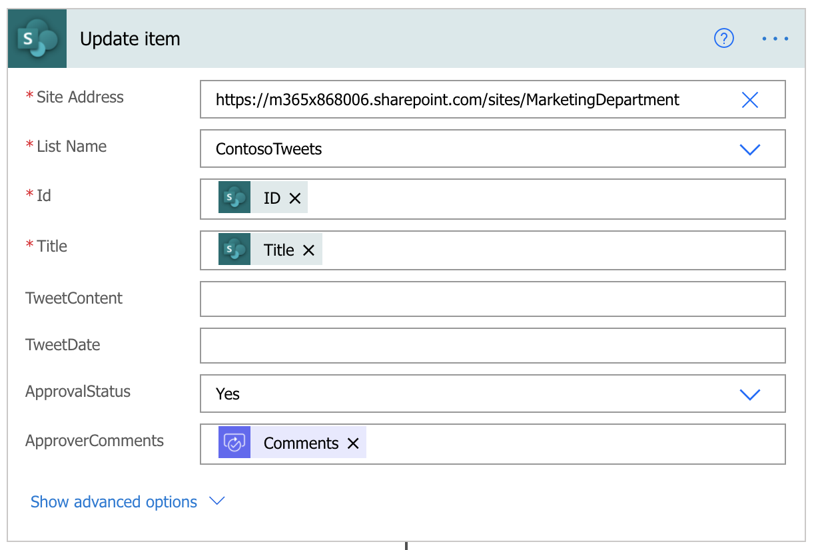

In this unit, you'll learn how to build a business-friendly scenario that uses approvals.

In this scenario, anyone who has access to the Microsoft SharePoint list can contribute tweets without knowing anything about Twitter. The social media team can then approve or reject those tweets allowing that team to remain in control of the account and the content that goes out to customers.

## Prerequisites

- Access to [Power Automate](https://flow.microsoft.com/?azure-portal=true)
- A Microsoft Office 365 account with access to SharePoint
- A Twitter account

## Step 1: Create a SharePoint list for tweets

You'll use a template that starts an approval process whenever a new item is created in a specific list. If the item is approved, a tweet is posted to Twitter. For this unit, you'll change the process by adding steps that update a SharePoint list with the approval response, indicate whether the item was approved, and add any comments that the approver added to the proposed tweet.

First, let's create the SharePoint list.

1. On your SharePoint site, select the gear settings icon on the top right and then select **Site contents**.

    

1. Select **New** and then select **List**.

    

1. Select **Blank list**.

    

1. Name the list as *ContosoTweets*.

    

1. Select the gear settings icon on the top right and select **List settings**. 

	

1. Open the list and select **+ Add column** to add the following columns. Select **Save** after you create each column.

    - Add a *Multiple lines of text* column and name it *TweetContent*. This column will hold the content of the tweets that will require approval.
    
    - Add a *Date and time* column and name it *TweetDate*. Toggle the **Include Time** option to Yes.
    
	- Add a *Yes/No* column and name it *ApprovalStatus*. Set the Default value to **No**, which will ensure all items must be reviewed by the approver before the tweet can be approved.
    
	- Add a *Single line of text* column and name it *ApproverComments*. The approver can then add a comment about the approval status.

	

1. Copy the URL of the SharePoint list. You'll use it when you create the flow.

## Step 2: Create an approval request flow

1. Sign in to [Power Automate](https://ms.flow.microsoft.com/?azure-portal=true), and then select **Templates**.

1. Search **Post list items to Twitter** under **Approval** and select the appropriate template.

    

1. Make sure your account credentials for **SharePoint**, **Approvals**, and **Twitter** are entered and are correct. If any of these connections aren't entered, select the **+** icon next the connection and enter your credentials accordingly.

1. For Twitter authentication you'll receive a pop-up window similar to this one. 

    

1. Once all of these connections are set up properly, select **Continue** to proceed.

1. In the **When a new item is created** trigger, enter the following values:

    - **Site Address**: Enter the URL of your team's SharePoint site.
    
    - **List Name**: Select *ContosoTweets*.

1. In the **Start an approval** action, set the **Title** field to *New tweet for *, and then select **Title** from the **Dynamic content** window.

    

1. In the **Assigned to** field, enter and select either your name or the name of a test user.

1. In the **Details** field, remove the default items, add dynamic fields and text to get **TweetContent** on **TweetDate** by **Created by DisplayName**.

1. In the **Item Link** field, select **Link to Item** from the **Dynamic content** window.

1. In the **Item Link Description** field, enter *Contoso Tweet List*.

    

1. Select **Expand condition** and confirm the settings.

    

1. In the **If yes** section of the **Condition**, select **Add an action**.

1. Search for *update item*, and then select the **SharePoint – Update item** action.

    

1. In the **Site Address**, enter the URL of the team's SharePoint site again.

1. In the **List Name** field, select *ContosoTweets* again.

1. In the **Id** field, add **ID** from the **Dynamic content** window. The **Id** field is used to match the actual tweet request in the SharePoint list.

1. Select the **Title** field, and then search for and select **Title** under the **When a new item is created** action in the **Dynamic content** window.

1. Set the **ApprovalStatus** field to *Yes*.

1. In the **ApproverComments** field, under the **Start an approval** action, add **Comments** from the **Dynamic content** window.

    

1. Select and drag **Post a Tweet** action below the **Update Item** action.

1. Expand the **Post a tweet** action by selecting the title bar.

1. Select the **Tweet text** field and remove **Title** and add **TweetContent** from the **Dynamic content** window. This step will create the actual tweet and then post it to Twitter when it's approved.

    

1. In the **If no** section of the **Condition**, select **Add an action**.

1. Repeat steps 12 through 18 to create a **SharePoint – Update item** action. Set the same values that you set for the **If yes** section of the **Condition**. The only difference is that you set the **ApprovalStatus** field to *No* this time.

1. Select **Save**.

Congratulations! You just created your first approval flow.

This unit showed just one way that Power Automate can empower your team to be more productive. Your team can contribute ideas, relevant news, or product guidance, but you maintain control over what's tweeted out to customers.

In the next unit, you'll see what it looks like when an approver receives a new request for a proposed tweet.

