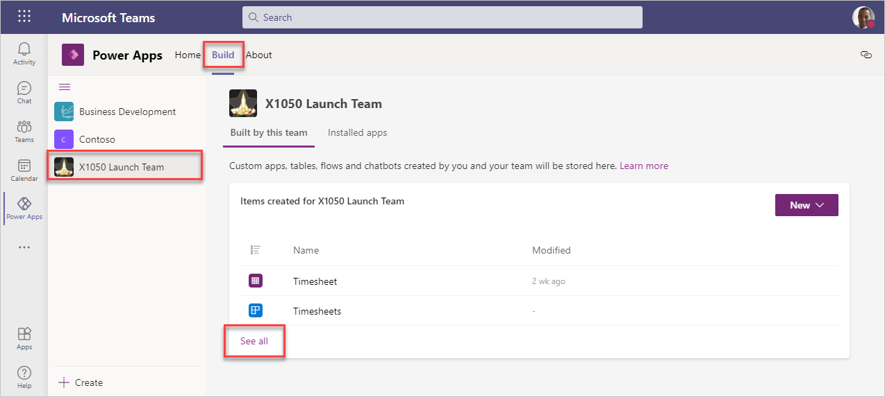
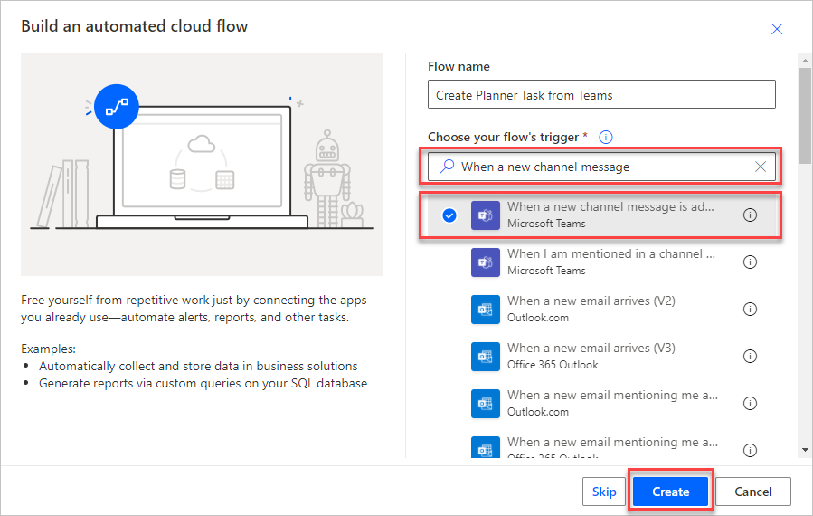
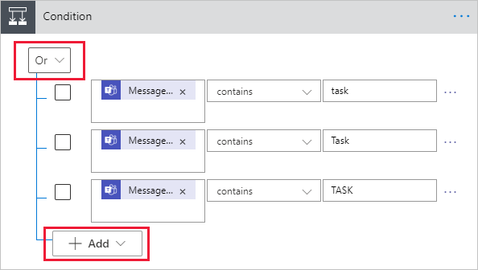
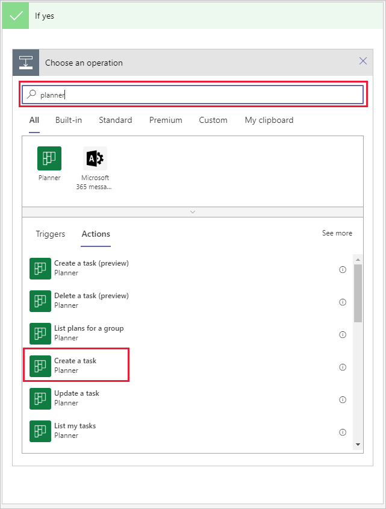
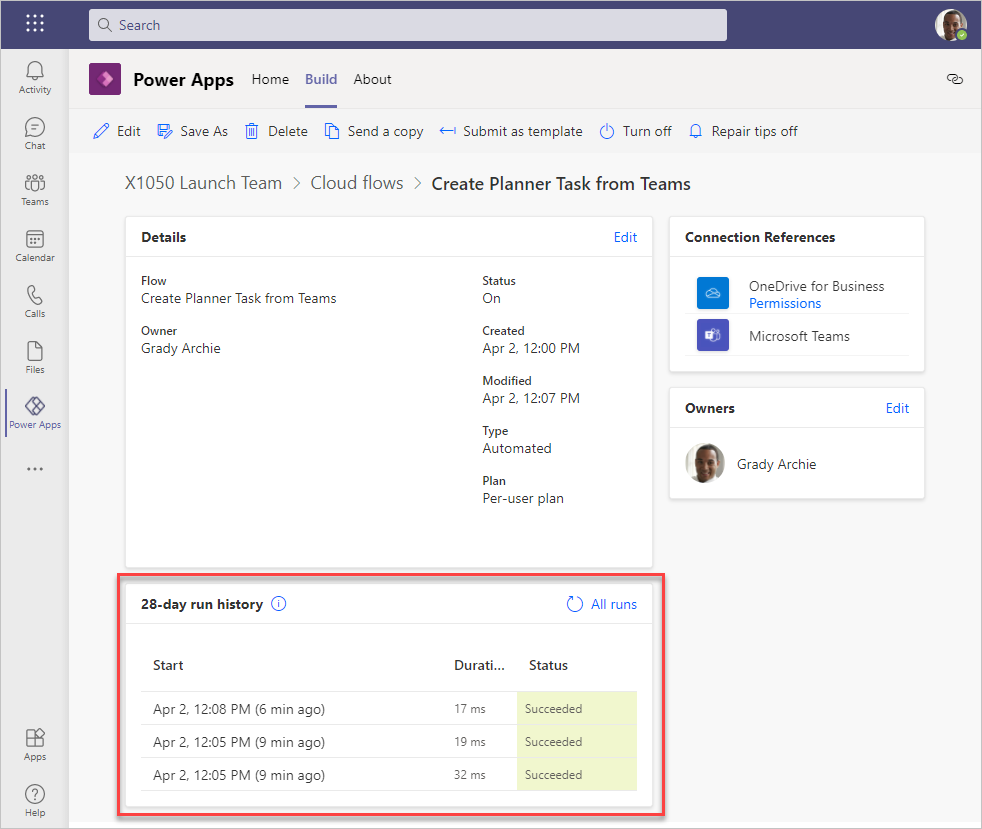

It's time to create your first flow using Dataverse for Teams. For this example, we'll create an automated workflow that will create a Planner task each time a message with "task" in the subject line is posted to a Teams Channel. The flow will need a Planner to create the tasks in. Identify an existing Planner plan or create a new one.

## Step 1: Create a new flow

1. From Teams, open the Power Apps app.

1. From the **Build** tab, select the Team on the left for the flow.
    Only Teams that have a Dataverse for Teams environment will appear.

1. Under the **Built by this team** tab, select **See all**.

   > [!div class="mx-imgBorder"]
   > 

1. Select **Cloud Flows** on the left to view any existing flows. To create a new automated flow, select **+ New** > **Cloud flow** > **Automated**.

1. Type in a name for the flow under **Flow name**.

1. For **"Choose your Flow's trigger**, scroll or search for **When a new channel message is added**. Select the trigger and select **Create** to continue.

   > [!div class="mx-imgBorder"]
   > 

At this point, you created a new flow, gave it a name, and defined the automated trigger that will start the workflow. The flow is now open in the Power Automate editor and ready to build.

## Step 2: Build the flow in Power Automate editor

To have the flow monitor the correct Teams channel for new messages, select the **Team** and then the **Channel** from the pull-down selections. Select **+ New step** to continue.

> [!div class="mx-imgBorder"]
> 

We want to search the subject of the messages to see if they have the word "task" in them. In the search bar, type in **Condition** and select it from the search results. Select **Choose a value** to view the dynamic content available. Dynamic content is the information that Flow has available based on the triggers and previous steps that have taken place.

1. From the list of dynamic content, select **Message subject**

1. In the middle pull-down, select **contains**

1. Type **task** in the box on the right

> [!div class="mx-imgBorder"]
> 

Now when the **Message subject** contains "task" it will perform actions in the **If yes** area. The conditions in Power Automate are case-sensitive so we'll need to add a few more conditions to detect common variations like "Task" and "TASK". Select **+ Add** then **+ Add Row.**

A new selection will appear at the top of the Condition window to switch between **And** and **Or** statements.

**And** - All conditions must be true

**Or** - Only one of the conditions must be true

Change the selection to **Or** and then fill out the other conditions for detect **"Task"** and **"Tasks"**. For each new row use **Message subject** from dynamic content and set the condition to **contains**. Select **+ Add** to add more rows.

> [!div class="mx-imgBorder"]
> 

The condition action gives us two other areas. If the condition is true, then we want a new Planner task created. No actions are needed if the condition is false so there is nothing more needed in the **If no** condition.

For the **If yes** condition box, select **Add an action**.

> [!div class="mx-imgBorder"]
> 

Type in **Planner,** then select **Create a task** from the results.

> [!div class="mx-imgBorder"]
> 

It may take up to a minute for Power Automate to authenticate into Planner. Once it comes up, fill out the information needed for the Planner task.

| Field | Value |
|-------|-------|
| Group ID | Select the group that has your Planner |
| Plan ID | Select the Planner for the new task |
| Title | Select Dynamic Content: **Message body content** |
| Start Date Time | Select Dynamic Content: **Message createdDateTime** |

Once completed, press **Save** at either the bottom of the editing window or in the toolbar to complete the flow.

You can now review the flow and see how it works. The flow is triggered when a new message is posted in a specific Teams Channel. Next, a check for the word "task" in the message subject. If yes, creates a new Planner task. If no, no action is taken.

> [!div class="mx-imgBorder"]
> 

## Step 3: Test the flow

Send a message to the Team channel that the flow is monitoring. In the subject line type in "task".

> [!div class="mx-imgBorder"]
> 

The Teams connector checks for a new message in three-minute intervals. Open Planner and watch for the new task to be created. The message body should be the task title. Select the task to check the start date and see if it was set to the same date as the message.

> [!div class="mx-imgBorder"]
> 

You can view the flow's run history for the last 28 days to see how long it takes the flow to run and if it was successful. To view:

1. Open Power Apps for Teams.

1. From the **Build** tab, select the Team that has the flow then **See all**.

1. Select **Cloud flows** then select the flow to view more information and the run history.

> [!div class="mx-imgBorder"]
> 

Select the run to see more information and troubleshoot each step of the flow.
