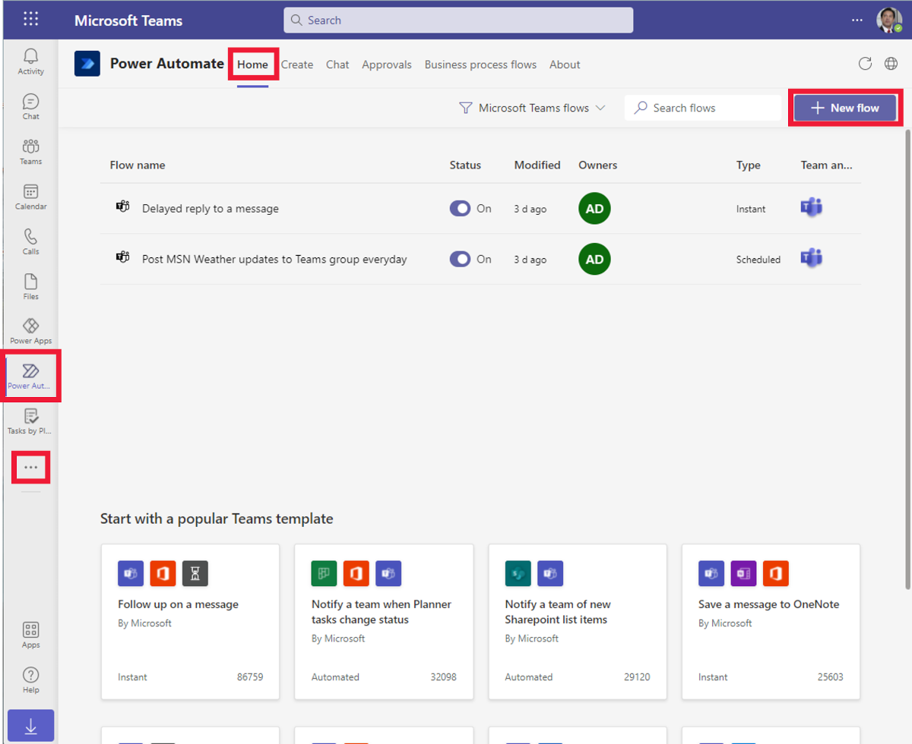
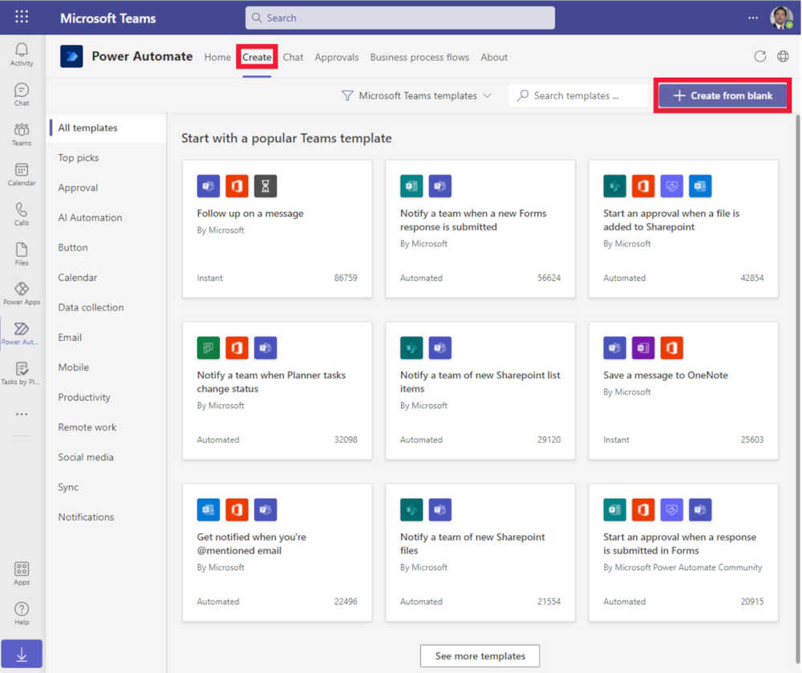
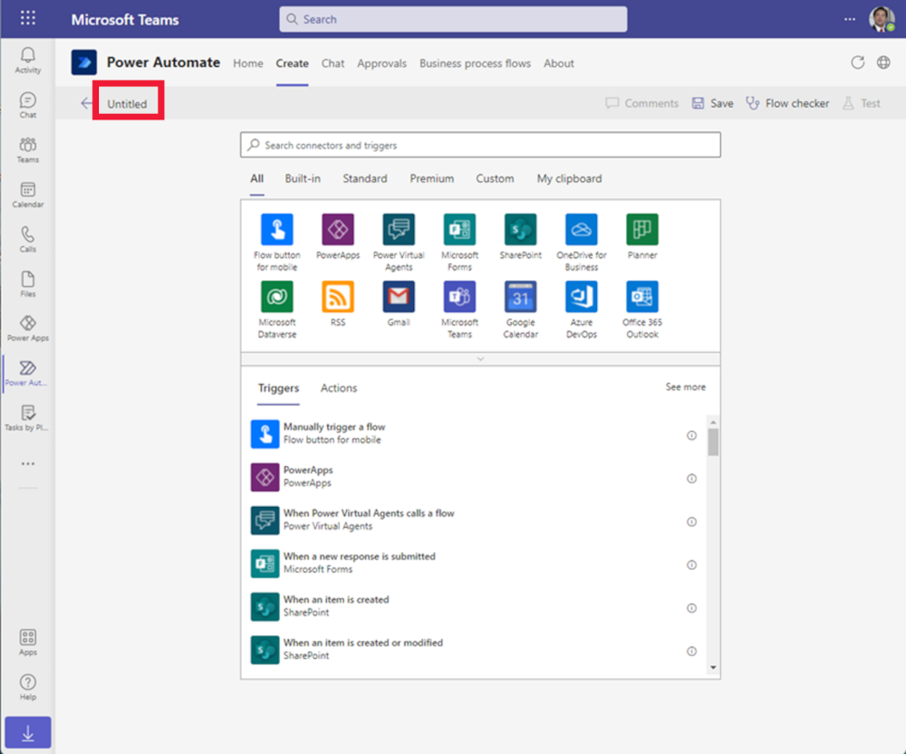
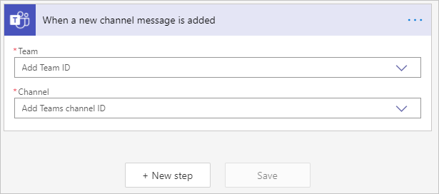
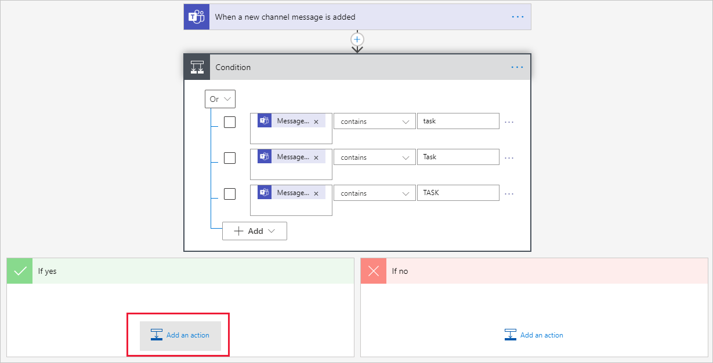
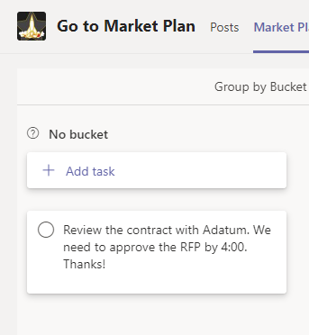

In this exercise, you will create your first flow by using Power Automate for Teams. For this example, you'll create an automated workflow that will create a Planner task each time that a message with the word "task" in the subject line is posted to a Teams channel. The flow will need a Planner to create the tasks in. You can identify an existing Planner plan or create a new one.

## Step 1: Create a new flow

To create a new flow, follow these steps:

1. From Teams, open the **Power Automate** application.  If Power Automate does not appear in the rail, click the three dots in the rail and search for it.  Notice that the **Home** tab includes a list of the currently active flows and some Teams templates to choose from.

1. From the **Home** tab, select **+ New flow**, which takes you to the **Create** tab.

   > [!div class="mx-imgBorder"]
   > 

1. In the **Create** tab, notice that the menu down the left side gives you the option to select templates related to the task you’re trying to automate.  For the purpose of this exercise, select **+ Create from blank** in the top right of the screen.

   > [!div class="mx-imgBorder"]
   > 

1. Notice how **Power Automate** has initiated a new flow within Teams. Rename your flow by clicking on **Untitled** in the upper left of the menu bar and type in a name.  Next, we will create the flow.

   > [!div class="mx-imgBorder"]
   > 

## Step 2: Build the flow in Power Automate editor

In the **Search connectors and triggers** search field, search for "Teams when a new channel message is added" and select that trigger.

To have the flow monitor the correct Teams channel for new messages, select the **Team** and then the **Channel** from the drop-down menu selections. Select **+ New step** to continue.

> [!div class="mx-imgBorder"]
> 

Now let's add a condition to search the subject of the messages to see if they have the word "task" in them. In the search bar, enter **Condition** and then select it from the search results. Select **Choose a value** to view the available dynamic content. Dynamic content is the information that the flow has available based on the triggers and previous steps that have taken place.

1. From the list of dynamic content, select **Message subject**.

1. In the middle drop-down menu, select **contains**.

1. Enter **task** in the box on the right.

> [!div class="mx-imgBorder"]
> 

Now, when the **Message subject** contains the word "task," it will perform actions in the **If yes** area. The conditions in Power Automate are case-sensitive, so you'll need to add a few more conditions to detect common variations such as "Task" and "TASK." Select **+ Add** and then select **+ Add Row**.

A new selection will appear at the top of the **Condition** window to switch between the following statements:

- **And** - All conditions must be true.

- **Or** - Only one of the conditions must be true.

Change the selection to **Or** and then fill out the other conditions for detecting **"Task"** and **"TASK"**. For each new row, use **Message subject** from dynamic content and set the condition to **contains**. Select **+ Add** to add more rows.

> [!div class="mx-imgBorder"]
> 

The condition action provides two other areas. If the condition is true, then you will want a new Planner task created. No actions are needed if the condition is false, so nothing more is needed in the **If no** condition.

For the **If yes** condition box, select **Add an action**.

> [!div class="mx-imgBorder"]
> 

Enter **planner** and then select **Create a task** from the results.

> [!div class="mx-imgBorder"]
> 

It might take up to a minute for Power Automate to authenticate into Planner. When Planner comes up, fill out the needed information for the Planner task.

| Field | Value |
|-------|-------|
| Group ID | Select the group that has your Planner |
| Plan ID | Select the Planner for the new task |
| Title | Select dynamic content **Message body content** |
| Start Date Time | Select dynamic content **Message created DateTime** |

When you have completed the task, select **Save** at the bottom of the editing window or in the toolbar to complete the flow.

You can now review the flow and see how it works. The flow is triggered when a new message is posted in a specific Teams channel. Next, you should check for the word "task" in the message subject. If yes, the system creates a new Planner task. If no, the system won't take action.

> [!div class="mx-imgBorder"]
> 

## Step 3: Test the flow

Send a message to the Teams channel that the flow is monitoring. Press the format icon under your message to bring up the format with the subject header. 

> [!div class="mx-imgBorder"]
> 

In the subject line, enter a subject including the word **task** and send the message.

> [!div class="mx-imgBorder"]
> 

The Teams connector checks for a new message in three-minute intervals. Next, open Planner and watch for the new task to be created. The message body should be the task title. Select the task to check the start date and see if it was set to the same date as the message.

> [!div class="mx-imgBorder"]
> 

You can view the flow's run history for the last 28 days to see how long it takes the flow to run and if it was successful:

1. Open Power Automate for Teams.

1. From the **Home** tab, select the team that has the flow that you just created, listed under **Flow name**.  The details screen view shows you more information on your flow and the run history. **See all**.

> [!div class="mx-imgBorder"]
> 

Select the run to see more information and troubleshoot each step of the flow.
