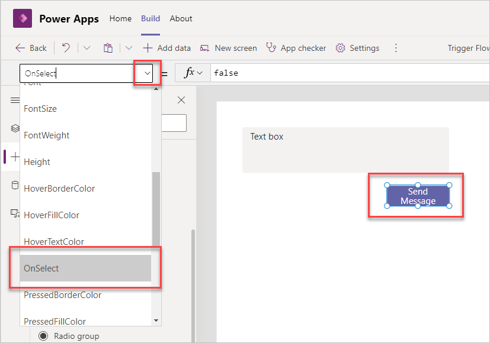

Flows can be used to automate a sequence of actions from within your Power App. For example, when a new customer record is created you could start an approval process, add a new SharePoint list item, or email a customer a forms survey. This allows for more consistent business processes and less manual work.

The key feature that makes this so powerful is that any needed information is passed from the app to a flow when it's triggered. To demonstrate how to connect a flow to Power Apps, here is a simple app to send a message to Teams. The goal is when Button1 is pressed, the contents of TextBox1 will be passed to the flow to become a message in Teams.

## Step 1 - Create the Power App

1. Open the Power Apps app in Teams and select **Create an app**.

1. Select a team to store the app then select **Create**.

1. Name the app **Trigger Flow From App** then select **Save**.

1. To open a blank screen without the Hero Template, select **New Screen** then **Blank**.

1. From the Insert menu, choose a **Text box** and **Button** from the **Input** section. Position them on the screen by selecting and dragging them around. Resize the text box by first selecting it and then select and drag the corners.

   > [!div class="mx-imgBorder"]
   > 

1. Change the following properties of TextBox1 and Button1 first selecting them and using the **Properties** tab.

    TextBox1 Mode: **Multiline**

    Button1 Text: **Send Message**

    > [!div class="mx-imgBorder"]
    > 

## Step 2 - Create and connect a flow

1. To connect a flow, we first need to select the item and event that will start the flow. Since we want the flow to trigger when **Button1** is pressed, select the Button and then select **OnSelect** from the pulldown.

   > [!div class="mx-imgBorder"]
   > 

1. To create a flow and link it to the app, select the **Ellipsis menu** and select **Power Automate**.

   > [!div class="mx-imgBorder"]
   > 

1. Select **Create a new flow** and the Power Automate editor will launch in a web browser.

1. Give your flow a new name by selecting **Untitled** then typing in **PowerApps to Teams Message**.

   Type in **PowerApps** in the search field and select **PowerApps** in the **Triggers** section.

   > [!div class="mx-imgBorder"]
   > 

1. The flow is now editable. It only has PowerApps defined as the trigger. To add an action, select **New Step**.

1. Type in **Teams** in the search then scroll down under **Actions** and select **Post a message (V3) (preview).**

   > [!div class="mx-imgBorder"]
   > 

1. Select the **Team** and **Channel** that you want the message to be sent to.

1. The Team message will be provided by the Power App when it's triggered. Select in the **Message** text box and then select **Ask in PowerApps** as the dynamic content.

   > [!div class="mx-imgBorder"]
   > 

1. When **Ask in PowerApps** was selected as the dynamic content for the message, it automatically created a variable and gave it a name. Select **Save** at the end of the flow.

   > [!div class="mx-imgBorder"]
   > 

1. With the flow saved, switch back to the Power App app editor that you started in. The new flow should appear in the PowerApp editor under the **Data** pop out. If for some reason that window is closed, select Button1 and check that **On select** is selected in the pull-down. Select the ellipsis menu and select **Power Automate.** Select the flow to continue.

   > [!div class="mx-imgBorder"]
   > 

1. The command to run the flow will appear in the formula bar. It will be in the format of **[FlowName].Run(**. This is only the first part of the formula, we now need to pass in the message text for the flow. For this example, type in **Textbox1.Value)** at the end of the formula.

   > [!div class="mx-imgBorder"]
   > 

    To learn more about formulas in Power Apps, see the links in the Summary unit at the end of this module.

1. Select **Save** in the toolbar.

## Step 3 - Test the app and flow

Before publishing any application to **Teams,** you can test it by selecting **Preview** from the toolbar.

1. From the toolbar, select **Preview**.

1. Type in a message into the text box then select **Send Message**.

   > [!div class="mx-imgBorder"]
   > 

1. Switch to the Teams channel to see the message in Teams.

   > [!div class="mx-imgBorder"]
   > 

1. In the Power Apps editor, close preview mode by selecting the **X icon** or pressing **ESC**. As this is just a test application, we'll not publish it to Teams.

If you need to edit a flow you have connected to PowerApps:

1. Open the PowerApps App in Teams.

1. Select the **Build** menu.

1. Select **See all**.

1. Select **Cloud flows** from the left menu and select the flow from the list.
