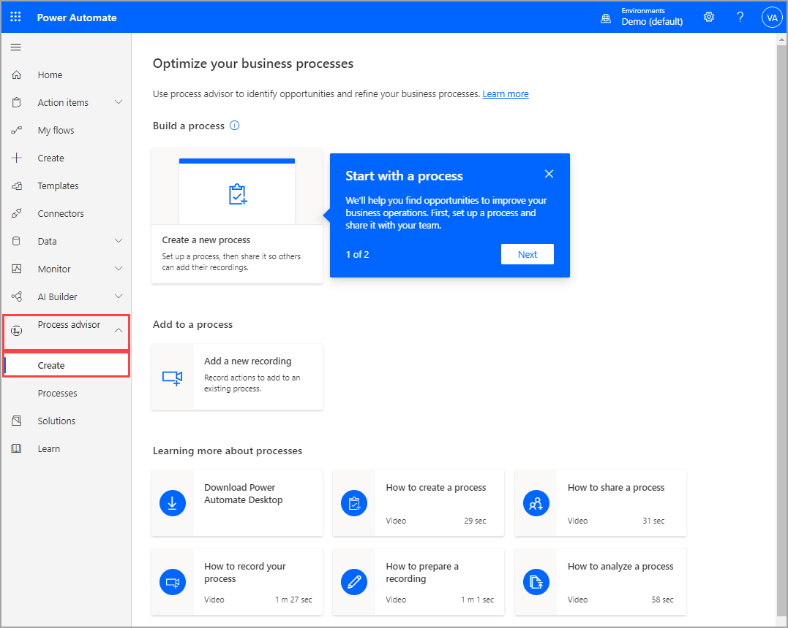
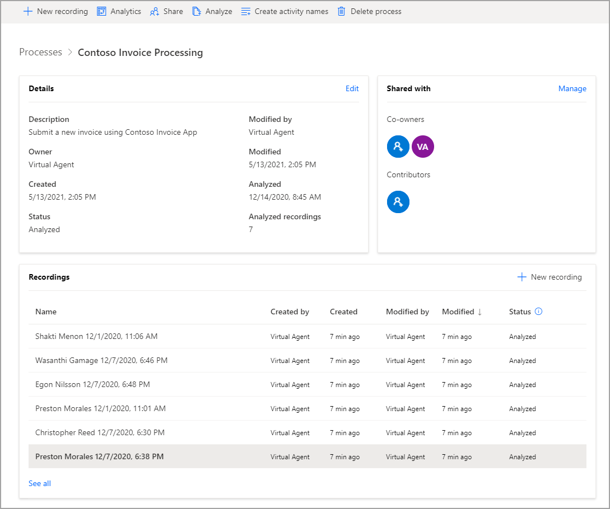

Process advisor is built using the great features and capabilities of the Power Platform to generate insights. Power Automate Desktop allows you to record actions you perform on your computer while Dataverse stores the information from your processes. Because of this, you will need to have access to all of these from a licensing and security perspective to take advantage of process advisor. If you cannot see process advisor when visiting Power Automate, talk to your administrator about your permissions. 

Process Advisor is accessed through [Power Automate](https://flow.microsoft.com/?azure-portal=true) by selecting **Process advisor** and then **Create** on the left navigation pane.

> [!div class="mx-imgBorder"]
> 

Here you can create a new process or add recordings to an existing process. You will also see a link to download Power Automate Desktop and short instructional videos to walk you through various tasks in Process Advisor. Remember that recordings are conducted through Power Automate Desktop and this program will need to be downloaded.

Selecting **Processes** will show the details of any existing processes, which you own or co-own. If you don't yet have any processes, you can begin a new one.

Selecting a process will allow you to see the details involved including the various recordings and who created them at what time and their status.

> [!div class="mx-imgBorder"]
> 

The possible statuses for recordings are as follows:

-   In progress - Recording is in progress, but it is also possible that the recording has not yet started. Since recording happens in the desktop client, the web portal will not know about its status until it has been saved. It is also possible to see this status after the recording has been saved since some processing is required after recording to make it ready to view.

-   Failed - An error occurred during recording processing. Create a new recording.

-   Not analyzed - The recording has been processed and is available to view and edit, but it has not been marked as ready to analyze.

-   Ready to analyze - The recording has been marked as ready to analyze and will be considered the next time you analyze the process.

-   Analyzed - The recording has been analyzed and is part of the analyzed output that can be viewed through the Analytics screen.

In addition to the recording information, you can see and manage the users who have access to your process.

> [!NOTE]
> Contributors have access to add recordings and manage recordings they created while co-owners have access to create recordings and manage the recordings of others as well as their own.

Later we will look at analytics and recommendations, but for now, let's work on how to add a recording.
