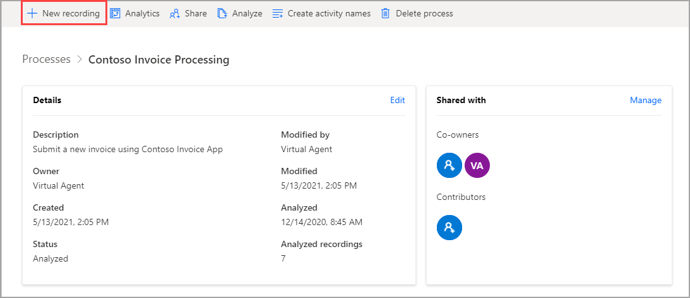
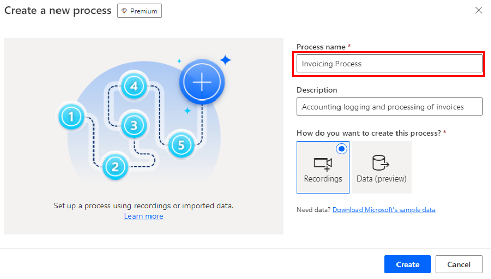
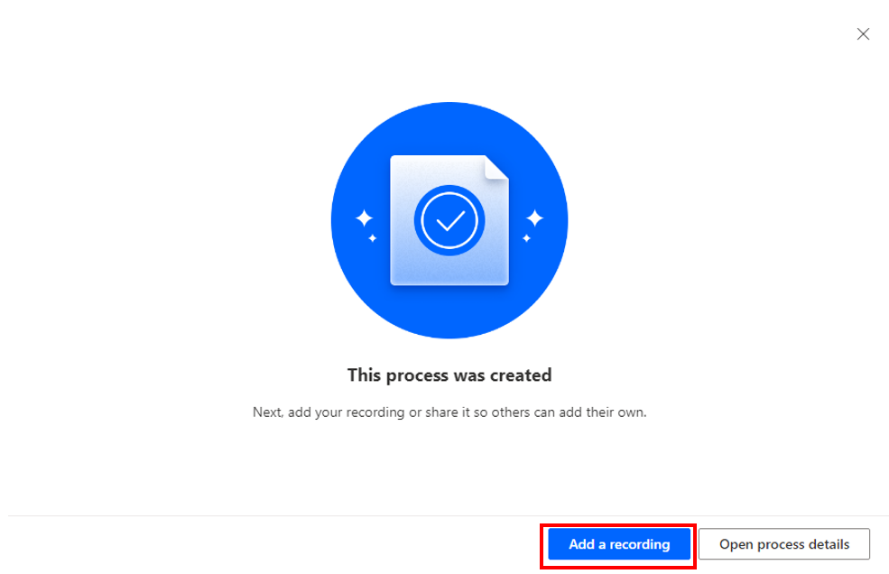

To begin recording, you first need to have a process. If you've already created a process, select that process and then select **New recording** in the upper-left corner of the page.

> [!div class="mx-imgBorder"]
> 

If you don't have a process yet, select **Process advisor > Create > Create a new process**.

> [!div class="mx-imgBorder"]
> 

Name your process. Provide a description to help you and your users understand the process that is being analyzed. Select **Create**.

> [!div class="mx-imgBorder"]
> 

Next, select **Add a recording**, which will open Power Automate for desktop. Make sure that you install Power Automate for desktop now if you haven't already.

> [!div class="mx-imgBorder"]
> 

The **Desktop recorder** window of Power Automate for desktop will open. Before you start recording, you need to complete some cleanup items. The process will go more smoothly if you exit out of unnecessary applications while you're recording. If you have other browsers or programs that are running, you should close them now. It will be difficult to read the instructions and perform the actions that are required for the recording simultaneously. So you might want to read through this unit completely before performing the next steps. After completing the cleanup items, you'll be ready to begin recording. To begin, select the **Start recording** button in Power Automate for desktop.

> [!div class="mx-imgBorder"]
> 

Now, perform your process as usual. You'll see actions appear on the recording pane as you move along in the process. Be sure to only use the mouse and not keyboard shortcuts to go to the next field. You can pause the recording or delete actions if you make a mistake.

> [!TIP]
> As you record, make sure that you go slowly and wait several seconds between actions. A red outline will appear on a control before selecting and a blue highlight will appear after. If these outlines and highlights do not appear, your actions might not be recorded properly.

After you've finished your actions, return to the recording window and select **Finish**. Your recorded actions should look similar to the following image.

> [!div class="mx-imgBorder"]
> 

After you select **Finish**, your recording will upload and the following dialog box will appear.

> [!div class="mx-imgBorder"]
> 

You can view and manage your new recording by going to your process (select **Process advisor > Processes** and then select the name of your process). Under **Recordings**, select **See all**. On the following page, you can view any recordings in your process, and you can select a recording and see more options.

> [!div class="mx-imgBorder"]
> 

Now that you've learned how to begin a new process and add recordings, you can learn how to edit those recordings.
