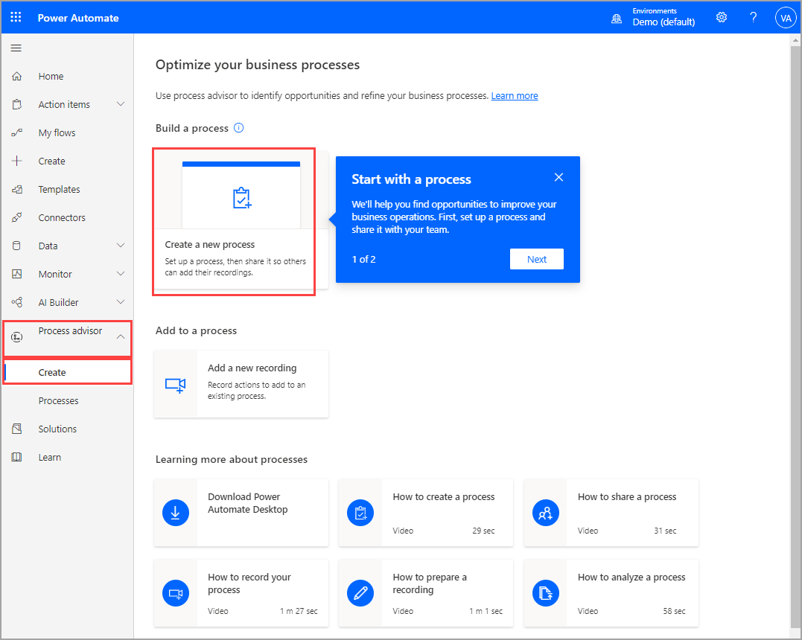
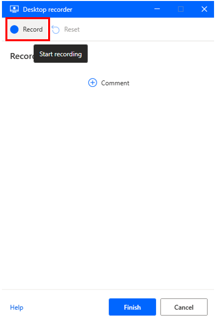
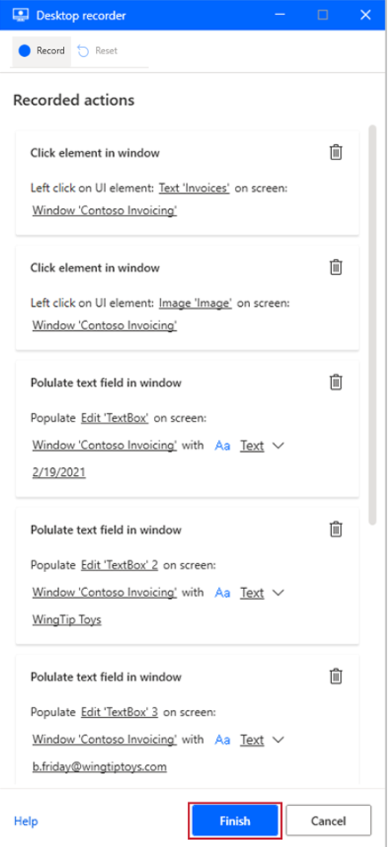
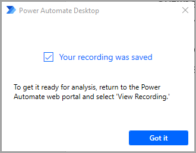

To begin recording, you first need to have a process. If you already have a process created, select that process and select **New recording** at the top.

> [!div class="mx-imgBorder"]
> 

If you do not have a process yet, select on **Process advisor**, **Create**, and **Create a new process**.

> [!div class="mx-imgBorder"]
> 

Name your process and provide a description to help you and your users understand the process being analyzed. Select **Create**.

> [!div class="mx-imgBorder"]
> 

Next, select **Add a recording**. This will open up Power Automate Desktop, so install this now if you haven't already.

> [!div class="mx-imgBorder"]
> 

The recording window of Power Automate Desktop will open on your screen. Before you start recording, there are a couple of cleanup items to call out. Firstly, the process will go more smoothly if you exit out of any unnecessary applications while recording. If you have other browsers or programs running, it's a good idea to close them now. Secondly, it will be difficult to read the instructions and perform the actions required for the recording simultaneously. You may want to read through this unit completely before performing the steps outlined below. With those items out of the way, you are now ready to begin recording. To begin, hit the **Start recording** button in Power Automate Desktop.

> [!div class="mx-imgBorder"]
> 

Now perform your process as normal. You will see actions pop up on the recording pane as you go. Be sure to only use clicks and not keyboard shortcuts to go to the next field. You can pause the recording or delete actions if you make a mistake.

> [!TIP]
> As you record, make sure to go slowly and wait several seconds between actions. There will be a red outline on a control before selecting and a blue highlight after. If these outlines and highlights do not appear, your actions may not be recorded properly.

Once you have finished your actions, go back to the recording window and select **Finish**. Your recorded actions should look similar to the below.

> [!div class="mx-imgBorder"]
> 

After selecting **Finish**, your recording will upload and the following dialogue box will appear.

> [!div class="mx-imgBorder"]
> 

You can see and manage your new recording by visiting your process (select **Process advisor**, **Processes**, and select the name of your process). Under recordings, select **See all**. On the following page, you can see any recordings in your process. You can select a recording and see more options.

> [!div class="mx-imgBorder"]
> 

Now that you understand how to begin a new process and add recordings, let's dive into editing those recordings.
