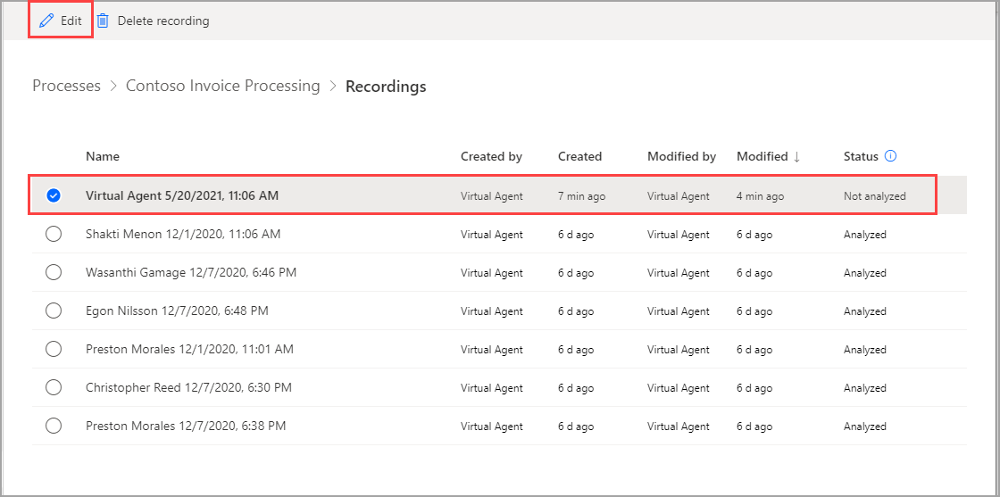
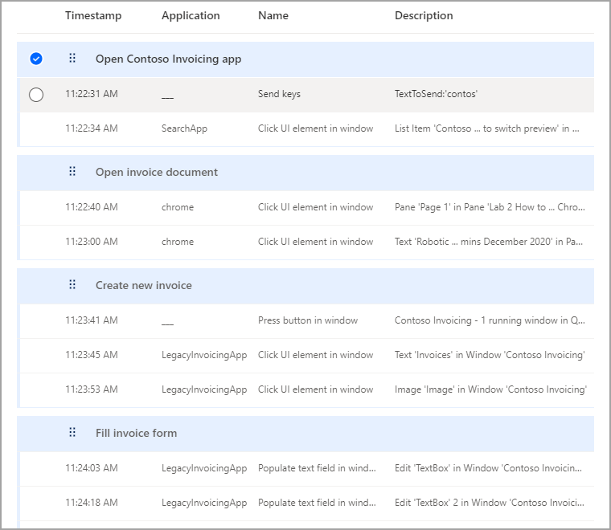

Once you are in a process and can see the list of recordings, select **Edit** for a recording to explore other options. On the edit page, you can alter or delete actions and group actions together to make an activity. Activities are groups of actions that will be the basis of the process map and the analysis. Activities will also allow Power Automate to understand variations in the process between users and recordings.

As you will remember from the second unit, there are several statuses for recordings. When a recording is being uploaded, it will have a status of "In progress". Once it is ready for grouping and editing, it will have a status of "Not analyzed". Choose a recording with this status to prepare it for analysis by grouping and editing actions.

> [!div class="mx-imgBorder"]
> 

> [!NOTE]
> You can edit recordings that have already been analyzed, but you must prepare every recording for analysis by grouping actions and changing the status to "Ready to analyze".

By clicking on individual actions, you can edit the action text or description to eliminate private data or Personal Identifiable Information (PII) and delete the screenshot. Screenshots help users or owners of the process to understand what is taking place in the action but deleting the screenshot will not affect the analysis in any way. Editing out personal information and deleting screenshots can be important for keeping anonymous data anonymous as it is shared with any owners of the process. You can also delete sensitive steps or modify data input while recording and pause the recording, perform actions regarding sensitive data, and then resume recording.

> [!div class="mx-imgBorder"]
> 

In order to prepare a recording for analysis, you must first group the individual actions into activities. These activities will allow recordings by different users to be analyzed together and help the Power Automate understand which actions go together to estimate average times and other analytics.

The first step to grouping is to press **Add activity**.

> [!div class="mx-imgBorder"]
> 

You can choose a new name for your activity, or if other recordings in the process have already been grouped, choose from a list of activity names.

> [!div class="mx-imgBorder"]
> 

Once you name the activity, it will appear at the top of your actions. You can move the activity header around to position it above the first activity in the group. Don't worry about the last action yet. Power Automate is just ensuring that every action fits in a group. You will have to add more activities to split up the actions. If you select a specific action before adding a new activity, the header will automatically be placed above it. If at any point you add an extra activity, you can delete the activity without affecting the actions by pressing **Delete activity**. You can also rename activities on the right-hand pane. You must have at least two activities to analyze a recording. In the end, your recording will look something like the below.

> [!div class="mx-imgBorder"]
> 

Once you are finished with your grouping, there is still one step left. Change the status to "Ready to analyze" by clicking the toggle at the top.

> [!div class="mx-imgBorder"]
> 

If you own a process, you can create activity names to act as guides for any contributing users. To do so, visit your process details screen and select **Create activity names**.

Now that you understand how to record a process and action on your recording, let's dive into analysis.
