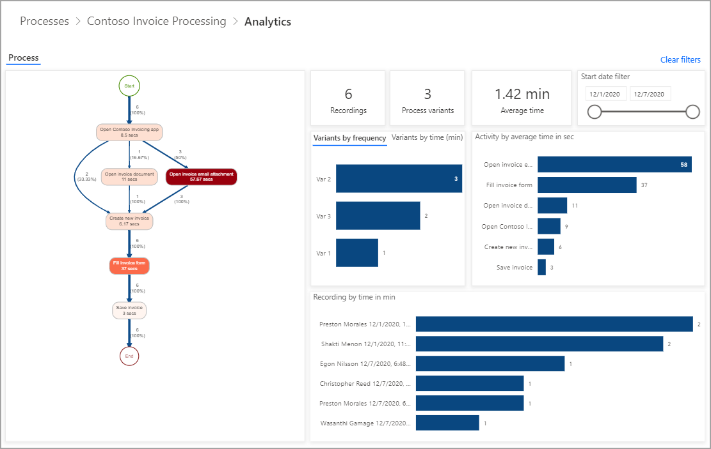
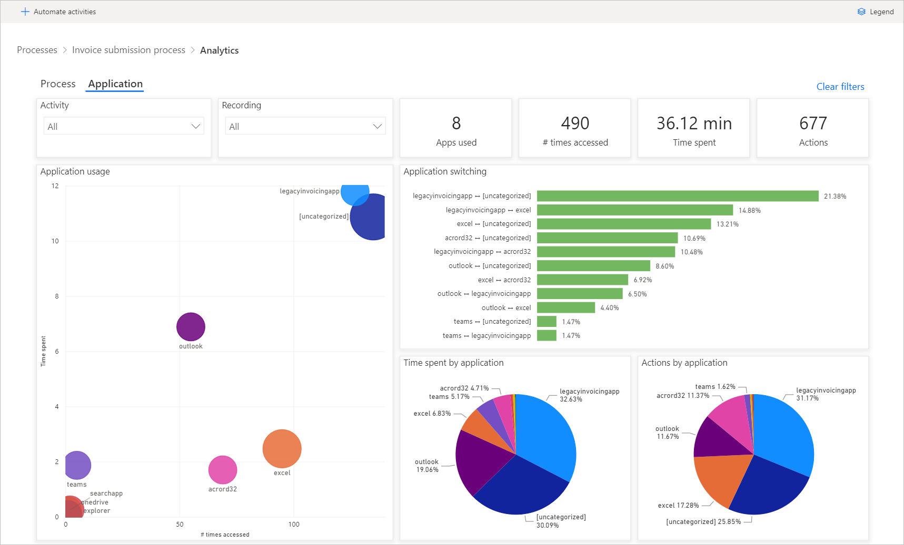

Once you have a couple of recordings and have grouped the actions in those recordings into activities, you are ready to analyze your process. While you can analyze a process with as few as two recordings, the more you have, the more valuable the analysis. When your recordings are prepared, visit your process and select **Analyze**.

> [!div class="mx-imgBorder"]
> 

In the following pop-up, press **Confirm**. Once your analysis is complete, the included recordings should switch status to "Analyzed." After this occurs, press **Analytics** to view the results.

> [!div class="mx-imgBorder"]
> 

The analytics screen will look like the below.

> [!div class="mx-imgBorder"]
> 

You can see that there are many metrics here to absorb. The first visual is the process map. You can enlarge the process map by pressing the focus mode icon in the top-right corner.

> [!div class="mx-imgBorder"]
> 

The process map breaks down each activity in order and shows the average amount of time per activity and any variations in the process. You can see with this process map that six recordings are being analyzed. In two recordings, the user opened the invoicing app and created a new invoice immediately. In one recording, the user opened an invoice document first. In 3 recordings, or 50% of the time, the user opened an invoice email attachment, which had the longest average time of any activity. The process map has thicker lines for the most traversed path in the process and each activity is color-coded for the average length of time with longer activities being darker red and shorter activities being lighter. This allows you to understand the process at a glance. Every distinct series of actions in a process is referred to as a variant. While no other variants existed, the other activity, which took a while was filling out the invoice form. Activities that take longer might be good opportunities for automation.

The other visuals will help break down the information in the process map further. For example, here you can see the number of recordings, number of process variants, and average time to complete the process. In addition, there is a start date filter, which can be especially useful if something in your process changed on a specific date.

> [!div class="mx-imgBorder"]
> 

On the next row of visual, we see the variants in terms of frequency and time. By comparing the two, we can see that Variant 1 had the lowest frequency but the greatest time to complete.

> [!div class="mx-imgBorder"]
> 

> [!div class="mx-imgBorder"]
> 

You can select Variant 1 to filter all the information on the analytics page to better understand this path.

> [!div class="mx-imgBorder"]
> 

You can see that in this recording, filling out the invoice form took longer than in the other recordings. In fact, the whole process took more than two minutes, the longest of all the runs. This may be because the user was typing information instead of copying and pasting, or it could be an outlier. Either way, you are gaining insights into the process.

In addition to information on your process, you can find analytics on the various applications being used in your process on the applications tab. 

> [!div class="mx-imgBorder"]
> 

Now you can see where bottlenecks may exist in your process and where you can most easily automate.
