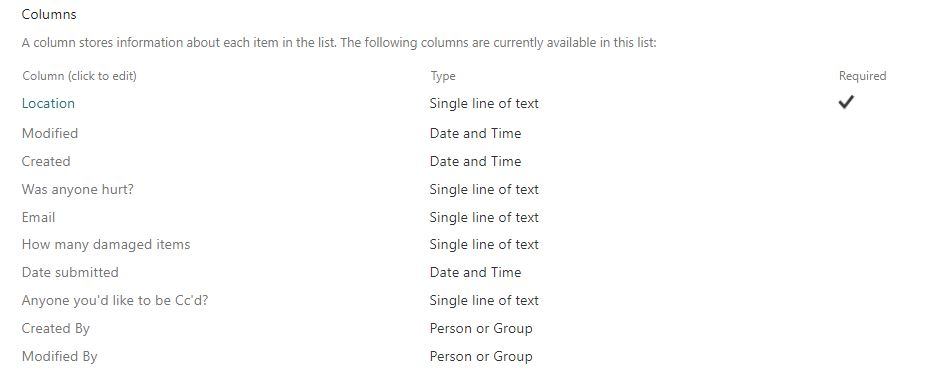

Let's create a flow button that will allow a user to report damages
noticed in the company property. The data will be saved on a SharePoint
list.

1.  Go to the SharePoint Online site of your choice.

1.  On the top left, you will see **+ New**. Click on it and select
    **List**.

    

1.  On the right, you will see **Create list**. Give the list a name,
    Reported Property Damage. Click **Create**. You will be re-directed
    automatically to the new list. The list will automatically have
    **Title**.

1.  Click on settings which is available on the top-right of the screen
    and looks like a gear icon. Hovering your mouse over it will show
    **Settings**. Next, click on **List settings** which will take you
    to the reported property damage settings page. In the middle of the
    screen, you will see **Columns** which already has **Title**.

    

1.  Click on **Title** and change the column name from Title to
    Location. Scroll down and click on **Ok** which is available on the
    bottom right.

1.  Below the columns, look for **Create column** and click on it.

1.  Add the column name as Was anyone hurt? Confirm **Single line of
    text** is the type of column. Scroll down and click on **Ok** which
    is available on the bottom right.

1.  Follow steps 6 and 7 to add Email and **How many damaged items** columns.

1.  Again, click on **Create column**. Add Date submitted as the column
    name and select Date and time as the column name. Scroll down and
    click on **Ok** which is available on the bottom right.

    

1. Here's a screenshot of all the columns.

    

1. Next, [sign in](https://flow.microsoft.com/?azure-portal=true). 

1. On the left vertical menu click on **+ Create**.

1. On the top you will see **Three ways to make a flow**. The first way
    is **Start from blank**. In that you will see **Instant flow**.
    Click on it.

1. Add **Report Property Damage** as your Flow Name and select
    **Manually trigger a flow** option.

1. You then click **Create** to start building the flow.

1. You will now be in the flow studio with the title and the Manually
    trigger a flow trigger already added.

    

1. Click on **Manually trigger a flow** trigger and click on **+ Add an
    input**.

1. Select  **Text**. Replace the **Input text**
    with **Location**.

1. Click on **+ Add an input** and select  **Yes/No.** Replace **Yes/No** with **Was anyone hurt?**

1. Click on **+ Add an input** and select  **File**. Replace **File Content** with **Take a picture of the damage**.

1. Click on **+ Add an input** and select  **Email**. Replace **Email** with
    **Anyone you'd like to be CC'd?**

1. Click on **+ Add an input** and select  **Number**. Replace Number with **How many damaged items?**

1. Click on **+ Add an input** and select  **Date**. Replace **Trigger date** with **Add today's date**.

1. Click on **+ New step** and search for SharePoint. Under **Actions** click on **Create item**.

1. In the **Create item** action, for **Site Address** click on the
    drop-down arrow which is to the right and select the site where your
    list is available. If the site doesn't appear, then click on Enter
    custom value and paste the site URL.

1. In List Name, select the Reported Property Damage list we just
    created above. After the list is selected the column names will
    appear below it.

1. Click in Location field then on the right, then in the Dynamic
    Content section select **Location**.

    

1. Do the same for the other fields after which it should look like this.

    

1. Click on **+ New step** and search for SharePoint. Under **Actions**
    click on **Add attachment**.

1. For Site Address click on the drop-down arrow, which is to the
    right, and select the site where your list is available. If the site
    doesn't appear, then click on **Enter custom value** and paste the
    site URL.

1. In List Name select the Reported Property Damage list we just
    created above. After the list is selected, the column names will
    appear below it.

1. Click in the **Id** field and select **ID** dynamic content.

    

1. Click in **File name** and type in ```DamageReportImage.jpeg```.

1. Click in **File Content**, in the dynamic content click on **Take
    a picture of the damage**.

    

1. Click on **Flow checker,** which is available on the top right. If
    you have 0 errors and warnings, then click on the **X**. Next, click
    on **Save**.

1. You can now test the button using your smartphone. Open the app and
    click on the **Buttons** option on the bottom horizontal menu. You
    will now see the **Report Property Damage** button. Click on it.

1. Populate all the items in the fields and then click on **Done**.

    

1. You can go back to your SharePoint list and confirm the new item
    which includes the image has been added.

    

You have successfully created the app using all the six inputs!
